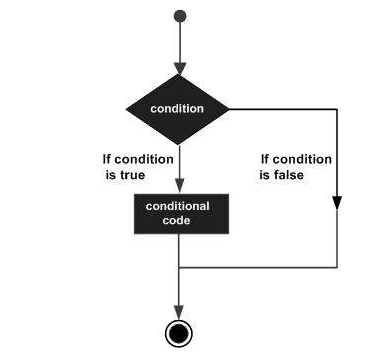

# _## C++ [Programming Tutorial_

## C++ [Basic Syntax](#basic_syntax)
## C++ [Comments](#comments)
## C++ [Data Types](#data-types)
## C++ [Variable Types](#variable-types)
## C++ [Variable Scope](#variable-scope)
## C++ [Constants/Literals](#constants-literals)
## C++ [Modifier Types](#modifier-types)
## C++ [Storage Classes](#storage-classes)
## C++ [Operators](#operators)
## C++ [Loop Types](#loops-types)
## C++ [Decision Making](#decision-making)
## C++ [Functions](#functions)
## C++ [Numbers](#number)
## C++ [Arrays](#arrays)
## C++ [Strings](#strings)
## C++ [Pointers](#pointers)
## C++ [References](#references)
## C++ [Date & Time](#data-time)
## C++ [Basic Input/Output](#basic-input-output)
## C++ [Data Structures](#data-structures)

## C++ [Classes & Objects](#classe-objects)
## C++ [Inheritance](#inheritance)
## C++ [Overloading](#overloading)
## C++ [Polymorphism](#polymorphism)
## C++ [Abstraction](#abstraction)
## C++ [Encapsulation](#encapsulation)
## C++ [Interfaces](#interfaces)

## C++ [Files and Streams](#files-and-streams)
## C++ [Exception Handling](#exception-handling)
## C++ [Dynamic Memory](#dynamic-memory)
## C++ [Namespaces](#namespaces)
## C++ [Templates](#templates)
## C++ [Preprocessor](#preprocessor)
## C++ [Signal Handling](#signal-handling)
## C++ [Multithreading](#multithreading)
## C++ [Web Programming](#web-programming)

/ ***************************************************************************** /

## <a id="basic_syntax"></a> C++ Basic Syntax
When we consider a C++ program, it can be defined as a collection of objects that communicate <br> via invoking each other's methods. Let us now briefly look into what a class, object, <br> methods, and instant variables mean.

  - **Object** − Objects have states and behaviors. Example: A dog has states - color, name, breed as well as behaviors - wagging, barking, eating. An object is an instance of a class.

  - **Class** − A class can be defined as a template/blueprint that describes the behaviors/states that object of its type support.

  - **Methods** − A method is basically a behavior. A class can contain many methods. It is in methods where the logics are written, data is manipulated and all the actions are executed.
 
  - **Instance Variables** − Each object has its unique set of instance variables. An object's state is created by the values assigned to these instance variables.

### **C++ Program Structure**
Let us look at a simple code that would print the words Hello World.
```sh
	#include <iostream>
	using namespace std;
	
	// main() is where program execution begins.
	int main() {
			cout << "Hello World"; // prints Hello World
			return 0;
	}
```
Let us look at the various parts of the above program −

  - The C++ language defines several headers, which contain information that is either necessary or useful to your program. For this program, the header **<iostream>** is needed.

  - The line **using namespace std**; tells the compiler to use the std namespace. Namespaces are a relatively recent addition to C++.

  - The next line **'// main() is where program execution begins.'** is a single-line comment available in C++. Single-line comments begin with // and stop at the end of the line.

  - The line **int main()** is the main function where program execution begins.

  - The next line **cout << "Hello World"**; causes the message "Hello World" to be displayed on the screen.

  - The next line **return 0**; terminates main( )function and causes it to return the value 0 to the calling process.

**Semicolons and Blocks in C++**
In C++, the semicolon is a statement terminator. That is, each individual statement must be <br> ended with a semicolon. It indicates the end of one logical entity.

For example, following are three different statements −
```sh
	x = y;
	y = y + 1;
	add(x, y);
```
A block is a set of logically connected statements that are surrounded by opening and closing <br> braces. For example −
```sh
	{
		cout << "Hello World"; // prints Hello World
		return 0;
	}
```

C++ does not recognize the end of the line as a terminator. For this reason, it does not matter <br> where you put a statement in a line. For example −
```sh
	x = y;
	y = y + 1;
	add(x, y);
```
is the same as
```sh
	x = y; y = y + 1; add(x, y);
```
### **C++ Identifiers**
A C++ identifier is a name used to identify a variable, function, class, module, or any other <br> user-defined item. An identifier starts with a letter A to Z or a to z or an underscore (_) followed <br> by zero or more letters, underscores, and digits (0 to 9).

C++ does not allow punctuation characters such as @, $, and % within identifiers. C++ is a <br> case-sensitive programming language. Thus, Manpower and manpower are two different identifiers <br> in C++.

Here are some examples of acceptable identifiers −
```sh
	mohd       zara    abc   move_name  a_123
	myname50   _temp   j     a23b9      retVal
```
### **C++ Keywords**
The following list shows the reserved words in C++. These reserved words may not be used as <br> constant or variable or any other identifier names.

|                |                |                    |            |
| -------------- | -------------- | -------------------| ---------- |
|    asm         |    else        |    new             |	 this     
|    auto        |    enum	      |    operator        |	 throw
|    bool        |	  explicit	  |    private         |   true
|    break	     |    export	    |    protected	     |   try
|    case	       |    extern	    |    public	         |   typedef
|    catch	     |    false	      |    register	       |   typeid
|    char	       |    float	      |    reinterpret_cast|	 typename
|    class	     |    for	        |    return	         |   union
|    const	     |    friend	    |    short	         |   unsigned
|    const_cast	 |    goto	      |    signed	         |   using
|    continue	   |    if	        |    sizeof	         |   virtual
|    default	   |    inline	    |    static	         |   void
|    delete      |    int	        |    static_cast     |	 volatile
|    do	         |    long        |    struct	         |   wchar_t
|    double	     |    mutable	    |    switch	         |   while
|    dynamic_cast|	  namespace	  |    template	

### **Trigraphs**
A few characters have an alternative representation, called a trigraph sequence. A trigraph is <br> a three-character sequence that represents a single character and the sequence always <br> starts with two question marks.

Trigraphs are expanded anywhere they appear, including within string literals and character <br> literals, in comments, and in preprocessor directives.

Following are most frequently used trigraph sequences −
|    Trigraph    |    Replacement    |
| -------------- | ----------------- |
|      ??=       |     	#
|      ??/       |     	\
|      ??'       |     	^
|      ??(       |     	[
|      ??)       |     	]
|      ??!       |     	|
|      ??<       |     	{
|      ??>       |     	}
|      ??-       |     	~

All the compilers do not support trigraphs and they are not advised to be used because of their <br> confusing nature.

### **Whitespace in C++**
A line containing only whitespace, possibly with a comment, is known as a blank line, and C++ <br> compiler totally ignores it.

Whitespace is the term used in C++ to describe blanks, tabs, newline characters and comments. <br> Whitespace separates one part of a statement from another and enables the compiler to <br> identify where one element in a statement, such as int, ends and the next element begins.

## <a id="comments"></a> C++ Comments
Program comments are explanatory statements that you can include in the C++ code. These <br> comments help anyone reading the source code. All programming languages allow for some form of <br> comments.

C++ supports single-line and multi-line comments. All characters available inside any comment <br> are ignored by C++ compiler.

C++ comments start with /* and end with */. For example −
```sh
	/* This is a comment */

	/* C++ comments can also
			* span multiple lines
	*/
```
A comment can also start with //, extending to the end of the line. For example −
```sh
	#include <iostream>
	using namespace std;
	
	main() {
			cout << "Hello World"; // prints Hello World
			
			return 0;
	}
```
Within a /* and */ comment, // characters have no special meaning. Within a // comment, /* and <br> */ have no special meaning. Thus, you can "nest" one kind of comment within the other <br> kind. For example −
```sh
	/* Comment out printing of Hello World:

	cout << "Hello World"; // prints Hello World
	
	*/
```

## <a id="data-types"></a> C++ Data Types
While writing program in any language, you need to use various variables to store various <br> information. Variables are nothing but reserved memory locations to store values. This means <br> that when you create a variable you reserve some space in memory.

You may like to store information of various data types like character, wide character, <br> integer, floating point, double floating point, boolean etc. Based on the data type of a <br> variable, the operating system allocates memory and decides what can be stored in the reserved <br> memory.

### **rimitive Built-in Types**
C++ offers the programmer a rich assortment of built-in as well as user defined data types. <br> Following table lists down seven basic C++ data types −

|    Type            |    Keyword     |
| ------------------ | -------------- |
|    Boolean         |	  bool
|    Character	     |    char
|    Integer	       |    int
|    Floating point	 |    float
|    Double floating |    point	double
|    Valueless	     |    void
|    Wide character	 |    wchar_t

Several of the basic types can be modified using one or more of these type modifiers −

  - signed
  - unsigned
  - short
  - long

The following table shows the variable type, how much memory it takes to store the value in memory, <br> and what is maximum and minimum value which can be stored in such type of variables.

|    Type                    |    Typical Bit Width    |    Typical Range            
| -------------------------- | ----------------------- | --------------------------- 
|    char	                   |    1byte	               |    -127 to 127 or 0 to 255
|    unsigned char           |    1byte	               |    0 to 255
|    signed char	           |    1byte	               |    -127 to 127
|    int	                   |    4bytes	             |    -2147483648 to 2147483647
|    unsigned int	           |    4bytes	             |    0 to 4294967295
|    signed int	             |    4bytes	             |    -2147483648 to 2147483647
|    short int	             |    2bytes	             |    -32768 to 32767
|    unsigned short int	     |    2bytes	             |    0 to 65,535
|    signed short int	       |    2bytes	             |    -32768 to 32767
|    long int	               |    8bytes	             |    -2,147,483,648 to 2,147,483,647
|    signed long int	       |    8bytes	             |     same as long int
|    unsigned long int	     |    8bytes	             |    0 to 4,294,967,295
|    long long int	         |    8bytes	             |    -(2^63) to (2^63)-1
|    unsigned long long int	 |    8bytes	             |    0 to 18,446,744,073,709,551,615
|    float	                 |    4bytes               |	
|    double	                 |    8bytes               |	
|    long double	           |    12bytes	             |
|    wchar_t	               |    2 or 4 bytes	       |    1 wide character

The size of variables might be different from those shown in the above table, depending on the <br> compiler and the computer you are using.

Following is the example, which will produce correct size of various data types on your computer.
```sh
	#include <iostream>
	using namespace std;
	
	int main() {
		cout << "Size of char : " << sizeof(char) << endl;
		cout << "Size of int : " << sizeof(int) << endl;
		cout << "Size of short int : " << sizeof(short int) << endl;
		cout << "Size of long int : " << sizeof(long int) << endl;
		cout << "Size of float : " << sizeof(float) << endl;
		cout << "Size of double : " << sizeof(double) << endl;
		cout << "Size of wchar_t : " << sizeof(wchar_t) << endl;
		
		return 0;
	}
```
### **typedef Declarations**
You can create a new name for an existing type using typedef. Following is the simple syntax to <br> define a new type using typedef −
```sh
  typedef type newname;
```
For example, the following tells the compiler that feet is another name for int −
```sh
  typedef int feet;
```
Now, the following declaration is perfectly legal and creates an integer variable called distance −
```sh
  feet distance;
```
### **Enumerated Types**
An enumerated type declares an optional type name and a set of zero or more identifiers that can be <br> used as values of the type. Each enumerator is a constant whose type is the enumeration.

Creating an enumeration requires the use of the keyword enum. The general form of an enumeration type <br> is −
```sh
  enum enum-name { list of names } var-list; 
```

Here, the enum-name is the enumeration's type name. The list of names is comma separated.

For example, the following code defines an enumeration of colors called colors and the variable c of <br> type color. Finally, c is assigned the value "blue".
```sh
	enum color { red, green, blue } c;
	c = blue;
```
By default, the value of the first name is 0, the second name has the value 1, and the third has the <br> value 2, and so on. But you can give a name, a specific value by adding an initializer. For <br> example, in the following enumeration, green will have the value 5.
```sh
  enum color { red, green = 5, blue };
```
## <a id="variable-types"></a> C++ Variable Types
A variable provides us with named storage that our programs can manipulate. Each variable in C++ has <br> a specific type, which determines the size and layout of the variable's memory; the range of <br> values that can be stored within that memory; and the set of operations that can be applied to <br> the variable.

The name of a variable can be composed of letters, digits, and the underscore character. It must <br> begin with either a letter or an underscore. Upper and lowercase letters are distinct because C++ is <br> case-sensitive −

There are following basic types of variable in C++ as explained in last chapter −

|    Sr.No    |    Type & Description
| ----------- | -----------------------------------------
|    1        |	   bool
|             |    Stores either value true or false.
|    2	      |    char
|             |    Typically a single octet (one byte). This is an integer type.
|    3	      |    int
|             |    The most natural size of integer for the machine.
|    4	      |    float
|             |    A single-precision floating point value.
|    5	      |    double
|             |    A double-precision floating point value.
|    6	      |    void
|             |    Represents the absence of type.
|    7	      |    wchar_t
|             |    A wide character type.

C++ also allows to define various other types of variables, which we will cover in subsequent <br> chapters like Enumeration, Pointer, Array, Reference, Data structures, and Classes.

Following section will cover how to define, declare and use various types of variables.

### **Variable Definition in C++**
A variable definition tells the compiler where and how much storage to create for the variable. A <br> variable definition specifies a data type, and contains a list of one or more variables of that <br> type as follows −
```sh
  type variable_list;
```

Here, **type** must be a valid C++ data type including char, w_char, int, float, double, bool or any <br> user-defined object, etc., and **variable_list** may consist of one or more identifier names separated by <br> commas. Some valid declarations are shown here −
```sh
	int    i, j, k;
	char   c, ch;
	float  f, salary;
	double d;
```

The line int i, j, k; both declares and defines the variables i, j and k; which instructs the <br> compiler to create variables named i, j and k of type int.

Variables can be initialized (assigned an initial value) in their declaration. The initializer <br> consists of an equal sign followed by a constant expression as follows −
```sh
  type variable_name = value;
```
Some examples are −
```sh
	extern int d = 3, f = 5;    // declaration of d and f. 
	int d = 3, f = 5;           // definition and initializing d and f. 
	byte z = 22;                // definition and initializes z. 
	char x = 'x';               // the variable x has the value 'x'.
```
For definition without an initializer: variables with static storage duration are implicitly <br> initialized with NULL (all bytes have the value 0); the initial value of all other variables is <br> undefined.

### **Variable Declaration in C++**
A variable declaration provides assurance to the compiler that there is one variable existing with <br> the given type and name so that compiler proceed for further compilation without needing <br> complete detail about the variable. A variable declaration has its meaning at the time of compilation <br> only, compiler needs actual variable definition at the time of linking of the program.

A variable declaration is useful when you are using multiple files and you define your variable in <br> one of the files which will be available at the time of linking of the program. You will use <br> **extern** keyword to declare a variable at any place. Though you can declare a variable <br> multiple times in your C++ program, but it can be defined only once in a file, a function or a block <br> of code.

Example
Try the following example where a variable has been declared at the top, but it has been defined <br> inside the main function −
```sh
	#include <iostream>
	using namespace std;
	
	// Variable declaration:
	extern int a, b;
	extern int c;
	extern float f;
		
	int main () {
		// Variable definition:
		int a, b;
		int c;
		float f;
	
		// actual initialization
		a = 10;
		b = 20;
		c = a + b;
	
		cout << c << endl ;

		f = 70.0/3.0;
		cout << f << endl ;
	
		return 0;
	}
```

Same concept applies on function declaration where you provide a function name at the time of its <br> declaration and its actual definition can be given anywhere else. For example −
```sh
	// function declaration
	int func();
	int main() {
			// function call
			int i = func();
	}
	
	// function definition
	int func() {
			return 0;
	}
```

### **Lvalues and Rvalues**
There are two kinds of expressions in C++ −
  - **lvalue** − Expressions that refer to a memory location is called "lvalue" expression. An lvalue may appear as either the left-hand or right-hand side of an assignment.

  - **rvalue** − The term rvalue refers to a data value that is stored at some address in memory. An rvalue is an expression that cannot have a value assigned to it which means an rvalue may appear on the right- but not left-hand side of an assignment.

Variables are lvalues and so may appear on the left-hand side of an assignment. Numeric literals are <br> rvalues and so may not be assigned and can not appear on the left-hand side. Following is a <br> valid statement −
```sh
  int g = 20;
```
But the following is not a valid statement and would generate compile-time error −
```sh
  10 = 20;
```
A scope is a region of the program and broadly speaking there are three places, where variables can be declared −

  - Inside a function or a block which is called local variables,
  - In the definition of function parameters which is called formal parameters.
  - Outside of all functions which is called global variables.

We will learn what is a function and it's parameter in subsequent chapters. Here let us explain what <br> are local and global variables.

### **Local Variables**
Variables that are declared inside a function or block are local variables. They can be used only by <br> statements that are inside that function or block of code. Local variables are not known to <br> functions outside their own. Following is the example using local variables −
```sh
	#include <iostream>
	using namespace std;
		
	int main () {
		// Local variable declaration:
		int a, b;
		int c;
	
		// actual initialization
		a = 10;
		b = 20;
		c = a + b;
	
		cout << c;
	
		return 0;
	}
```

### **Global Variables**
Global variables are defined outside of all the functions, usually on top of the program. The global <br> variables will hold their value throughout the life-time of your program.

A global variable can be accessed by any function. That is, a global variable is available for use <br> throughout your entire program after its declaration. Following is the example using global and <br> local variables −
```sh
	#include <iostream>
	using namespace std;
		
	// Global variable declaration:
	int g;
		
	int main () {
		// Local variable declaration:
		int a, b;
	
		// actual initialization
		a = 10;
		b = 20;
		g = a + b;
	
		cout << g;
	
		return 0;
	}
```
A program can have same name for local and global variables but value of local variable inside a <br> function will take preference. For example −
```sh
	#include <iostream>
	using namespace std;
		
	// Global variable declaration:
	int g = 20;
		
	int main () {
		// Local variable declaration:
		int g = 10;
	
		cout << g;
	
		return 0;
	}
```

### **Initializing Local and Global Variables**
When a local variable is defined, it is not initialized by the system, you must initialize it <br> yourself. Global variables are initialized automatically by the system when you define them as <br> follows −

|    Data Type	    |    Initializer
| ----------------- | -----------------
|    int	          |    0
|    char	          |    '\0'
|    float	        |    0
|    double	        |    0
|    pointer    	  |    NULL

It is a good programming practice to initialize variables properly, otherwise sometimes program would <br> produce unexpected result.

## <a id="variable-scope"></a> C++ Variable Scope
Constants refer to fixed values that the program may not alter and they are called literals.

Constants can be of any of the basic data types and can be divided into Integer Numerals, <br> Floating-Point Numerals, Characters, Strings and Boolean Values.

Again, constants are treated just like regular variables except that their values cannot be modified <br> after their definition.

### **Integer Literals**
An integer literal can be a decimal, octal, or hexadecimal constant. A prefix specifies the base or <br> radix: 0x or 0X for hexadecimal, 0 for octal, and nothing for decimal.

An integer literal can also have a suffix that is a combination of U and L, for unsigned and long, <br> respectively. The suffix can be uppercase or lowercase and can be in any order.

Here are some examples of integer literals −
```sh
	212         // Legal
	215u        // Legal
	0xFeeL      // Legal
	078         // Illegal: 8 is not an octal digit
	032UU       // Illegal: cannot repeat a suffix
```

Following are other examples of various types of Integer literals −
```sh
	85         // decimal
	0213       // octal
	0x4b       // hexadecimal
	30         // int
	30u        // unsigned int
	30l        // long
	30ul       // unsigned long
```
### **Floating-point Literals**
A floating-point literal has an integer part, a decimal point, a fractional part, and an exponent <br>part. You can represent floating point literals either in decimal form or exponential form.

While representing using decimal form, you must include the decimal point, the exponent, or both and <br> while representing using exponential form, you must include the integer part, the fractional <br> part, or both. The signed exponent is introduced by e or E.

Here are some examples of floating-point literals −
```sh
	3.14159       // Legal
	314159E-5L    // Legal
	510E          // Illegal: incomplete exponent
	210f          // Illegal: no decimal or exponent
	.e55          // Illegal: missing integer or fraction
```
### **Boolean Literals**
There are two Boolean literals and they are part of standard C++ keywords −

  - A value of true representing true.
  - A value of false representing false.

You should not consider the value of true equal to 1 and value of false equal to 0.

### **Character Literals**
Character literals are enclosed in single quotes. If the literal begins with L (uppercase only), it <br> is a wide character literal (e.g., L'x') and should be stored in **wchar_t** type of variable . <br> Otherwise, it is a narrow character literal (e.g., 'x') and can be stored in a simple variable <br> of **char** type.

A character literal can be a plain character (e.g., 'x'), an escape sequence (e.g., '\t'), or a <br> universal character (e.g., '\u02C0').

There are certain characters in C++ when they are preceded by a backslash they will have special <br> meaning and they are used to represent like newline (\n) or tab (\t). Here, you have a list of some <br> of such escape sequence codes −

|    Escape    |    sequence	Meaning
| ------------ | -----------------------
|    \\	       |    \ character
|    \'	       |    ' character
|    \"	       |    " character
|    \?	       |    ? character
|    \a	       |    Alert or bell
|    \b	       |    Backspace
|    \f	       |    Form feed
|    \n	       |    Newline
|    \r	       |    Carriage return
|    \t	       |    Horizontal tab
|    \v	       |    Vertical tab
|    \ooo	     |    Octal number of one to three digits
|    \xhh . . .|	  Hexadecimal number of one or more digits

Following is the example to show a few escape sequence characters −
```sh
	#include <iostream>
	using namespace std;
	
	int main() {
			cout << "Hello\tWorld\n\n";
			return 0;
	}
```

### **String Literals**
String literals are enclosed in double quotes. A string contains characters that are similar to <br> character literals: plain characters, escape sequences, and universal characters.

You can break a long line into multiple lines using string literals and separate them using <br> whitespaces.

Here are some examples of string literals. All the three forms are identical strings.
```sh
	"hello, dear"

	"hello, \
	
	dear"
	
	"hello, " "d" "ear"
```

### **Defining Constants**
There are two simple ways in C++ to define constants −

  - Using #define preprocessor.
  - Using const keyword.

### **The #define Preprocessor**
Following is the form to use #define preprocessor to define a constant −
```sh
	#define identifier value
```

Following example explains it in detail −
```sh
	#include <iostream>
	using namespace std;
	
	#define LENGTH 10   
	#define WIDTH  5
	#define NEWLINE '\n'
	
	int main() {
		int area;  
		
		area = LENGTH * WIDTH;
		cout << area;
		cout << NEWLINE;
		return 0;
	}
```

### **The const Keyword**
You can use const prefix to declare constants with a specific type as follows −
```sh
  const type variable = value;
```

Following example explains it in detail −
```sh
	#include <iostream>
	using namespace std;
	
	int main() {
		const int  LENGTH = 10;
		const int  WIDTH  = 5;
		const char NEWLINE = '\n';
		int area;  
		
		area = LENGTH * WIDTH;
		cout << area;
		cout << NEWLINE;
		return 0;
	}
```
## <a id="constants-literals"></a> C++ Constants/Literals
Constants refer to fixed values that the program may not alter and they are called literals.

Constants can be of any of the basic data types and can be divided into Integer Numerals, Floating-Point ?<br> Numerals, Characters, Strings and Boolean Values.

Again, constants are treated just like regular variables except that their values cannot be modified after <br> their definition.

### **Integer Literals**
An integer literal can be a decimal, octal, or hexadecimal constant. A prefix specifies the base or radix: <br> 0x or 0X for hexadecimal, 0 for octal, and nothing for decimal.

An integer literal can also have a suffix that is a combination of U and L, for unsigned and long, <br> respectively. The suffix can be uppercase or lowercase and can be in any order.

Here are some examples of integer literals −
```sh
	212         // Legal
	215u        // Legal
	0xFeeL      // Legal
	078         // Illegal: 8 is not an octal digit
	032UU       // Illegal: cannot repeat a suffix
```

Following are other examples of various types of Integer literals −
```sh
	85         // decimal
	0213       // octal
	0x4b       // hexadecimal
	30         // int
	30u        // unsigned int
	30l        // long
	30ul       // unsigned long
```

### **Floating-point Literals**
A floating-point literal has an integer part, a decimal point, a fractional part, and an exponent part. <br> You can represent floating point literals either in decimal form or exponential form.

While representing using decimal form, you must include the decimal point, the exponent, or both and while <br> representing using exponential form, you must include the integer part, the fractional part, or both. <br> The signed exponent is introduced by e or E.

Here are some examples of floating-point literals −
```sh
	3.14159       // Legal
	314159E-5L    // Legal
	510E          // Illegal: incomplete exponent
	210f          // Illegal: no decimal or exponent
	.e55          // Illegal: missing integer or fraction
```

### **Boolean Literals**
There are two Boolean literals and they are part of standard C++ keywords −

  - A value of true representing true.
  - A value of false representing false.

You should not consider the value of true equal to 1 and value of false equal to 0.

### **Character Literals**
Character literals are enclosed in single quotes. If the literal begins with L (uppercase only), it is a <br> wide character literal (e.g., L'x') and should be stored in wchar_t type of variable . Otherwise, it <br> is a narrow character literal (e.g., 'x') and can be stored in a simple variable of char type.

A character literal can be a plain character (e.g., 'x'), an escape sequence (e.g., '\t'), or a universal <br> character (e.g., '\u02C0').

There are certain characters in C++ when they are preceded by a backslash they will have special meaning <br> and they are used to represent like newline (\n) or tab (\t). Here, you have a list of some of such <br> escape sequence codes −

|    Escape sequence    |    Meaning
| --------------------- | -------------------------------------------
|    \\	                |    \ character
|    \'	                |    ' character
|    \"	                |    " character
|    \?	                |    ? character
|    \a	                |    Alert or bell
|    \b	                |    Backspace
|    \f	                |    Form feed
|    \n	                |    Newline
|    \r	                |    Carriage return
|    \t	                |    Horizontal tab
|    \v	                |    Vertical tab
|    \ooo	              |    Octal number of one to three digits
|    \xhh . . .	        |    Hexadecimal number of one or more digits

Following is the example to show a few escape sequence characters −
```sh
	#include <iostream>
	using namespace std;
	
	int main() {
		cout << "Hello\tWorld\n\n";
		return 0;
	}
```

### **String Literals**
String literals are enclosed in double quotes. A string contains characters that are similar to character <br> literals: plain characters, escape sequences, and universal characters.

You can break a long line into multiple lines using string literals and separate them using whitespaces.

Here are some examples of string literals. All the three forms are identical strings.
```sh
	"hello, dear"

	"hello, \
	
	dear"
	
	"hello, " "d" "ear"
```

### **Defining Constants**
There are two simple ways in C++ to define constants −

  - Using #define preprocessor.    
  - Using const keyword.

### **The #define Preprocessor**
Following is the form to use #define preprocessor to define a constant −
```sh
  #define identifier value
```

Following example explains it in detail −
```sh
	#include <iostream>
	using namespace std;
	
	#define LENGTH 10   
	#define WIDTH  5
	#define NEWLINE '\n'
	
	int main() {
		int area;  
		
		area = LENGTH * WIDTH;
		cout << area;
		cout << NEWLINE;
		return 0;
	}
```

### **The const Keyword**
You can use const prefix to declare constants with a specific type as follows −
```sh
  const type variable = value;
```

Following example explains it in detail −
```sh
	#include <iostream>
	using namespace std;
	
	int main() {
		const int  LENGTH = 10;
		const int  WIDTH  = 5;
		const char NEWLINE = '\n';
		int area;  
		
		area = LENGTH * WIDTH;
		cout << area;
		cout << NEWLINE;
		return 0;
	}
```

## <a id="modifier-types"></a> C++ Modifier Types
C++ allows the **char, int,** and **double** data types to have modifiers preceding them. A modifier <br> is used to alter the meaning of the base type so that it more precisely fits the needs of <br> various situations.
The data type modifiers are listed here −

  - signed
  - unsigned
  - long
  - short

The modifiers **signed, unsigned, long,** and **short** can be applied to integer base types. In <br> addition, **signed** and **unsigned** can be applied to char, and **long** can be applied to double.

The modifiers signed and unsigned can also be used as prefix to long or short modifiers. For example, <br> unsigned long int.

C++ allows a shorthand notation for declaring **unsigned, short,** or **long** integers. You can <br> simply use the word **unsigned, short,** or **long**, without int. It automatically implies **int**. <br> For example, the following two statements both declare unsigned integer variables.
```sh
  unsigned x;
  unsigned int y;
```
To understand the difference between the way signed and unsigned integer modifiers are interpreted by <br> C++, you should run the following short program −
```sh
	#include <iostream>
	using namespace std;
		
	/* This program shows the difference between
			* signed and unsigned integers.
	*/
	int main() {
		short int i;           // a signed short integer
		short unsigned int j;  // an unsigned short integer

		j = 50000;

		i = j;
		cout << i << " " << j;

		return 0;
	}
```
### **Type Qualifiers in C++**
The type qualifiers provide additional information about the variables they precede.

|    Sr.No    |    Qualifier & Meaning
| ----------- | ------------------------------------------------------
|    1	      |    const
|             |    Objects of type const cannot be changed by your program during execution.
|    2	      |    volatile
|             |    The modifier volatile tells the compiler that a variable's value 
|             |    may be changed in ways not explicitly specified by the program.
|    3	      |    restrict
|             |    A pointer qualified by restrict is initially the only means 
|             |    by which the object it points to can be accessed. 
|             |    Only C99 adds a new type qualifier called restrict.

## <a id="storage-classes"></a> C++ Storage Classes
A storage class defines the scope (visibility) and life-time of variables and/or functions within a C++ <br> Program. These specifiers precede the type that they modify. There are following storage classes, <br> which can be used in a C++ Program

  - auto
  - register
  - static
  - extern
  - mutable

### **The auto Storage Class**
The auto storage class is the default storage class for all local variables.
```sh
	{
			int mount;
			auto int month;
	}
```
The example above defines two variables with the same storage class, auto can only be used within <br> functions, i.e., local variables.

### **The register Storage Class**
The **register** storage class is used to define local variables that should be stored in a register <br> instead of RAM. This means that the variable has a maximum size equal to the register size (usually one <br> word) and can't have the unary '&' operator applied to it (as it does not have a memory location).
```sh
	{
			register int  miles;
	}
```
The register should only be used for variables that require quick access such as counters. It should also <br> be noted that defining 'register' does not mean that the variable will be stored in a register. It <br> means that it MIGHT be stored in a register depending on hardware and implementation restrictions.

### **The static Storage Class**
The **static** storage class instructs the compiler to keep a local variable in existence during the <br> life-time of the program instead of creating and destroying it each time it comes into and goes out of <br> scope. Therefore, making local variables static allows them to maintain their values between function <br> calls.

The static modifier may also be applied to global variables. When this is done, it causes that variable's <br> scope to be restricted to the file in which it is declared.

In C++, when static is used on a class data member, it causes only one copy of that member to be shared by <br> all objects of its class.
```sh
	#include <iostream>
 
	// Function declaration
	void func(void);
		
	static int count = 10; /* Global variable */
		
	main() {
		while(count--) {
			func();
		}
		
		return 0;
	}
	
	// Function definition
	void func( void ) {
		static int i = 5; // local static variable
		i++;
		std::cout << "i is " << i ;
		std::cout << " and count is " << count << std::endl;
	}
```
### **The extern Storage Class**
The **extern** storage class is used to give a reference of a global variable that is visible to ALL <br> the program files. When you use 'extern' the variable cannot be initialized as all it does is <br> point the variable name at a storage location that has been previously defined.

When you have multiple files and you define a global variable or function, which will be used in other <br> files also, then extern will be used in another file to give reference of defined variable or <br> function. Just for understanding extern is used to declare a global variable or function in <br> another file.

The extern modifier is most commonly used when there are two or more files sharing the same global <br> variables or functions as explained below.

First File: main.cpp
```sh
```

Second File: support.cpp
```sh
```
### **The mutable Storage Class**
The **mutable** specifier applies only to class objects, which are discussed later in this tutorial. <br> It allows a member of an object to override const member function. That is, a mutable member can <br> be modified by a const member function.

## <a id="operators"></a> C++ Operators
An operator is a symbol that tells the compiler to perform specific mathematical or logical <br> manipulations. C++ is rich in built-in operators and provide the following types of operators −

  - Arithmetic Operators
  - Relational Operators
  - Logical Operators
  - Bitwise Operators    
  - Assignment Operators
  - Misc Operators

This chapter will examine the arithmetic, relational, logical, bitwise, assignment and other operators <br> one by one.

### **Arithmetic Operators**
There are following arithmetic operators supported by C++ language −
<br> Assume variable A holds 10 and variable B holds 20, then −


|    Operator    |    Description	Example
| -------------- | ------------------------------------------
|    +	         |    Adds two operands	A + B will give 30
|    -	         |    Subtracts second operand from the first	A - B will give -10
|    *	         |    Multiplies both operands	A * B will give 200
|    /	         |    Divides numerator by de-numerator	B / A will give 2
|    %	         |    Modulus Operator and remainder of after an integer division	B % A will give 0
|    ++          |    Increment operator, increases integer value by one	A++ will give 11
|    --          |    Decrement operator, decreases integer value by one	A-- will give 9

### **Relational Operators**
There are following relational operators supported by C++ language
<br> Assume variable A holds 10 and variable B holds 20, then −

|    Operator    |    Description	                                                |    Example
| -------------- | -------------------------------------------------------------- | ---------------------
|    ==	         |    Checks if the values of two operands are equal or not,      |
|                |    if yes then condition becomes true.	                        |    (A == B) is not true.
|    !=	         |    Checks if the values of two operands are equal or not,      |
|                |    if values are not equal then condition becomes true.	      |    (A != B) is true.
|    >	         |    Checks if the value of left operand is greater than the     |
|                |    value of right operand, if yes then condition becomes true.	|    (A > B) is not true.
|    <	         |    Checks if the value of left operand is less than the value  |
|                |    of right operand, if yes then condition becomes true.	      |    (A < B) is true.
|    >=	         |    Checks if the value of left operand is greater than or      |
|                |    equal to the value of right operand, if yes then condition  |
|                |    becomes true.	                                              |    (A >= B) is not true.
|    <=	         |    Checks if the value of left operand is less than or equal   |
|                |    to the value of right operand, if yes then condition        |
|                |    becomes true.	                                              |    (A <= B) is true.

### **Logical Operators**
There are following logical operators supported by C++ language.
<br> Assume variable A holds 1 and variable B holds 0, then −

|    Operator    |    Description	                                                |    Example
| -------------- | -------------------------------------------------------------- | ------------------------
|    &&	         |    Called Logical AND operator. If both the operands are       |
|                |    non-zero, then condition becomes true.	                    |    (A && B) is false.
|    //	         |    Called Logical OR Operator. If any of the two operands is   |
|                |    non-zero, then condition becomes true.	                    |    (A // B) is true.
|    !	         |    Called Logical NOT Operator. Use to reverses the logical    |
|                |    state of its operand. If a condition is true, then Logical  |
|                |    NOT operator will make false.	                              |    !(A && B) is true.

### **Bitwise Operators**
Bitwise operator works on bits and perform bit-by-bit operation. The truth tables for &, |, and ^ are as follows −

|    p    |    q    |    p & q    |    p / q    |    p ^ q
| ------- | ------- | ----------- | ----------- | -------------
|    0	  |    0	  |      0	    |      0	    |      0
|    0	  |    1	  |      0	    |      1	    |      1
|    1	  |    1	  |      1	    |      1	    |      0
|    1	  |    0	  |      0	    |      1	    |      1

Assume if A = 60; and B = 13; now in binary format they will be as follows −

A = 0011 1100

B = 0000 1101

-----------------

A&B = 0000 1100

A|B = 0011 1101

A^B = 0011 0001

~A  = 1100 0011

The Bitwise operators supported by C++ language are listed in the following table. 
<br> Assume variable A holds 60 and variable B holds 13, then −


|    Operator    |    Description                                                |    Example
| -------------- | ------------------------------------------------------------- | ---------------------------------------------
|    &	         |    Binary AND Operator copies a bit to the result if it exists|
|                |    in both operands.	                                         |    (A & B) will give 12 which is 0000 1100
|    /	         |    Binary OR Operator copies a bit if it exists in either     |
|                |    operand.	                                                 |    (A | B) will give 61 which is 0011 1101
|    ^    	     |    Binary XOR Operator copies the bit if it is set in one     |
|                |    operand but not both.	                                     |    (A ^ B) will give 49 which is 0011 0001
|    ~	         |    Binary Ones Complement Operator is unary and has the effect|
|                |    of 'flipping' bits.	                                       |    (~A ) will give -61 which is 1100 0011 
|                |                                                               |    in 2's complement form due to a signed binary number.
|    <<	         |    Binary Left Shift Operator. The left operands value is     |
|                |    moved left by the number of bits specified by the right    |
|                |    operand.	                                                 |    A << 2 will give 240 which is 1111 0000
|    >>	         |    Binary Right Shift Operator. The left operands value is    |
|                |    moved right by the number of bits specified by the right   |
|                |    operand.	                                                 |    A >> 2 will give 15 which is 0000 1111

### **Assignment Operators**
There are following assignment operators supported by C++ language −


|    Operator    |    Description	                                                |    Example
| -------------- | -------------------------------------------------------------- | --------------------------------------
|    =	         |    Simple assignment operator, Assigns values from right side  |
|                |    operands to left side operand.	                            |    C = A + B will assign value of A + B into C
|    +=	         |    Add AND assignment operator, It adds right operand to the   |
|                |    left operand and assign the result to left operand.    	    |    C += A is equivalent to C = C + A
|    -=	         |    Subtract AND assignment operator, It subtracts right        |    
|                |    operand from the left operand and assign the result to      |
|                |    left operand.	                                              |    C -= A is equivalent to C = C - A
|    *=	         |    Multiply AND assignment operator, It multiplies right       |
|                |    operand with the left operand and assign the result to      |
|                |    left operand.	                                              |    C *= A is equivalent to C = C * A
|    /=          |	  Divide AND assignment operator, It divides left operand     |
|                |    with the right operand and assign the result to left        |
|                |    operand.	                                                  |    C /= A is equivalent to C = C / A
|    %=	         |    Modulus AND assignment operator, It takes modulus using two |
|                |    operands and assign the result to left operand.	            |    C %= A is equivalent to C = C % A
|    <<=	       |    Left shift AND assignment operator.	                        |    C <<= 2 is same as C = C << 2
|    >>=	       |    Right shift AND assignment operator.	                      |    C >>= 2 is same as C = C >> 2
|    &=	         |    Bitwise AND assignment operator.	                          |    C &= 2 is same as C = C & 2
|    ^=	         |    Bitwise exclusive OR and assignment operator.	              |    C ^= 2 is same as C = C ^ 2
|    /=	         |    Bitwise inclusive OR and assignment operator.	              |    C /= 2 is same as C = C | 2

### **Misc Operators**
The following table lists some other operators that C++ supports.


|    Sr.No    |    Operator & Description
| ----------- | ----------------------------
|    1	      |    **sizeof**
|             |    [sizeof operator](https://www.tutorialspoint.com/cplusplus/cpp_sizeof_operator.htm) 
|             |    returns the size of a variable. For example, sizeof(a), where ‘a’ is integer, and will return 4.
|    2	      |    **Condition ? X : Y**
|             |    [Conditional operator (?)](https://www.tutorialspoint.com/cplusplus/cpp_conditional_operator.htm) 
|             |    If Condition is true then it returns value of X otherwise returns value of Y.
|    3	      |    **,**
|             |    [Comma operator](https://www.tutorialspoint.com/cplusplus/cpp_comma_operator.htm) 
|             |    causes a sequence of operations to be performed. The value of the entire comma expression is the |             |    value of the last expression of the comma-separated list.
|    4	      |    *. (dot) and -> (arrow)*
|             |    [Member operators](https://www.tutorialspoint.com/cplusplus/cpp_member_operators.htm) 
|             |    are used to reference individual members of classes, structures, and unions.
|    5	      |    **Cast**
|             |    [Casting operators](https://www.tutorialspoint.com/cplusplus/cpp_casting_operators.htm)
|             |    convert one data type to another. For example, int(2.2000) would return 2.
|    6	      |    **&**
|             |    [Pointer operator & ](https://www.tutorialspoint.com/cplusplus/cpp_pointer_operators.htm)
|             |    returns the address of a variable. For example &a; will give actual address of the variable.
|    7	      |    *
|             |    [Pointer operator * ](https://www.tutorialspoint.com/cplusplus/cpp_pointer_operators.htm)
|             |    is pointer to a variable. For example *var; will pointer to a variable var.

### **Operators Precedence in C++**
Operator precedence determines the grouping of terms in an expression. This affects how an expression is evaluated. <br> Certain operators have higher precedence than others; for example, the multiplication operator has higher precedence <br> than the addition operator −

For example x = 7 + 3 * 2; here, x is assigned 13, not 20 because operator * has higher precedence than +, so it first <br> gets multiplied with 3*2 and then adds into 7.

Here, operators with the highest precedence appear at the top of the table, those with the lowest appear at the bottom. <br> Within an expression, higher precedence operators will be evaluated first.


|    Category        |    Operator                        |    Associativity 
| ------------------ | ---------------------------------- | --------------------
|    Postfix 	       |    () [] -> . ++ - -  	            |    Left to right 
|    Unary 	         |    + - ! ~ ++ - - (type)* & sizeof | 	 Right to left 
|    Multiplicative  |    * / % 	                        |    Left to right 
|    Additive  	     |    + - 	                          |    Left to right 
|    Shift  	       |    << >> 	                        |    Left to right 
|    Relational  	   |    < <= > >= 	                    |    Left to right 
|    Equality  	     |    == != 	                        |    Left to right 
|    Bitwise AND 	   |    & 	                            |    Left to right 
|    Bitwise XOR 	   |    ^ 	                            |    Left to right 
|    Bitwise OR 	   |    / 	                            |    Left to right 
|    Logical AND 	   |    && 	                            |    Left to right 
|    Logical OR 	   |    // 	                            |    Left to right 
|    Conditional 	   |    ?: 	                            |    Right to left 
|    Assignment 	   |    = += -= *= /= %=>>= <<= &= ^= /=|  	 Right to left 
|    Comma 	         |    , 	                            |    Left to right 

## <a id="loops-types"></a> C++ Loop Types
There may be a situation, when you need to execute a block of code several number of times. In general, <br> statements are executed sequentially: The first statement in a function is executed first, followed <br> by the second, and so on.

Programming languages provide various control structures that allow for more complicated execution paths.

A loop statement allows us to execute a statement or group of statements multiple times and following is <br> the general from of a loop statement in most of the programming languages −


C++ programming language provides the following type of loops to handle looping requirements.

|    Sr.No    |    Loop Type & Description
| ----------- | -------------------------------------------------------------------
|    1	      |    [while loop](https://www.tutorialspoint.com/cplusplus/cpp_while_loop.htm)
|             |    Repeats a statement or group of statements while a given condition is true. 
|             |    It tests the condition before executing the loop body.
|    2	      |    [for loop](https://www.tutorialspoint.com/cplusplus/cpp_for_loop.htm)
|             |    Execute a sequence of statements multiple times and abbreviates 
|             |    the code that manages the loop variable.
|    3	      |    [do...while loop](https://www.tutorialspoint.com/cplusplus/cpp_do_while_loop.htm)
|             |    Like a ‘while’ statement, except that it tests the condition at 
|             |    the end of the loop body.
|    4	      |    [nested loops](https://www.tutorialspoint.com/cplusplus/cpp_nested_loops.htm)
|             |    You can use one or more loop inside any another ‘while’, ‘for’ or ‘do..while’ loop.

### **Loop Control Statements**
Loop control statements change execution from its normal sequence. When execution leaves a scope, all <br> automatic objects that were created in that scope are destroyed.

C++ supports the following control statements.

|    Sr.No    |    Control Statement & Description
| ----------- | ------------------------------------------------------------------
|    1	      |    [break statement](https://www.tutorialspoint.com/cplusplus/cpp_break_statement.htm)
|             |    Terminates the loop or switch statement and transfers execution to 
|             |    the statement immediately following the loop or switch.
|    2	      |    [continue statement](https://www.tutorialspoint.com/cplusplus/cpp_continue_statement.htm)
|             |    Causes the loop to skip the remainder of its body and immediately 
|             |    retest its condition prior to reiterating.
|    3	      |    [goto statement](https://www.tutorialspoint.com/cplusplus/cpp_goto_statement.htm)
|             |    Transfers control to the labeled statement. Though it is not 
|             |    advised to use goto statement in your program.

### **he Infinite Loop**
A loop becomes infinite loop if a condition never becomes false. The for loop is traditionally used for <br> this purpose. Since none of the three expressions that form the ‘for’ loop are required, you can <br> make an endless loop by leaving the conditional expression empty.
```sh
	#include <iostream>
	using namespace std;
		
	int main () {
		for( ; ; ) {
			printf("This loop will run forever.\n");
		}

		return 0;
	}
```
When the conditional expression is absent, it is assumed to be true. You may have an initialization and <br> increment expression, but C++ programmers more commonly use the ‘for (;;)’ construct to signify an <br> infinite loop.

## <a id="decision-making"></a> C++ Decision Making
Decision making structures require that the programmer specify one or more conditions to be evaluated or <br> tested by the program, along with a statement or statements to be executed if the condition is <br> determined to be true, and optionally, other statements to be executed if the condition is determined to <br> be false.

Following is the general form of a typical decision making structure found in most of the programming <br> languages −



C++ programming language provides following types of decision making statements.

|    Sr.No    |    Statement & Description
| ----------- | ---------------------------------------------------------------------------
|    1	      |    [if statement](https://www.tutorialspoint.com/cplusplus/cpp_if_statement.htm)
|             |    An ‘if’ statement consists of a boolean expression followed by 
|             |    one or more statements.
|    2	      |    [if...else statement](https://www.tutorialspoint.com/cplusplus/cpp_if_else_statement.htm)
|             |    An ‘if’ statement can be followed by an optional ‘else’ statement, 
|             |    which executes when the boolean expression is false.
|    3	      |    [switch statement](https://www.tutorialspoint.com/cplusplus/cpp_switch_statement.htm)
|             |    A ‘switch’ statement allows a variable to be tested for equality 
|             |    against a list of values.
|    4	      |    [nested if statements](https://www.tutorialspoint.com/cplusplus/cpp_nested_if.htm)
|             |    You can use one ‘if’ or ‘else if’ statement inside another ‘if’ 
|             |    or ‘else if’ statement(s).
|    5	      |    [nested switch statements](https://www.tutorialspoint.com/cplusplus/cpp_nested_switch.htm)
|             |    You can use one ‘switch’ statement inside another ‘switch’ statement(s).

### **he ? : Operator**
We have covered conditional operator “? :” in previous chapter which can be used to replace **if...else** <br> statements. It has the following general form −
```sh
  Exp1 ? Exp2 : Exp3;
```
Exp1, Exp2, and Exp3 are expressions. Notice the use and placement of the colon.
<br> The value of a ‘?’ expression is determined like this: Exp1 is evaluated. If it is true, then Exp2 <br> is evaluated and becomes the value of the entire ‘?’ expression. If Exp1 is false, then Exp3 is <br> evaluated and its value becomes the value of the expression.

## <a id="functions"></a> C++ Functions
A C++ function definition consists of a function header and a function body. Here are all the parts of a <br> function −

  - **Return Type** − A function may return a value. The return_type is the data type of the value the <br> function returns. Some functions perform the desired operations without returning a value. In this <br> case, the return_type is the keyword void.

  - **Function Name** − This is the actual name of the function. The function name and the parameter list <br> together constitute the function signature.

  - **Parameters** − A parameter is like a placeholder. When a function is invoked, you pass a value to the <br> parameter. This value is referred to as actual parameter or argument. The parameter list refers to <br> the type, order, and number of the parameters of a function. Parameters are optional; that is, a <br> function may contain no parameters.

  - **Function Body** − The function body contains a collection of statements that define what the function <br> does.

Example
<br> Following is the source code for a function called max(). This function takes two parameters num1 <br> and num2 and return the biggest of both −

```sh
	// function returning the max between two numbers
 
	int max(int num1, int num2) {
		// local variable declaration
		int result;
	
		if (num1 > num2)
			result = num1;
		else
			result = num2;
	
		return result; 
	}
```

### **Function Declarations**
A function declaration tells the compiler about a function name and how to call the function. The actual <br> body of the function can be defined separately.

A function declaration has the following parts −
```sh
  return_type function_name( parameter list );
```

For the above defined function max(), following is the function declaration −
```sh
  int max(int num1, int num2);
```
Parameter names are not important in function declaration only their type is required, so following is <br> also valid declaration −
```sh
  int max(int, int);
```
Function declaration is required when you define a function in one source file and you call that function <br> in another file. In such case, you should declare the function at the top of the file calling the <br> function.

### **Calling a Function**
While creating a C++ function, you give a definition of what the function has to do. To use a function, <br> you will have to call or invoke that function.

When a program calls a function, program control is transferred to the called function. A called function <br> performs defined task and when it’s return statement is executed or when its function-ending closing <br> brace is reached, it returns program control back to the main program.

To call a function, you simply need to pass the required parameters along with function name, and if <br> function returns a value, then you can store returned value. For example −
```sh
	#include <iostream>
	using namespace std;
		
	// function declaration
	int max(int num1, int num2);
		
	int main () {
		// local variable declaration:
		int a = 100;
		int b = 200;
		int ret;
	
		// calling a function to get max value.
		ret = max(a, b);
		cout << "Max value is : " << ret << endl;
	
		return 0;
	}
		
	// function returning the max between two numbers
	int max(int num1, int num2) {
		// local variable declaration
		int result;
	
		if (num1 > num2)
			result = num1;
		else
			result = num2;
	
		return result; 
	}
```

|    Sr.No    |    Call Type & Description
| ----------- | ---------------------------------------------------------------------
|    1	      |    [Call by Value](https://www.tutorialspoint.com/cplusplus/cpp_function_call_by_value.htm)
|             |    This method copies the actual value of an argument into the formal 
|             |    parameter of the function. In this case, changes made to the parameter 
|             |    inside the function have no effect on the argument.
|    2	      |    [Call by Pointer](https://www.tutorialspoint.com/cplusplus/cpp_function_call_by_pointer.htm)
|             |    This method copies the address of an argument into the formal parameter. 
|             |    Inside the function, the address is used to access the actual argument 
|             |    used in the call. This means that changes made to the parameter affect the argument.
|    3	      |    [Call by Reference](https://www.tutorialspoint.com/cplusplus/cpp_function_call_by_reference.htm)
|             |    This method copies the reference of an argument into the formal parameter. 
|             |    Inside the function, the reference is used to access the actual argument 
|             |    used in the call. This means that changes made to the parameter affect the argument.

By default, C++ uses **call by value** to pass arguments. In general, this means that code within a <br> function cannot alter the arguments used to call the function and above mentioned example while calling max() <br> function used the same method.

### **Default Values for Parameters**
When you define a function, you can specify a default value for each of the last parameters. This value <br> will be used if the corresponding argument is left blank when calling to the function.

This is done by using the assignment operator and assigning values for the arguments in the function <br> definition. If a value for that parameter is not passed when the function is called, the default given <br> value is used, but if a value is specified, this default value is ignored and the passed value is used <br> instead. Consider the following example −

```sh
	#include <iostream>
	using namespace std;
		
	int sum(int a, int b = 20) {
		int result;
		result = a + b;
	
		return (result);
	}
	int main () {
		// local variable declaration:
		int a = 100;
		int b = 200;
		int result;
	
		// calling a function to add the values.
		result = sum(a, b);
		cout << "Total value is :" << result << endl;

		// calling a function again as follows.
		result = sum(a);
		cout << "Total value is :" << result << endl;
	
		return 0;
	}
```
## <a id="number"></a> C++ Numbers
Normally, when we work with Numbers, we use primitive data types such as int, short, long, float and <br>double, etc. The number data types, their possible values and number ranges have been explained while <br> discussing C++ Data Types.

### **Defining Numbers in C++**
You have already defined numbers in various examples given in previous chapters. Here is another <br> consolidated example to define various types of numbers in C++ −
```sh
	#include <iostream>
	using namespace std;
		
	int main () {
		// number definition:
		short  s;
		int    i;
		long   l;
		float  f;
		double d;
		
		// number assignments;
		s = 10;      
		i = 1000;    
		l = 1000000; 
		f = 230.47;  
		d = 30949.374;
		
		// number printing;
		cout << "short  s :" << s << endl;
		cout << "int    i :" << i << endl;
		cout << "long   l :" << l << endl;
		cout << "float  f :" << f << endl;
		cout << "double d :" << d << endl;
	
		return 0;
	}
```

### **Math Operations in C++**
In addition to the various functions you can create, C++ also includes some useful functions you can use. <br> These functions are available in standard C and C++ libraries and called built-in functions. These are <br> functions that can be included in your program and then use.

C++ has a rich set of mathematical operations, which can be performed on various numbers. Following table <br> lists down some useful built-in mathematical functions available in C++.

To utilize these functions you need to include the math header file **<cmath>.**

|    Sr.No    |    Function & Purpose
| ----------- | --------------------------------------------------------------
|    1	      |    **ouble cos(double);**
|             |    This function takes an angle (as a double) and returns the cosine.
|    2	      |    **double sin(double);**
|             |    This function takes an angle (as a double) and returns the sine.
|    3	      |    **double tan(double);**
|             |    This function takes an angle (as a double) and returns the tangent.
|    4        |	   **double log(double);**
|             |    This function takes a number and returns the natural log of that number.
|    5	      |    **double pow(double, double);**
|             |    The first is a number you wish to raise and the second is the power you wish to raise it t
|    6	      |    **double hypot(double, double);**
|             |    If you pass this function the length of two sides of a right triangle, 
|             |    it will return you the length of the hypotenuse.
|    7	      |    **double sqrt(double);**
|             |    You pass this function a number and it gives you the square root.
|    8        |    **int abs(int);**
|             |    This function returns the absolute value of an integer that is passed to it.
|    9	      |    **double fabs(double);**
|             |    This function returns the absolute value of any decimal number passed to it.
|    10	      |    **double floor(double);**
|             |    Finds the integer which is less than or equal to the argument passed to it.

Following is a simple example to show few of the mathematical operations −
```sh
	#include <iostream>
	#include <cmath>
	using namespace std;
		
	int main () {
		// number definition:
		short  s = 10;
		int    i = -1000;
		long   l = 100000;
		float  f = 230.47;
		double d = 200.374;

		// mathematical operations;
		cout << "sin(d) :" << sin(d) << endl;
		cout << "abs(i)  :" << abs(i) << endl;
		cout << "floor(d) :" << floor(d) << endl;
		cout << "sqrt(f) :" << sqrt(f) << endl;
		cout << "pow( d, 2) :" << pow(d, 2) << endl;
	
		return 0;
	}
```

### **Random Numbers in C++**
There are many cases where you will wish to generate a random number. There are actually two functions you <br> will need to know about random number generation. The first is **rand()**, this function will only <br> return a pseudo random number. The way to fix this is to first call the **srand()** function.

Following is a simple example to generate few random numbers. This example makes use of **time()** function <br> to get the number of seconds on your system time, to randomly seed the **rand()** function −
```sh
	#include <iostream>
	#include <ctime>
	#include <cstdlib>
	
	using namespace std;
		
	int main () {
		int i,j;
	
		// set the seed
		srand( (unsigned)time( NULL ) );

		/* generate 10  random numbers. */
		for( i = 0; i < 10; i++ ) {
			// generate actual random number
			j = rand();
			cout <<" Random Number : " << j << endl;
		}

		return 0;
	}
```

## <a id="arrays"></a> C++ Arrays
C++ provides a data structure, **the array**, which stores a fixed-size sequential collection of elements of the <br> same type. An array is used to store a collection of data, but it is often more useful to think of <br> an array as a collection of variables of the same type.

Instead of declaring individual variables, such as number0, number1, ..., and number99, you declare one <br> array variable such as numbers and use numbers[0], numbers[1], and ..., numbers[99] to represent individual <br> variables. A specific element in an array is accessed by an index.

All arrays consist of contiguous memory locations. The lowest address corresponds to the first element and <br> the highest address to the last element.

### **eclaring Arrays**
To declare an array in C++, the programmer specifies the type of the elements and the number of elements <br> required by an array as follows −
```sh
  type arrayName [ arraySize ];
```
This is called a single-dimension array. The **arraySize** must be an integer constant greater than zero and <br> **type** can be any valid C++ data type. For example, to declare a 10-element array called balance of <br> type double, use this statement −
```sh
  double balance[10];
```
### **Initializing Arrays**
You can initialize C++ array elements either one by one or using a single statement as follows −
```sh
  double balance[5] = {1000.0, 2.0, 3.4, 17.0, 50.0};
```
The number of values between braces { } can not be larger than the number of elements that we declare for <br> the array between square brackets [ ]. Following is an example to assign a single element of the array −

If you omit the size of the array, an array just big enough to hold the initialization is created. <br> Therefore, if you write −
```sh    
	double balance[] = {1000.0, 2.0, 3.4, 17.0, 50.0};
```
You will create exactly the same array as you did in the previous example.
```sh
  balance[4] = 50.0;
```
The above statement assigns element number 5th in the array a value of 50.0. Array with 4th index will be <br> 5th, i.e., last element because all arrays have 0 as the index of their first element which is also <br> called base index. Following is the pictorial representaion of the same array we discussed above −


### **Accessing Array Elements**
An element is accessed by indexing the array name. This is done by placing the index of the element within <br> square brackets after the name of the array. For example −
```sh
  double salary = balance[9];
```
The above statement will take 10th element from the array and assign the value to salary variable. Following <br> is an example, which will use all the above-mentioned three concepts viz. declaration, assignment and <br> accessing arrays −
```sh
	#include <iostream>
	using namespace std;
		
	#include <iomanip>
	using std::setw;
		
	int main () {
	
		int n[ 10 ]; // n is an array of 10 integers
	
		// initialize elements of array n to 0          
		for ( int i = 0; i < 10; i++ ) {
			n[ i ] = i + 100; // set element at location i to i + 100
		}
		cout << "Element" << setw( 13 ) << "Value" << endl;
	
		// output each array element's value                      
		for ( int j = 0; j < 10; j++ ) {
			cout << setw( 7 )<< j << setw( 13 ) << n[ j ] << endl;
		}
	
		return 0;
	}
```
### **Arrays in C++**
Arrays are important to C++ and should need lots of more detail. There are following few important concepts, <br> which should be clear to a C++ programmer −

|    r.No    |    Concept & Description
| ---------- | ------------------------------------------------------------------
|    1	     |    [Multi-dimensional arrays](https://www.tutorialspoint.com/cplusplus/cpp_multi_dimensional_arrays.htm)
|            |    C++ supports multidimensional arrays. The simplest form of the 
|            |    multidimensional array is the two-dimensional array.
|    2	     |    [Pointer to an array](https://www.tutorialspoint.com/cplusplus/cpp_pointer_to_an_array.htm)
|            |    You can generate a pointer to the first element of an array by 
|            |    simply specifying the array name, without any index.
|    3	     |    [Passing arrays to functions](https://www.tutorialspoint.com/cplusplus/cpp_passing_arrays_to_functions.htm)
|            |    You can pass to the function a pointer to an array by specifying 
|            |    the array's name without an index.
|    4	     |    [Return array from functions**](https://www.tutorialspoint.com/cplusplus/cpp_return_arrays_from_functions.htm)
|            |    C++ allows a function to return an array.

## <a id="strings"></a> C++ Strings
C++ provides following two types of string representations −

  - The C-style character string.
  - The string class type introduced with Standard C++.

### **The C-Style Character String**
The C-style character string originated within the C language and continues to be supported within C++. This <br> string is actually a one-dimensional array of characters which is terminated by a null character '\0'. <br> Thus a null-terminated string contains the characters that comprise the string followed by a **null.**

The following declaration and initialization create a string consisting of the word "Hello". To hold the <br> null character at the end of the array, the size of the character array containing the string is one <br> more than the number of characters in the word "Hello."
```sh
  char greeting[6] = {'H', 'e', 'l', 'l', 'o', '\0'};
```
If you follow the rule of array initialization, then you can write the above statement as follows −
```sh
  char greeting[] = "Hello";
```
Following is the memory presentation of above defined string in C/C++ −


Actually, you do not place the null character at the end of a string constant. The C++ compiler <br> automatically places the '\0' at the end of the string when it initializes the array. Let us try to print <br> above-mentioned string −
```sh
	#include <iostream>

	using namespace std;
	
	int main () {
	
		char greeting[6] = {'H', 'e', 'l', 'l', 'o', '\0'};

		cout << "Greeting message: ";
		cout << greeting << endl;

		return 0;
	}
```
C++ supports a wide range of functions that manipulate null-terminated strings −

|    Sr.No    |    Function & Purpose
| ----------- | ------------------------------------------------------------
|    1	      |    **strcpy(s1, s2);**
|             |    Copies string s2 into string s1.
|    2	      |    **strcat(s1, s2);**
|             |    Concatenates string s2 onto the end of string s1.
|    3	      |    **strlen(s1);**
|             |    Returns the length of string s1.
|    4	      |    **strcmp(s1, s2);**
|             |    Returns 0 if s1 and s2 are the same; less than 0 
|             |    if s1<s2; greater than 0 if s1>s2.
|    5	      |    **strchr(s1, ch);**
|             |    Returns a pointer to the first occurrence of character ch in string s1.
|    6	      |    **strstr(s1, s2);**
|             |    Returns a pointer to the first occurrence of string s2 in string s1.

Following example makes use of few of the above-mentioned functions −
```sh
	#include <iostream>
	#include <cstring>
	
	using namespace std;
	
	int main () {
	
		char str1[10] = "Hello";
		char str2[10] = "World";
		char str3[10];
		int  len ;

		// copy str1 into str3
		strcpy( str3, str1);
		cout << "strcpy( str3, str1) : " << str3 << endl;

		// concatenates str1 and str2
		strcat( str1, str2);
		cout << "strcat( str1, str2): " << str1 << endl;

		// total lenghth of str1 after concatenation
		len = strlen(str1);
		cout << "strlen(str1) : " << len << endl;

		return 0;
	}
```

### **The String Class in C++*
The standard C++ library provides a string class type that supports all the operations mentioned above, <br> additionally much more functionality. Let us check the following example −
```sh
	#include <iostream>
	#include <string>
	
	using namespace std;
	
	int main () {
	
		string str1 = "Hello";
		string str2 = "World";
		string str3;
		int  len ;

		// copy str1 into str3
		str3 = str1;
		cout << "str3 : " << str3 << endl;

		// concatenates str1 and str2
		str3 = str1 + str2;
		cout << "str1 + str2 : " << str3 << endl;

		// total length of str3 after concatenation
		len = str3.size();
		cout << "str3.size() :  " << len << endl;

		return 0;
	}
```

## <a id="pointers"></a> C++ Pointers
C++ pointers are easy and fun to learn. Some C++ tasks are performed more easily with pointers, and other C++ <br> tasks, such as dynamic memory allocation, cannot be performed without them.

As you know every variable is a memory location and every memory location has its address defined which can <br> be accessed using ampersand (&) operator which denotes an address in memory. Consider the following <br> which will print the address of the variables defined −
```sh
	#include <iostream>

	using namespace std;
	int main () {
		int  var1;
		char var2[10];

		cout << "Address of var1 variable: ";
		cout << &var1 << endl;

		cout << "Address of var2 variable: ";
		cout << &var2 << endl;

		return 0;
	}
```
### **What are Pointers?**
A **pointer** is a variable whose value is the address of another variable. Like any variable or constant, you <br> must declare a pointer before you can work with it. The general form of a pointer variable declaration is −
```sh
  type *var-name;
```

Here, **type** is the pointer's base type; it must be a valid C++ type and **var-name** is the name of the <br> pointer variable. The asterisk you used to declare a pointer is the same asterisk that you use for <br> multiplication. However, in this statement the asterisk is being used to designate a variable as a pointer. <br> Following are the valid pointer declaration −

```sh
  int    *ip;    // pointer to an integer
  double *dp;    // pointer to a double
  float  *fp;    // pointer to a float
  char   *ch     // pointer to character
```

The actual data type of the value of all pointers, whether integer, float, character, or otherwise, is the <br> same, a long hexadecimal number that represents a memory address. The only difference between pointers <br> of different data types is the data type of the variable or constant that the pointer points to.

### **Using Pointers in C++**
There are few important operations, which we will do with the pointers very frequently. (a) We define a <br> pointer variable. **(b)** Assign the address of a variable to a pointer. (c) Finally access the value at the <br> address available in the pointer variable. This is done by using unary operator * that returns the <br> value of the variable located at the address specified by its operand. Following example makes use of these <br> operations −
```sh
	#include <iostream>

	using namespace std;
	
	int main () {
		int  var = 20;   // actual variable declaration.
		int  *ip;        // pointer variable 

		ip = &var;       // store address of var in pointer variable

		cout << "Value of var variable: ";
		cout << var << endl;

		// print the address stored in ip pointer variable
		cout << "Address stored in ip variable: ";
		cout << ip << endl;

		// access the value at the address available in pointer
		cout << "Value of *ip variable: ";
		cout << *ip << endl;

		return 0;
	}
```

### **Pointers in C++**
Pointers have many but easy concepts and they are very important to C++ programming. There are following few <br> important pointer concepts which should be clear to a C++ programmer −


|    Sr.No    |    Concept & Description
| ----------- | ------------------------------------------------------
|    1	      |    [Null Pointers](https://www.tutorialspoint.com/cplusplus/cpp_null_pointers.htm)
|             |    C++ supports null pointer, which is a constant with a value of 
|             |    zero defined in several standard libraries.
|    2	      |    [Pointer Arithmetic](https://www.tutorialspoint.com/cplusplus/cpp_pointer_arithmatic.htm)
|             |    There are four arithmetic operators that can be used on pointers: ++, --, +, -
|    3	      |    [Pointers vs Arrays](https://www.tutorialspoint.com/cplusplus/cpp_pointers_vs_arrays.htm)
|             |    There is a close relationship between pointers and arrays.
|    4	      |    [Array of Pointers](https://www.tutorialspoint.com/cplusplus/cpp_array_of_pointers.htm)
|             |    You can define arrays to hold a number of pointers.
|    5	      |    [Pointer to Pointer](https://www.tutorialspoint.com/cplusplus/cpp_pointer_to_pointer.htm)
|             |    C++ allows you to have pointer on a pointer and so on.
|    6	      |    [Passing Pointers to Functions](https://www.tutorialspoint.com/cplusplus/cpp_passing_pointers_to_functions.htm)
|             |    Passing an argument by reference or by address both enable the 
|             |    passed argument to be changed in the calling function by the called function.
|    7	      |    [Return Pointer from Functions](https://www.tutorialspoint.com/cplusplus/cpp_return_pointer_from_functions.htm)
|             |    C++ allows a function to return a pointer to local variable, 
|             |    static variable and dynamically allocated memory as well.

## <a id="references"></a> C++ References
A reference variable is an alias, that is, another name for an already existing variable. Once a reference <br> is initialized with a variable, either the variable name or the reference name may be used to refer to <br> the variable.

### **References vs Pointers**
References are often confused with pointers but three major differences between references and pointers are −

  - You cannot have NULL references. You must always be able to assume that a reference is connected to a <br> legitimate piece of storage.
  - Once a reference is initialized to an object, it cannot be changed to refer to another object. Pointers <br> can be pointed to another object at any time.
  - A reference must be initialized when it is created. Pointers can be initialized at any time.

### **Creating References in C++**
Think of a variable name as a label attached to the variable's location in memory. You can then think of a <br> reference as a second label attached to that memory location. Therefore, you can access the contents of <br> the variable through either the original variable name or the reference. For example, suppose we have ?<br> the following example −
```sh
  int i = 17;
```
We can declare reference variables for i as follows.
```sh
  int& r = i;
```
Read the & in these declarations as reference. Thus, read the first declaration as "r is an integer <br> reference initialized to i" and read the second declaration as "s is a double reference initialized to d.". <br> Following example makes use of references on int and double −

```sh
	#include <iostream>
 
	using namespace std;
		
	int main () {
		// declare simple variables
		int    i;
		double d;
	
		// declare reference variables
		int&    r = i;
		double& s = d;
		
		i = 5;
		cout << "Value of i : " << i << endl;
		cout << "Value of i reference : " << r  << endl;
	
		d = 11.7;
		cout << "Value of d : " << d << endl;
		cout << "Value of d reference : " << s  << endl;
		
		return 0;
	}
```
References are usually used for function argument lists and function return values. So following are two <br> important subjects related to C++ references which should be clear to a C++ programmer −

|    Sr.No    |    Concept & Description
| ----------- | --------------------------------------------------------------------
|    1	      |    [References as Parameters](https://www.tutorialspoint.com/cplusplus/passing_parameters_by_references.htm)
|             |    C++ supports passing references as function parameter more safely than parameters.
|    2	      |    [Reference as Return Value](https://www.tutorialspoint.com/cplusplus/returning_values_by_reference.htm)
|             |    You can return reference from a C++ function like any other data type.


## <a id="data-time"></a> C++ Date & Time
The C++ standard library does not provide a proper date type. C++ inherits the structs and functions for <br> date and time manipulation from C. To access date and time related functions and structures, you would <br> need to include <ctime> header file in your C++ program.

There are four time-related types: **clock_t, time_t, size_t,** and **tm**. The types - clock_t, size_t and <br> time_t are capable of representing the system time and date as some sort of integer.

The structure type **tm** holds the date and time in the form of a C structure having the following elements −
```sh
	struct tm {
		int tm_sec;   // seconds of minutes from 0 to 61
		int tm_min;   // minutes of hour from 0 to 59
		int tm_hour;  // hours of day from 0 to 24
		int tm_mday;  // day of month from 1 to 31
		int tm_mon;   // month of year from 0 to 11
		int tm_year;  // year since 1900
		int tm_wday;  // days since sunday
		int tm_yday;  // days since January 1st
		int tm_isdst; // hours of daylight savings time
	}
```

Following are the important functions, which we use while working with date and time in C or C++. All these <br> functions are part of standard C and C++ library and you can check their detail using reference to C++ <br> standard library given below.

|    Sr.No    |    Function & Purpose
| ----------- | --------------------------------------------------------
|    1	      |    **time_t time(time_t *time);**
|             |    This returns the current calendar time of the system in number of 
|             |    seconds elapsed since January 1, 1970. If the system has no time, .1 is returned.
|    2	      |    **char *ctime(const time_t *time);**
|             |    This returns a pointer to a string of the form day month year 
|             |    hours:minutes:seconds year\n\0.
|    3	      |    **struct tm *localtime(const time_t *time);**
|             |    This returns a pointer to the tm structure representing local time.
|    4	      |    **clock_t clock(void);**
|             |    This returns a value that approximates the amount of time the calling 
|             |    program has been running. A value of .1 is returned if the time is not available.
|    5	      |    **char * asctime ( const struct tm * time );**
|             |    This returns a pointer to a string that contains the information stored 
|             |    in the structure pointed to by time converted into the form: day month 
|             |    date hours:minutes:seconds year\n\0
|    6	      |    **struct tm *gmtime(const time_t *time);**
|             |    This returns a pointer to the time in the form of a tm structure. The 
|             |    time is represented in Coordinated Universal Time (UTC), which is 
|             |    essentially Greenwich Mean Time (GMT).
|    7	      |    **time_t mktime(struct tm *time);**
|             |    This returns the calendar-time equivalent of the time found in the structure 
|             |    pointed to by time.
|    8	      |    **double difftime ( time_t time2, time_t time1 );**
|             |    This function calculates the difference in seconds between time1 and time2.
|    9	      |    **size_t strftime();**
|             |    This function can be used to format date and time in a specific format.

### **urrent Date and Time**
Suppose you want to retrieve the current system date and time, either as a local time or as a Coordinated <br> Universal Time (UTC). Following is the example to achieve the same −
```sh
	#include <iostream>
	#include <ctime>
	
	using namespace std;
	
	int main() {
		// current date/time based on current system
		time_t now = time(0);
		
		// convert now to string form
		char* dt = ctime(&now);

		cout << "The local date and time is: " << dt << endl;

		// convert now to tm struct for UTC
		tm *gmtm = gmtime(&now);
		dt = asctime(gmtm);
		cout << "The UTC date and time is:"<< dt << endl;
	}
```
### **Format Time using struct tm**
The tm structure is very important while working with date and time in either C or C++. This structure holds <br>the date and time in the form of a C structure as mentioned above. Most of the time related functions <br> makes use of tm structure. Following is an example which makes use of various date and time related <br> functions and tm structure −

While using structure in this chapter, I'm making an assumption that you have basic understanding on C <br> structure and how to access structure members using arrow -> operator.
```sh
	#include <iostream>
	#include <ctime>
	
	using namespace std;
	
	int main() {
		// current date/time based on current system
		time_t now = time(0);

		cout << "Number of sec since January 1,1970 is:: " << now << endl;

		tm *ltm = localtime(&now);

		// print various components of tm structure.
		cout << "Year:" << 1900 + ltm->tm_year<<endl;
		cout << "Month: "<< 1 + ltm->tm_mon<< endl;
		cout << "Day: "<< ltm->tm_mday << endl;
		cout << "Time: "<< 5+ltm->tm_hour << ":";
		cout << 30+ltm->tm_min << ":";
		cout << ltm->tm_sec << endl;
	}
```

## <a id="basic-input-output"></a> C++ Basic Input/Output
The C++ standard libraries provide an extensive set of input/output capabilities which we will see in <br> subsequent chapters. This chapter will discuss very basic and most common I/O operations required for C++ <br> programming.

C++ I/O occurs in streams, which are sequences of bytes. If bytes flow from a device like a keyboard, a disk <br> drive, or a network connection etc. to main memory, this is called **input operation** and if bytes <br> flow from main memory to a device like a display screen, a printer, a disk drive, or a network <br> connection, etc., this is called **output operation**.

### **I/O Library Header Files**
There are following header files important to C++ programs −

|    Sr.No    |    Header File & Function and Description
| ----------- | -----------------------------------------------------------
|    1	      |    **iostream**
|             |    This file defines the cin, cout, cerr and clog objects, 
|             |    which correspond to the standard input stream, the standard 
|             |    output stream, the un-buffered standard error stream and the 
|             |    buffered standard error stream, respectively.
|    2	      |    **iomanip**
|             |    This file declares services useful for performing formatted 
|             |    I/O with so-called parameterized stream manipulators, 
|             |    such as setw and setprecision.
|    3	      |    **fstream**
|             |    This file declares services for user-controlled file processing. 
|             |    We will discuss about it in detail in File and Stream related chapter.

### **The Standard Output Stream (cout)**
The predefined object **cout** is an instance of **ostream** class. The cout object is said to be "connected <br> to" the standard output device, which usually is the display screen. The cout is used in conjunction <br> with the stream insertion operator, which is written as << which are two less than signs as shown in <br> the following example.
```sh
	#include <iostream>
 
	using namespace std;
		
	int main() {
		char str[] = "Hello C++";
	
		cout << "Value of str is : " << str << endl;
	}
```
The C++ compiler also determines the data type of variable to be output and selects the appropriate stream <br> insertion operator to display the value. The << operator is overloaded to output data items of built-in <br> types integer, float, double, strings and pointer values.

The insertion operator << may be used more than once in a single statement as shown above and endl is used <br> to add a new-line at the end of the line.

### **The Standard Input Stream (cin)**
The predefined object **cin** is an instance of **istream** class. The cin object is said to be attached to the standard input device, which usually is the keyboard. The cin is used in conjunction with the stream extraction operator, which is written as >> which are two greater than signs as shown in the following example.
```sh
	#include <iostream>
 
	using namespace std;
		
	int main() {
		char name[50];
	
		cout << "Please enter your name: ";
		cin >> name;
		cout << "Your name is: " << name << endl;
		
	}
```

The C++ compiler also determines the data type of the entered value and selects the appropriate stream <br> extraction operator to extract the value and store it in the given variables.

The stream extraction operator >> may be used more than once in a single statement. To request more than one <br> datum you can use the following −
```sh
  cin >> name >> age;
```
This will be equivalent to the following two statements −
```sh
  cin >> name;
  cin >> age;
```

### **The Standard Error Stream (cerr)**
The predefined object **cerr** is an instance of **ostream** class. The cerr object is said to be attached <br> to the standard error device, which is also a display screen but the object cerr is un-buffered and <br> each stream insertion to cerr causes its output to appear immediately.

The **cerr** is also used in conjunction with the stream insertion operator as shown in the following example.

```sh
	#include <iostream>
 
	using namespace std;
		
	int main() {
			char str[] = "Unable to read....";
		
			cerr << "Error message : " << str << endl;
	}
```
### **The Standard Log Stream (clog)**
The predefined object **clog** is an instance of **ostream** class. The clog object is said to be attached <br> to the standard error device, which is also a display screen but the object **clog** is buffered. This <br> means that each insertion to clog could cause its output to be held in a buffer until the buffer is <br> filled or until the buffer is flushed.

The **clog** is also used in conjunction with the stream insertion operator as shown in the following <br> example.
```sh
	#include <iostream>
 
	using namespace std;
		
	int main() {
		char str[] = "Unable to read....";
	
		clog << "Error message : " << str << endl;
	}
```

You would not be able to see any difference in cout, cerr and clog with these small examples, but while <br> writing and executing big programs the difference becomes obvious. So it is good practice to display error <br> messages using cerr stream and while displaying other log messages then clog should be used.

## <a id="data-structures"></a> C++ Data Structures
C/C++ arrays allow you to define variables that combine several data items of the same kind, but <br> **structure** is another user defined data type which allows you to combine data items of different kinds.

Structures are used to represent a record, suppose you want to keep track of your books in a library. You <br> might want to track the following attributes about each book −

  - Title
  - Author
  - Subject
  - Book ID

### **Defining a Structure**
To define a structure, you must use the struct statement. The struct statement defines a new data type, with <br> more than one member, for your program. The format of the struct statement is this −
```sh
	struct [structure tag] {
		member definition;
		member definition;
		...
		member definition;
	} [one or more structure variables];  
```

The **structure** tag is optional and each member definition is a normal variable definition, such as int i; <br> or float f; or any other valid variable definition. At the end of the structure's definition, before <br> the final semicolon, you can specify one or more structure variables but it is optional. Here is the <br> way you would declare the Book structure −
```sh
	struct Books {
		char  title[50];
		char  author[50];
		char  subject[100];
		int   book_id;
	} book;  
```

### **Accessing Structure Members**
To access any member of a structure, we use the **member access operator (.)**. The member access operator <br> is coded as a period between the structure variable name and the structure member that we wish to <br> access. You would use **struct** keyword to define variables of structure type. Following is the example to <br> explain usage of structure −
```sh
	#include <iostream>
	#include <cstring>
		
	using namespace std;
		
	struct Books {
		char  title[50];
		char  author[50];
		char  subject[100];
		int   book_id;
	};
		
	int main() {
		struct Books Book1;        // Declare Book1 of type Book
		struct Books Book2;        // Declare Book2 of type Book
	
		// book 1 specification
		strcpy( Book1.title, "Learn C++ Programming");
		strcpy( Book1.author, "Chand Miyan"); 
		strcpy( Book1.subject, "C++ Programming");
		Book1.book_id = 6495407;

		// book 2 specification
		strcpy( Book2.title, "Telecom Billing");
		strcpy( Book2.author, "Yakit Singha");
		strcpy( Book2.subject, "Telecom");
		Book2.book_id = 6495700;
	
		// Print Book1 info
		cout << "Book 1 title : " << Book1.title <<endl;
		cout << "Book 1 author : " << Book1.author <<endl;
		cout << "Book 1 subject : " << Book1.subject <<endl;
		cout << "Book 1 id : " << Book1.book_id <<endl;

		// Print Book2 info
		cout << "Book 2 title : " << Book2.title <<endl;
		cout << "Book 2 author : " << Book2.author <<endl;
		cout << "Book 2 subject : " << Book2.subject <<endl;
		cout << "Book 2 id : " << Book2.book_id <<endl;

		return 0;
	}
```
### **Structures as Function Arguments**
You can pass a structure as a function argument in very similar way as you pass any other variable or <br> pointer. You would access structure variables in the similar way as you have accessed in the above example −
```sh
	#include <iostream>
	#include <cstring>
		
	using namespace std;
	void printBook( struct Books book );
	
	struct Books {
		char  title[50];
		char  author[50];
		char  subject[100];
		int   book_id;
	};
		
	int main() {
		struct Books Book1;        // Declare Book1 of type Book
		struct Books Book2;        // Declare Book2 of type Book
	
		// book 1 specification
		strcpy( Book1.title, "Learn C++ Programming");
		strcpy( Book1.author, "Chand Miyan"); 
		strcpy( Book1.subject, "C++ Programming");
		Book1.book_id = 6495407;

		// book 2 specification
		strcpy( Book2.title, "Telecom Billing");
		strcpy( Book2.author, "Yakit Singha");
		strcpy( Book2.subject, "Telecom");
		Book2.book_id = 6495700;
	
		// Print Book1 info
		printBook( Book1 );

		// Print Book2 info
		printBook( Book2 );

		return 0;
	}
	void printBook( struct Books book ) {
		cout << "Book title : " << book.title <<endl;
		cout << "Book author : " << book.author <<endl;
		cout << "Book subject : " << book.subject <<endl;
		cout << "Book id : " << book.book_id <<endl;
	}
```

### **Pointers to Structures**
You can define pointers to structures in very similar way as you define pointer to any other variable as <br> follows −
```sh
	struct Books *struct_pointer;
```
Now, you can store the address of a structure variable in the above defined pointer variable. To find the <br> address of a structure variable, place the & operator before the structure's name as follows −
```sh
  struct_pointer = &Book1;
```
To access the members of a structure using a pointer to that structure, you must use the -> operator as <br> follows −
```sh
struct_pointer->title;
```

Let us re-write above example using structure pointer, hope this will be easy for you to understand the <br> concept −
```sh
	#include <iostream>
	#include <cstring>
		
	using namespace std;
	void printBook( struct Books *book );
	
	struct Books {
		char  title[50];
		char  author[50];
		char  subject[100];
		int   book_id;
	};
	int main() {
		struct Books Book1;        // Declare Book1 of type Book
		struct Books Book2;        // Declare Book2 of type Book
	
		// Book 1 specification
		strcpy( Book1.title, "Learn C++ Programming");
		strcpy( Book1.author, "Chand Miyan"); 
		strcpy( Book1.subject, "C++ Programming");
		Book1.book_id = 6495407;

		// Book 2 specification
		strcpy( Book2.title, "Telecom Billing");
		strcpy( Book2.author, "Yakit Singha");
		strcpy( Book2.subject, "Telecom");
		Book2.book_id = 6495700;
	
		// Print Book1 info, passing address of structure
		printBook( &Book1 );

		// Print Book1 info, passing address of structure
		printBook( &Book2 );

		return 0;
	}
	
	// This function accept pointer to structure as parameter.
	void printBook( struct Books *book ) {
		cout << "Book title : " << book->title <<endl;
		cout << "Book author : " << book->author <<endl;
		cout << "Book subject : " << book->subject <<endl;
		cout << "Book id : " << book->book_id <<endl;
	}
```

### **The typedef Keyword**
There is an easier way to define structs or you could "alias" types you create. For example −
```sh
	typedef struct {
		char  title[50];
		char  author[50];
		char  subject[100];
		int   book_id;
	} Books;
```
Now, you can use Books directly to define variables of Books type without using struct keyword. Following is the example −
```sh
	Books Book1, Book2;
```
You can use typedef keyword for non-structs as well as follows −
```sh
	typedef long int *pint32;    
	pint32 x, y, z;
```
x, y and z are all pointers to long ints.

## <a id="classe-objects"></a> C++ Classes & Objects
The main purpose of C++ programming is to add object orientation to the C programming language and classes <br> are the central feature of C++ that supports object-oriented programming and are often called <br> user-defined types.

A class is used to specify the form of an object and it combines data representation and methods for <br> manipulating that data into one neat package. The data and functions within a class are called members of <br> the class.

### **C++ Class Definitions**
When you define a class, you define a blueprint for a data type. This doesn't actually define any data, but <br> it does define what the class name means, that is, what an object of the class will consist of and what <br> operations can be performed on such an object.

A class definition starts with the keyword **class** followed by the class name; and the class body, enclosed by <br> a pair of curly braces. A class definition must be followed either by a semicolon or a list of <br> declarations. For example, we defined the Box data type using the keyword **class** as follows −

```sh
	class Box {
		public:
			double length;   // Length of a box
			double breadth;  // Breadth of a box
			double height;   // Height of a box
	};
```
The keyword public determines the access attributes of the members of the class that follows it. A public <br> member can be accessed from outside the class anywhere within the scope of the class object. You can <br> also specify the members of a class as private or protected which we will discuss in a sub-section.

### **Define C++ Objects**
A class provides the blueprints for objects, so basically an object is created from a class. We declare <br> objects of a class with exactly the same sort of declaration that we declare variables of basic types. <br> Following statements declare two objects of class Box −
```sh
  Box Box1;          // Declare Box1 of type Box
  Box Box2;          // Declare Box2 of type Box
```
Both of the objects Box1 and Box2 will have their own copy of data members.

### **Accessing the Data Members**
The public data members of objects of a class can be accessed using the direct member access operator (.). <br> Let us try the following example to make the things clear −
```sh
	#include <iostream>

	using namespace std;
	
	class Box {
		public:
			double length;   // Length of a box
			double breadth;  // Breadth of a box
			double height;   // Height of a box
	};
	
	int main() {
		Box Box1;        // Declare Box1 of type Box
		Box Box2;        // Declare Box2 of type Box
		double volume = 0.0;     // Store the volume of a box here
	
		// box 1 specification
		Box1.height = 5.0; 
		Box1.length = 6.0; 
		Box1.breadth = 7.0;

		// box 2 specification
		Box2.height = 10.0;
		Box2.length = 12.0;
		Box2.breadth = 13.0;
		
		// volume of box 1
		volume = Box1.height * Box1.length * Box1.breadth;
		cout << "Volume of Box1 : " << volume <<endl;

		// volume of box 2
		volume = Box2.height * Box2.length * Box2.breadth;
		cout << "Volume of Box2 : " << volume <<endl;
		return 0;
	}
```

### **Classes and Objects in Detail**
So far, you have got very basic idea about C++ Classes and Objects. There are further interesting concepts <br> related to C++ Classes and Objects which we will discuss in various sub-sections listed below −

|    Sr.No    |    Concept & Description
| ----------- | ------------------------------------------------------------------
|    1	      |    [Class Member Functions](https://www.tutorialspoint.com/cplusplus/cpp_class_member_functions.htm)
|             |    A member function of a class is a function that has its definition or its prototype |             |    within the class definition like any other variable.
|    2	      |    [Class Access Modifiers](https://www.tutorialspoint.com/cplusplus/cpp_class_access_modifiers.htm)
|             |    A class member can be defined as public, private or protected. By default members would |             |    be assumed as private.
|    3	      |    [Constructor & Destructor](https://www.tutorialspoint.com/cplusplus/cpp_constructor_destructor.htm)
|             |    A class constructor is a special function in a class that is called when a new object of |             |    the class is created. A destructor is also a special function which is called when |             |    created object is deleted.
|    4	      |    [Copy Constructor](https://www.tutorialspoint.com/cplusplus/cpp_copy_constructor.htm)
|             |    The copy constructor is a constructor which creates an object by initializing it with an |             |    object of the same class, which has been created previously.
|    5	      |    [Friend Functions](https://www.tutorialspoint.com/cplusplus/cpp_friend_functions.htm)
|             |    A friend function is permitted full access to private and protected members of a class.
|    6	      |    [Inline Functions](https://www.tutorialspoint.com/cplusplus/cpp_inline_functions.htm)
|             |    With an inline function, the compiler tries to expand the code in the body of the |             |    function in place of a call to the function.
|    7	      |    [this Pointer](https://www.tutorialspoint.com/cplusplus/cpp_this_pointer.htm)
|             |    Every object has a special pointer this which points to the object itself.
|    8	      |    [Pointer to C++ Classes](https://www.tutorialspoint.com/cplusplus/cpp_pointer_to_class.htm)
|             |    A pointer to a class is done exactly the same way a pointer to a structure is. In fact a |             |    class is really just a structure with functions in it.
|    9	      |    [Static Members of a Class](https://www.tutorialspoint.com/cplusplus/cpp_static_members.htm)
|             |    Both data members and function members of a class can be declared as static.

## <a id="inheritance"></a> C++ Inheritance
One of the most important concepts in object-oriented programming is that of inheritance. Inheritance allows <br> us to define a class in terms of another class, which makes it easier to create and maintain an ?<br> application. This also provides an opportunity to reuse the code functionality and fast implementation time.

When creating a class, instead of writing completely new data members and member functions, the programmer <br> can designate that the new class should inherit the members of an existing class. This existing class <br> is called the base class, and the new class is referred to as the derived class.

The idea of inheritance implements the is a relationship. For example, mammal IS-A animal, dog IS-A mammal <br> hence dog IS-A animal as well and so on.

### **Base and Derived Classes**
A class can be derived from more than one classes, which means it can inherit data and functions from <br> multiple base classes. To define a derived class, we use a class derivation list to specify the base class <br> (es). A class derivation list names one or more base classes and has the form −
```sh
  class derived-class: access-specifier base-class
```
Where access-specifier is one of public, protected, or private, and base-class is the name of a previously <br> defined class. If the access-specifier is not used, then it is private by default.

Consider a base class Shape and its derived class Rectangle as follows −
```sh
	#include <iostream>
 
	using namespace std;
	
	// Base class
	class Shape {
		public:
			void setWidth(int w) {
					width = w;
			}
			void setHeight(int h) {
					height = h;
			}
			
		protected:
			int width;
			int height;
	};
	
	// Derived class
	class Rectangle: public Shape {
		public:
			int getArea() { 
					return (width * height); 
			}
	};
	
	int main(void) {
		Rectangle Rect;
	
		Rect.setWidth(5);
		Rect.setHeight(7);

		// Print the area of the object.
		cout << "Total area: " << Rect.getArea() << endl;

		return 0;
	}
```

### **Access Control and Inheritance**
A derived class can access all the non-private members of its base class. Thus base-class members that <br> should not be accessible to the member functions of derived classes should be declared private in the base <br> class.

We can summarize the different access types according to - who can access them in the following way −

|    Access             |    public    |    protected    |    private
| --------------------- | ------------ | --------------- | ------------
|    Same class	        |    yes	     |    yes	         |    yes
|    Derived classes	  |    yes	     |    yes	         |    no
|    Outside classes	  |    yes	     |    no	         |    no

A derived class inherits all base class methods with the following exceptions −

  - Constructors, destructors and copy constructors of the base class.
  - Overloaded operators of the base class.
  - The friend functions of the base class.

### **Type of Inheritance**
When deriving a class from a base class, the base class may be inherited through public, **protected** or **private** inheritance. The type of inheritance is specified by the access-specifier as explained above.

We hardly use **protected** or **private** inheritance, but **public** inheritance is commonly used. While using different type of inheritance, following rules are applied −

  - **Public Inheritance** − When deriving a class from a **public** base class, **public** members of the <br> base class become **public** members of the derived class and **protected** members of the base class <br> become protected members of the derived class. A base class's **private** members are never <br> accessible directly from a derived class, but can be accessed through calls to the **public** and <br> **protected** members of the base class.

  - **Protected Inheritance** − When deriving from a **protected** base class, **public** and **protected** members of <br> the base class become **protected** members of the derived class.

  - **Private Inheritance** − When deriving from a **private** base class, **public** and **protected** <br> members of the base class become private **members** of the derived class.

### **Multiple Inheritance**
A C++ class can inherit members from more than one class and here is the extended syntax −
```sh
	class derived-class: access baseA, access baseB....
```
Where access is one of **public**, **protected**, or **private** and would be given for every base class and <br> they will be separated by comma as shown above. Let us try the following example −
```sh
	#include <iostream>
 
	using namespace std;
	
	// Base class Shape
	class Shape {
		public:
			void setWidth(int w) {
				width = w;
			}
			void setHeight(int h) {
				height = h;
			}
			
		protected:
			int width;
			int height;
	};
	
	// Base class PaintCost
	class PaintCost {
		public:
			int getCost(int area) {
				return area * 70;
			}
	};
	
	// Derived class
	class Rectangle: public Shape, public PaintCost {
			public:
				int getArea() {
					return (width * height); 
				}
	};
	
	int main(void) {
		Rectangle Rect;
		int area;
	
		Rect.setWidth(5);
		Rect.setHeight(7);

		area = Rect.getArea();
		
		// Print the area of the object.
		cout << "Total area: " << Rect.getArea() << endl;

		// Print the total cost of painting
		cout << "Total paint cost: $" << Rect.getCost(area) << endl;

		return 0;
	}
```

## <a id="overloading"></a> C++ Overloading
C++ allows you to specify more than one definition for a **function** name or an **operator** in the same <br> scope, which is called **function overloading** and **operator overloading** respectively.

An overloaded declaration is a declaration that is declared with the same name as a previously declared <br> declaration in the same scope, except that both declarations have different arguments and obviously <br> different definition (implementation).

When you call an overloaded **function** or **operator**, the compiler determines the most appropriate <br> definition to use, by comparing the argument types you have used to call the function or operator with the <br> parameter types specified in the definitions. The process of selecting the most appropriate overloaded <br> function or operator is called **overload resolution**.

### **Function Overloading in C++**
You can have multiple definitions for the same function name in the same scope. The definition of the <br> function must differ from each other by the types and/or the number of arguments in the argument list. You <br> cannot overload function declarations that differ only by return type.

Following is the example where same function **print()** is being used to print different data types −
```sh
	#include <iostream>
	using namespace std;
		
	class printData {
		public:
			void print(int i) {
				cout << "Printing int: " << i << endl;
			}
			void print(double  f) {
				cout << "Printing float: " << f << endl;
			}
			void print(char* c) {
				cout << "Printing character: " << c << endl;
			}
	};
	
	int main(void) {
		printData pd;
	
		// Call print to print integer
		pd.print(5);
		
		// Call print to print float
		pd.print(500.263);
		
		// Call print to print character
		pd.print("Hello C++");
	
		return 0;
	}
```

### **Operators Overloading in C++**
You can redefine or overload most of the built-in operators available in C++. Thus, a programmer can use <br> operators with user-defined types as well.

Overloaded operators are functions with special names: the keyword "operator" followed by the symbol for the <br> operator being defined. Like any other function, an overloaded operator has a return type and a <br>  parameter list.
```sh
  Box operator+(const Box&);
```

declares the addition operator that can be used to add two Box objects and returns final Box object. Most <br> overloaded operators may be defined as ordinary non-member functions or as class member functions. In <br> case we define above function as non-member function of a class then we would have to pass two <br> arguments for each operand as follows −
```sh
	#include <iostream>
	using namespace std;
	
	class Box {
		public:
			double getVolume(void) {
					return length * breadth * height;
			}
			void setLength( double len ) {
					length = len;
			}
			void setBreadth( double bre ) {
					breadth = bre;
			}
			void setHeight( double hei ) {
					height = hei;
			}
			
			// Overload + operator to add two Box objects.
			Box operator+(const Box& b) {
					Box box;
					box.length = this->length + b.length;
					box.breadth = this->breadth + b.breadth;
					box.height = this->height + b.height;
					return box;
			}
			
		private:
			double length;      // Length of a box
			double breadth;     // Breadth of a box
			double height;      // Height of a box
	};
	
	// Main function for the program
	int main() {
		Box Box1;                // Declare Box1 of type Box
		Box Box2;                // Declare Box2 of type Box
		Box Box3;                // Declare Box3 of type Box
		double volume = 0.0;     // Store the volume of a box here
	
		// box 1 specification
		Box1.setLength(6.0); 
		Box1.setBreadth(7.0); 
		Box1.setHeight(5.0);
	
		// box 2 specification
		Box2.setLength(12.0); 
		Box2.setBreadth(13.0); 
		Box2.setHeight(10.0);
	
		// volume of box 1
		volume = Box1.getVolume();
		cout << "Volume of Box1 : " << volume <<endl;
	
		// volume of box 2
		volume = Box2.getVolume();
		cout << "Volume of Box2 : " << volume <<endl;

		// Add two object as follows:
		Box3 = Box1 + Box2;

		// volume of box 3
		volume = Box3.getVolume();
		cout << "Volume of Box3 : " << volume <<endl;

		return 0;
	}
```

### **Overloadable/Non-overloadableOperators**
Following is the list of operators which can be overloaded −

|    +    |    -    |    *    |    /        |    %        |    ^
| ------- | ------- | ------- | ----------- | ----------- | --
|    &	  |    /	  |    ~	  |    !	      |    ,        |    =
|    <	  |    >	  |    <=	  |    >=	      |    ++       |    --
|    <<	  |    >>	  |    ==	  |    !=	      |    &&	      |    //
|    +=	  |    -=	  |    /=	  |    %=	      |    ^=       |    &=
|    /=	  |    *=	  |    <<=	|    >>=	    |    []	      |    ()
|    ->	  |    ->*	|    new	|    new []	  |    delete	  |    delete []

### **Operator Overloading Examples**
Here are various operator overloading examples to help you in understanding the concept.

|    Sr.No    |    Operators & Example
| ----------- | ------------------------------------
|    1	      |    [Unary Operators Overloading](https://www.tutorialspoint.com/cplusplus/unary_operators_overloading.htm)
|    2	      |    [Binary Operators Overloading](https://www.tutorialspoint.com/cplusplus/binary_operators_overloading.htm)
|    3	      |    [Relational Operators Overloading](https://www.tutorialspoint.com/cplusplus/relational_operators_overloading.htm)
|    4	      |    [Input/Output Operators Overloading](https://www.tutorialspoint.com/cplusplus/input_output_operators_overloading.htm)
|    5	      |    [++ and -- Operators Overloading](https://www.tutorialspoint.com/cplusplus/increment_decrement_operators_overloading.htm)
|    6	      |    [Assignment Operators Overloading](https://www.tutorialspoint.com/cplusplus/assignment_operators_overloading.htm)
|    7	      |    [Function call () Operator Overloading](https://www.tutorialspoint.com/cplusplus/function_call_operator_overloading.htm)
|    8	      |    [Subscripting [] Operator Overloading](https://www.tutorialspoint.com/cplusplus/subscripting_operator_overloading.htm)
|    9	      |    [Class Member Access Operator -> Overloading](https://www.tutorialspoint.com/cplusplus/class_member_access_operator_overloading.htm)

## <a id="polymorphism"></a> C++ Polymorphism
The word **polymorphism** means having many forms. Typically, polymorphism occurs when there is a hierarchy <br> of classes and they are related by inheritance.

C++ polymorphism means that a call to a member function will cause a different function to be executed <br> depending on the type of object that invokes the function.

Consider the following example where a base class has been derived by other two classes −
```sh
	#include <iostream> 
	using namespace std;
		
	class Shape {
		protected:
			int width, height;
			
		public:
			Shape( int a = 0, int b = 0){
				width = a;
				height = b;
			}
			int area() {
				cout << "Parent class area :" <<endl;
				return 0;
			}
	};
	class Rectangle: public Shape {
			public:
			Rectangle( int a = 0, int b = 0):Shape(a, b) { }
			
			int area () { 
				cout << "Rectangle class area :" <<endl;
				return (width * height); 
			}
	};
	
	class Triangle: public Shape {
		public:
			Triangle( int a = 0, int b = 0):Shape(a, b) { }
			
			int area () { 
				cout << "Triangle class area :" <<endl;
				return (width * height / 2); 
			}
	};
	
	// Main function for the program
	int main() {
		Shape *shape;
		Rectangle rec(10,7);
		Triangle  tri(10,5);

		// store the address of Rectangle
		shape = &rec;
		
		// call rectangle area.
		shape->area();

		// store the address of Triangle
		shape = &tri;
		
		// call triangle area.
		shape->area();
		
		return 0;
	}
```

The reason for the incorrect output is that the call of the function area() is being set once by the <br> compiler as the version defined in the base class. This is called **static resolution** of the function <br> call, or **static linkage** - the function call is fixed before the program is executed. This is also <br> sometimes called **early binding** because the area() function is set during the compilation of the program.

But now, let's make a slight modification in our program and precede the declaration of area() in the Shape <br> class with the keyword **virtual** so that it looks like this −
```sh
	class Shape {
		protected:
			int width, height;
			
		public:
			Shape( int a = 0, int b = 0) {
				width = a;
				height = b;
			}
			virtual int area() {
				cout << "Parent class area :" <<endl;
				return 0;
			}
	};
```

This time, the compiler looks at the contents of the pointer instead of it's type. Hence, since addresses of <br> objects of tri and rec classes are stored in *shape the respective area() function is called.

As you can see, each of the child classes has a separate implementation for the function area(). This is <br> how  **polymorphism** is generally used. You have different classes with a function of the same name, <br> and even the same parameters, but with different implementations.

### **Virtual Function**
A virtual function is a function in a base class that is declared using the keyword virtual. Defining in a <br> base class a virtual function, with another version in a derived class, signals to the compiler that we <br>don't want static linkage for this function.

What we do want is the selection of the function to be called at any given point in the program to be based <br> on the kind of object for which it is called. This sort of operation is referred to as dynamic linkage, <br> or late binding.

### **Pure Virtual Functions**
It is possible that you want to include a virtual function in a base class so that it may be redefined in a <br> derived class to suit the objects of that class, but that there is no meaningful definition you could <br> give for the function in the base class.

We can change the virtual function area() in the base class to the following −
```sh
	class Shape {
		protected:
			int width, height;

		public:
			Shape(int a = 0, int b = 0) {
				width = a;
				height = b;
			}
			
			// pure virtual function
			virtual int area() = 0;
	};
```

## <a id="abstraction"></a> C++ Abstraction
Data abstraction refers to providing only essential information to the outside world and hiding their <br> background details, i.e., to represent the needed information in program without presenting the details.

Data abstraction is a programming (and design) technique that relies on the separation of interface and <br>implementation.

Let's take one real life example of a TV, which you can turn on and off, change the channel, adjust the <br> volume, and add external components such as speakers, VCRs, and DVD players, BUT you do not know its <br> internal details, that is, you do not know how it receives signals over the air or through a cable, how it <br> translates them, and finally displays them on the screen.

Thus, we can say a television clearly separates its internal implementation from its external interface and <br> you can play with its interfaces like the power button, channel changer, and volume control without <br> having any knowledge of its internals.

In C++, classes provides great level of data abstraction. They provide sufficient public methods to the <br> outside world to play with the functionality of the object and to manipulate object data, i.e., state <br> without actually knowing how class has been implemented internally.

For example, your program can make a call to the sort() function without knowing what algorithm the function <br> actually uses to sort the given values. In fact, the underlying implementation of the sorting <br> functionality could change between releases of the library, and as long as the interface stays the same, <br> your function call will still work.

In C++, we use classes to define our own abstract data types (ADT). You can use the cout object of class <br> ostream to stream data to standard output like this −
```sh
	#include <iostream>
	using namespace std;
	
	int main() {
		cout << "Hello C++" <<endl;
		return 0;
	}
```
Here, you don't need to understand how cout displays the text on the user's screen. You need to only know the public interface and the underlying implementation of ‘cout’ is free to change.

### **Access Labels Enforce Abstraction**
In C++, we use access labels to define the abstract interface to the class. A class may contain zero or more <br> access labels −

  - Members defined with a public label are accessible to all parts of the program. The data-abstraction <br> view of a type is defined by its public members.
  - Members defined with a private label are not accessible to code that uses the class. The private <br> sections hide the implementation from code that uses the type.

There are no restrictions on how often an access label may appear. Each access label specifies the access <br> level of the succeeding member definitions. The specified access level remains in effect until the next <br> access label is encountered or the closing right brace of the class body is seen.

### **Benefits of Data Abstraction**
Data abstraction provides two important advantages −

  - Class internals are protected from inadvertent user-level errors, which might corrupt the state of the <br> object.
  - The class implementation may evolve over time in response to changing requirements or bug reports <br> without requiring change in user-level code.

By defining data members only in the private section of the class, the class author is free to make changes <br> in the data. If the implementation changes, only the class code needs to be examined to see what affect <br> the change may have. If data is public, then any function that directly access the data members of the <br> old representation might be broken.

### **Data Abstraction Example**
Any C++ program where you implement a class with public and private members is an example of data <br> abstraction. Consider the following example −
```sh
	#include <iostream>
	using namespace std;
	
	class Adder {
		public:
			// constructor
			Adder(int i = 0) {
				total = i;
			}
			
			// interface to outside world
			void addNum(int number) {
				total += number;
			}
			
			// interface to outside world
			int getTotal() {
				return total;
			};
			
		private:
			// hidden data from outside world
			int total;
	};
	
	int main() {
		Adder a;
		
		a.addNum(10);
		a.addNum(20);
		a.addNum(30);

		cout << "Total " << a.getTotal() <<endl;
		return 0;
	}
```

Above class adds numbers together, and returns the sum. The public members - addNum and getTotal are the <br> interfaces to the outside world and a user needs to know them to use the class. The private member <br> total is something that the user doesn't need to know about, but is needed for the class to operate properly.

### **Designing Strategy**
Abstraction separates code into interface and implementation. So while designing your component, you must ?<br> keep interface independent of the implementation so that if you change underlying implementation then <br> interface would remain intact.

In this case whatever programs are using these interfaces, they would not be impacted and would just need a <br> recompilation with the latest implementation.

## <a id="encapsulation"></a> C++ Encapsulation
All C++ programs are composed of the following two fundamental elements −

  - **Program statements (code)** − This is the part of a program that performs actions and they are called <br> functions.
  - **Program data** − The data is the information of the program which gets affected by the program <br> functions.

Encapsulation is an Object Oriented Programming concept that binds together the data and functions that <br> manipulate the data, and that keeps both safe from outside interference and misuse. Data encapsulation led <br>to the important OOP concept of **data hiding**.

**Data encapsulation** is a mechanism of bundling the **data**, and the functions that use them and data <br> **abstraction** is a mechanism of exposing only the interfaces and hiding the implementation details <br> from the user.

C++ supports the properties of encapsulation and data hiding through the creation of user-defined types, <br> called **classes**. We already have studied that a class can contain **private, protected** and **public** members. <br> By default, all items defined in a class are private. For example −

```sh
	class Box {
		public:
			double getVolume(void) {
				return length * breadth * height;
			}

		private:
			double length;      // Length of a box
			double breadth;     // Breadth of a box
			double height;      // Height of a box
	};
```

The variables length, breadth, and height are **private**. This means that they can be accessed only by <br> other members of the Box class, and not by any other part of your program. This is one way encapsulation is <br> achieved.

To make parts of a class **public** (i.e., accessible to other parts of your program), you must declare them <br> after the **public** keyword. All variables or functions defined after the public specifier are <br> accessible by all other functions in your program.

Making one class a friend of another exposes the implementation details and reduces encapsulation. The ideal <br> is to keep as many of the details of each class hidden from all other classes as possible.

### **Data Encapsulation Example**
Any C++ program where you implement a class with public and private members is an example of data <br> encapsulation and data abstraction. Consider the following example −
```sh
	#include <iostream>
	using namespace std;
	
	class Adder {
		public:
			// constructor
			Adder(int i = 0) {
				total = i;
			}
			
			// interface to outside world
			void addNum(int number) {
				total += number;
			}
			
			// interface to outside world
			int getTotal() {
				return total;
			};
		
		private:
			// hidden data from outside world
			int total;
	};
	
	int main() {
		Adder a;
		
		a.addNum(10);
		a.addNum(20);
		a.addNum(30);

		cout << "Total " << a.getTotal() <<endl;
		return 0;
	}
```

Above class adds numbers together, and returns the sum. The public members addNum and getTotal are the <br> interfaces to the outside world and a user needs to know them to use the class. The private member total is <br> something that is hidden from the outside world, but is needed for the class to operate properly.

### **Designing Strategy**
Most of us have learnt to make class members private by default unless we really need to expose them. That's <br> just good **encapsulation**.

This is applied most frequently to data members, but it applies equally to all members, including virtual <br> functions.

## <a id="interfaces"></a> C++ Interfaces
An interface describes the behavior or capabilities of a C++ class without committing to a particular <br> implementation of that class.

The C++ interfaces are implemented using **abstract classes** and these abstract classes should not be <br> confused with data abstraction which is a concept of keeping implementation details separate from associated <br> data.

A class is made abstract by declaring at least one of its functions as **pure virtual** function. A pure <br> virtual function is specified by placing "= 0" in its declaration as follows −
```sh
	class Box {
		public:
			// pure virtual function
			virtual double getVolume() = 0;
			
		private:
			double length;      // Length of a box
			double breadth;     // Breadth of a box
			double height;      // Height of a box
	};
```

The purpose of an **abstract class** (often referred to as an ABC) is to provide an appropriate base class <br> from which other classes can inherit. Abstract classes cannot be used to instantiate objects and serves <br> only as an **interface**. Attempting to instantiate an object of an abstract class causes a compilation <br> error.

Thus, if a subclass of an ABC needs to be instantiated, it has to implement each of the virtual functions, <br> which means that it supports the interface declared by the ABC. Failure to override a pure virtual <br> function in a derived class, then attempting to instantiate objects of that class, is a compilation error.

Classes that can be used to instantiate objects are called **concrete classes.**

### **Abstract Class Example**
Consider the following example where parent class provides an interface to the base class to implement a <br> function **called getArea() −**

```sh
	#include <iostream>
 
	using namespace std;
		
	// Base class
	class Shape {
		public:
			// pure virtual function providing interface framework.
			virtual int getArea() = 0;
			void setWidth(int w) {
				width = w;
			}
		
			void setHeight(int h) {
				height = h;
			}
		
		protected:
			int width;
			int height;
	};
		
	// Derived classes
	class Rectangle: public Shape {
		public:
			int getArea() { 
				return (width * height); 
			}
	};
	
	class Triangle: public Shape {
		public:
			int getArea() { 
				return (width * height)/2; 
			}
	};
		
	int main(void) {
		Rectangle Rect;
		Triangle  Tri;
	
		Rect.setWidth(5);
		Rect.setHeight(7);
		
		// Print the area of the object.
		cout << "Total Rectangle area: " << Rect.getArea() << endl;

		Tri.setWidth(5);
		Tri.setHeight(7);
		
		// Print the area of the object.
		cout << "Total Triangle area: " << Tri.getArea() << endl; 

		return 0;
	}
```

### **Designing Strategy**
An object-oriented system might use an abstract base class to provide a common and standardized interface <br> appropriate for all the external applications. Then, through inheritance from that abstract base class, <br> derived classes are formed that operate similarly.

The capabilities (i.e., the public functions) offered by the external applications are provided as pure <br> virtual functions in the abstract base class. The implementations of these pure virtual functions are <br> provided in the derived classes that correspond to the specific types of the application.

This architecture also allows new applications to be added to a system easily, even after the system has <br> been defined.

## <a id="files-and-streams"></a> C++ Files and Streams
So far, we have been using the **iostream** standard library, which provides **cin** and **cout** methods <br> for reading from standard input and writing to standard output respectively.

This tutorial will teach you how to read and write from a file. This requires another standard C++ library <br> alled **fstream**, which defines three new data types −

|    Sr.No    |    Data Type & Description
| ----------- | ---------------------------
|    1	      |    **ofstream**
|             |    This data type represents the output file stream and is used to create 
|             |    files and to write information to files.
|    2	      |    **ifstream**
|             |    This data type represents the input file stream and is used to read 
|             |    information from files.
|    3	      |    **fstream**
|             |    This data type represents the file stream generally, and has the 
|             |    capabilities of both ofstream and ifstream which means it can 
|             |    create files, write information to files, and read information from files.

To perform file processing in C++, header files **iostream** and **fstream** must be included in your C++ <br> source file.

### **Opening a File**
A file must be opened before you can read from it or write to it. Either **ofstream** or **fstream** object <br> may be used to open a file for writing. And ifstream object is used to open a file for reading purpose <br> only.

Following is the standard syntax for open() function, which is a member of fstream, ifstream, and ofstream <br> objects.
```sh
  void open(const char *filename, ios::openmode mode);
```
Here, the first argument specifies the name and location of the file to be opened and the second argument of the **open()** member function defines the mode in which the file should be opened.

|    Sr.No    |    Mode Flag & Description
| ----------- | -------------------------------------------
|    1	      |    **ios::app**
|             |    Append mode. All output to that file to be appended to the end.
|    2	      |    **ios::ate**
|             |    Open a file for output and move the read/write control to the end of the file.
|    3        |    **ios::in**
|             |    Open a file for reading.
|    4	      |    **ios::out**
|             |    Open a file for writing.
|    5	      |    **ios::trunc**
|             |    If the file already exists, its contents will be truncated
|             |    before opening the file.

You can combine two or more of these values by ORing them together. For example if you want to open a file <br> in write mode and want to truncate it in case that already exists, following will be the syntax −
```sh
  ofstream outfile;
  outfile.open("file.dat", ios::out | ios::trunc );
```
Similar way, you can open a file for reading and writing purpose as follows −
```sh
  fstream  afile;
  afile.open("file.dat", ios::out | ios::in );
```

### **Closing a File**
When a C++ program terminates it automatically flushes all the streams, release all the allocated memory and <br> close all the opened files. But it is always a good practice that a programmer should close all the <br> opened files before program termination.

Following is the standard syntax for close() function, which is a member of fstream, ifstream, and ofstream <br> objects.
```sh
  void close();
```

### **riting to a File**
While doing C++ programming, you write information to a file from your program using the stream insertion <br> operator (<<) just as you use that operator to output information to the screen. The only difference is <br> that you use an **ofstream** or **fstream** object instead of the **cout** object.

### **Reading from a File**
You read information from a file into your program using the stream extraction operator (>>) just as you use <br> that operator to input information from the keyboard. The only difference is that you use an <br> **ifstream** or **fstream** object instead of the **cin** object.

### **Read and Write Example**
Following is the C++ program which opens a file in reading and writing mode. After writing information <br> entered by the user to a file named afile.dat, the program reads information from the file and outputs it <br> onto the screen −

```sh
	#include <fstream>
	#include <iostream>
	using namespace std;
		
	int main () {
		char data[100];

		// open a file in write mode.
		ofstream outfile;
		outfile.open("afile.dat");

		cout << "Writing to the file" << endl;
		cout << "Enter your name: "; 
		cin.getline(data, 100);

		// write inputted data into the file.
		outfile << data << endl;

		cout << "Enter your age: "; 
		cin >> data;
		cin.ignore();
		
		// again write inputted data into the file.
		outfile << data << endl;

		// close the opened file.
		outfile.close();

		// open a file in read mode.
		ifstream infile; 
		infile.open("afile.dat"); 
	
		cout << "Reading from the file" << endl; 
		infile >> data; 

		// write the data at the screen.
		cout << data << endl;
		
		// again read the data from the file and display it.
		infile >> data; 
		cout << data << endl; 

		// close the opened file.
		infile.close();

		return 0;
	}
```
Above examples make use of additional functions from cin object, like getline() function to read the line <br> from outside and ignore() function to ignore the extra characters left by previous read statement.

### **File Position Pointers**
Both istream and ostream provide member functions for repositioning the file-position pointer. These member <br> functions are seekg ("seek get") for istream and seekp ("seek put") for ostream.

The argument to seekg and seekp normally is a long integer. A second argument can be specified to indicate <br> the seek direction. The seek direction can be **ios::beg** (the default) for positioning relative to <br> the beginning of a stream, **ios::cur** for positioning relative to the current position in a stream or <br> **ios::end** for positioning relative to the end of a stream.

The file-position pointer is an integer value that specifies the location in the file as a number of bytes <br> from the file's starting location. Some examples of positioning the "get" file-position pointer are −
```sh
	// position to the nth byte of fileObject (assumes ios::beg)
	fileObject.seekg( n );
	
	// position n bytes forward in fileObject
	fileObject.seekg( n, ios::cur );
	
	// position n bytes back from end of fileObject
	fileObject.seekg( n, ios::end );
	
	// position at end of fileObject
	fileObject.seekg( 0, ios::end );
```

## <a id="exception-handling"></a> C++ Exception Handling
An exception is a problem that arises during the execution of a program. A C++ exception is a response to an <br> exceptional circumstance that arises while a program is running, such as an attempt to divide by zero.

Exceptions provide a way to transfer control from one part of a program to another. C++ exception handling <br> is built upon three keywords: **try**, **catch**, and **throw.**

  - **throw** − A program throws an exception when a problem shows up. This is done using a throw keyword.

  - **catch** − A program catches an exception with an exception handler at the place in a program where you <br> want to handle the problem. The catch keyword indicates the catching of an exception.

  - **try** − A try block identifies a block of code for which particular exceptions will be activated. It's <br>followed by one or more catch blocks.

Assuming a block will raise an exception, a method catches an exception using a combination of the **try** <br> and **catch** keywords. A try/catch block is placed around the code that might generate an exception. <br> Code within a try/catch block is referred to as protected code, and the syntax for using try/catch as <br> follows −

```sh
	try {
		// protected code
	} catch( ExceptionName e1 ) {
		// catch block
	} catch( ExceptionName e2 ) {
		// catch block
	} catch( ExceptionName eN ) {
		// catch block
	}
```
You can list down multiple catch statements to catch different type of exceptions in case your try block <br> raises more than one exception in different situations.

### **Throwing Exceptions**
Exceptions can be thrown anywhere within a code block using throw statement. The operand of the throw <br> statement determines a type for the exception and can be any expression and the type of the result of the <br> expression determines the type of exception thrown.

Following is an example of throwing an exception when dividing by zero condition occurs −
```sh
	double division(int a, int b) {
		if( b == 0 ) {
			throw "Division by zero condition!";
		}
		return (a/b);
	}
```
### **Catching Exceptions**
The catch block following the try block catches any exception. You can specify what type of exception you <br> want to catch and this is determined by the exception declaration that appears in parentheses following <br> the keyword catch.
```sh
	try {
			// protected code
	} catch( ExceptionName e ) {
		// code to handle ExceptionName exception
	}
```
Above code will catch an exception of ExceptionName type. If you want to specify that a catch block should <br> handle any type of exception that is thrown in a try block, you must put an ellipsis, ..., between the <br> parentheses enclosing the exception declaration as follows −
```sh
	try {
		// protected code
		} catch(...) {
			// code to handle any exception
  }
```
The following is an example, which throws a division by zero exception and we catch it in catch block.

```sh
  #include <iostream>
	using namespace std;
	
	double division(int a, int b) {
		if( b == 0 ) {
			throw "Division by zero condition!";
		}
		return (a/b);
	}
	
	int main () {
		int x = 50;
		int y = 0;
		double z = 0;
	
		try {
			z = division(x, y);
			cout << z << endl;
		} catch (const char* msg) {
			cerr << msg << endl;
		}

		return 0;
	}
```

Because we are raising an exception of type const char*, so while catching this exception, we have to use <br> const char* in catch block. If we compile and run above code, this would produce the following result −
```sh
  Division by zero condition!
```

### **C++ Standard Exceptions**
C++ provides a list of standard exceptions defined in **exception** which we can use in our programs. These <br> are arranged in a parent-child class hierarchy shown below −


Here is the small description of each exception mentioned in the above hierarchy −

|    Sr.No    |    Exception & Description
| ----------- | -----------------------------------------------
|    1	      |    **std::exception**
|             |    An exception and parent class of all the standard C++ exceptions.
|    2	      |    **std::bad_alloc**
|             |    This can be thrown by new.
|    3	      |    **std::bad_cast**
|             |    This can be thrown by dynamic_cast.
|    4	      |    **std::bad_exception**
|             |    This is useful device to handle unexpected exceptions in a C++ program.
|    5	      |    **std::bad_typeid**
|             |    This can be thrown by typeid.
|    6	      |    **std::logic_error**
|             |    An exception that theoretically can be detected by reading the code.
|    7	      |    **std::domain_error**
|             |    This is an exception thrown when a mathematically invalid domain is used.
|    8	      |    **std::invalid_argument**
|             |    This is thrown due to invalid arguments.
|    9	      |    **std::length_error**
|             |    This is thrown when a too big std::string is created.
|    10	      |    **std::out_of_range**
|             |    This can be thrown by the 'at' method, for example a std::vector 
|             |    and std::bitset<>::operator[]().
|    11	      |    **std::runtime_error**
|             |    An exception that theoretically cannot be detected by reading the code.
|    12	      |    **std::overflow_error**
|             |    This is thrown if a mathematical overflow occurs.
|    13	      |    **std::range_error**
|             |    This is occurred when you try to store a value which is out of range.
|    14	      |    **td::underflow_error**
|             |    This is thrown if a mathematical underflow occurs.

### **Define New Exceptions**
You can define your own exceptions by inheriting and overriding exception class functionality. Following is the <br> example, which shows how you can use std::exception class to implement your own exception in standard way −

```sh
	#include <iostream>
	#include <exception>
	using namespace std;
	
	struct MyException : public exception {
		const char * what () const throw () {
			return "C++ Exception";
		}
	};
		
	int main() {
		try {
			throw MyException();
		} catch(MyException& e) {
			std::cout << "MyException caught" << std::endl;
			std::cout << e.what() << std::endl;
		} catch(std::exception& e) {
			//Other errors
		}
	}
```
## <a id="dynamic-memory"></a> C++ Dynamic Memory
A good understanding of how dynamic memory really works in C++ is essential to becoming a good C++ programmer. Memory in your C++ program is divided into two parts −

  - The **stack** − All variables declared inside the function will take up memory from the stack.
  - The **heap** − This is unused memory of the program and can be used to allocate the memory dynamically when <br> program runs.

Many times, you are not aware in advance how much memory you will need to store particular information in a <br> defined variable and the size of required memory can be determined at run time.

You can allocate memory at run time within the heap for the variable of a given type using a special operator in 
<br> C++ which returns the address of the space allocated. This operator is called new operator.

If you are not in need of dynamically allocated memory anymore, you can use delete operator, which de-allocates <br> memory that was previously allocated by new operator.

new and delete Operators
There is following generic syntax to use new operator to allocate memory dynamically for any data-type.

### **new data-type;**
Here, data-type could be any built-in data type including an array or any user defined data types include class <br> or structure. Let us start with built-in data types. For example we can define a pointer to type double and <br> then request that the memory be allocated at execution time. We can do this using the new operator with the <br> following statements −
```sh
	double* pvalue  = NULL; // Pointer initialized with null
	pvalue  = new double;   // Request memory for the variable
```
The memory may not have been allocated successfully, if the free store had been used up. So it is good practice <br> to check if new operator is returning NULL pointer and take appropriate action as below −
```sh
	double* pvalue  = NULL;
	if( !(pvalue  = new double )) {
			cout << "Error: out of memory." <<endl;
			exit(1);
	}
```
The malloc() function from C, still exists in C++, but it is recommended to avoid using malloc() function. The <br> main advantage of new over malloc() is that new doesn't just allocate memory, it constructs objects which <br> is prime purpose of C++.

At any point, when you feel a variable that has been dynamically allocated is not anymore required, you can free <br> up the memory that it occupies in the free store with the ‘delete’ operator as follows −
```sh
	delete pvalue;        // Release memory pointed to by pvalue
```
Let us put above concepts and form the following example to show how ‘new’ and ‘delete’ work −
```sh
	#include <iostream>
	using namespace std;
	
	int main () {
		double* pvalue  = NULL; // Pointer initialized with null
		pvalue  = new double;   // Request memory for the variable
	
		*pvalue = 29494.99;     // Store value at allocated address
		cout << "Value of pvalue : " << *pvalue << endl;

		delete pvalue;         // free up the memory.

		return 0;
	}
```

### **Dynamic Memory Allocation for Arrays**
Consider you want to allocate memory for an array of characters, i.e., string of 20 characters. Using the same <br> syntax what we have used above we can allocate memory dynamically as shown below.
```sh
  char* pvalue  = NULL;         // Pointer initialized with null
  pvalue  = new char[20];       // Request memory for the variable
```

To remove the array that we have just created the statement would look like this −
```sh
	delete [] pvalue;             // Delete array pointed to by pvalue
```
Following the similar generic syntax of new operator, you can allocate for a multi-dimensional array as follows −
```sh
	double** pvalue  = NULL;      // Pointer initialized with null 
	pvalue  = new double [3][4];  // Allocate memory for a 3x4 array 
```
However, the syntax to release the memory for multi-dimensional array will still remain same as above −
```sh
	delete [] pvalue;            // Delete array pointed to by pvalue
```

### **Dynamic Memory Allocation for Objects**
Objects are no different from simple data types. For example, consider the following code where we are going to <br> use an array of objects to clarify the concept −
```sh
	#include <iostream>
	using namespace std;
	
	class Box {
		public:
			Box() { 
					cout << "Constructor called!" <<endl; 
			}
			~Box() { 
					cout << "Destructor called!" <<endl; 
			}
	};
	int main() {
		Box* myBoxArray = new Box[4];
		delete [] myBoxArray; // Delete array

		return 0;
	}
```
## <a id="namespaces"></a> C++ Namespaces
Consider a situation, when we have two persons with the same name, Zara, in the same class. Whenever we need to <br> differentiate them definitely we would have to use some additional information along with their name, like <br> either the area, if they live in different area or their mother’s or father’s name, etc.

Same situation can arise in your C++ applications. For example, you might be writing some code that has a <br> function called xyz() and there is another library available which is also having same function xyz(). Now the <br> compiler has no way of knowing which version of xyz() function you are referring to within your code.

A **namespace** is designed to overcome this difficulty and is used as additional information to differentiate <br> similar functions, classes, variables etc. with the same name available in different libraries. Using namespace, <br> you can define the context in which names are defined. In essence, a namespace defines a scope.

### **Defining a Namespace**
A namespace definition begins with the keyword namespace followed by the namespace name as follows −
```sh
	namespace namespace_name {
			// code declarations
	}
```
To call the namespace-enabled version of either function or variable, prepend (::) the namespace name as follows −
```sh
  name::code;  // code could be variable or function.
```
Let us see how namespace scope the entities including variable and functions −
```sh
	#include <iostream>
	using namespace std;
	
	// first name space
	namespace first_space {
		void func() {
			cout << "Inside first_space" << endl;
		}
	}
	
	// second name space
	namespace second_space {
		void func() {
			cout << "Inside second_space" << endl;
		}
	}
	
	int main () {
		// Calls function from first name space.
		first_space::func();
		
		// Calls function from second name space.
		second_space::func(); 

		return 0;
	}
```

### **The using directive**
You can also avoid prepending of namespaces with the using namespace directive. This directive tells the <br> compiler that the subsequent code is making use of names in the specified namespace. The namespace is thus <br> implied for the following code −

```sh
	#include <iostream>
	using namespace std;
	
	// first name space
	namespace first_space {
		void func() {
			cout << "Inside first_space" << endl;
		}
	}
	
	// second name space
	namespace second_space {
		void func() {
			cout << "Inside second_space" << endl;
		}
	}
	
	using namespace first_space;
	int main () {
		// This calls function from first name space.
		func();
		
		return 0;
	}
```

If we compile and run above code, this would produce the following result −
```sh
  Inside first_space
```
The ‘using’ directive can also be used to refer to a particular item within a namespace. For example, if the <br> only part of the std namespace that you intend to use is cout, you can refer to it as follows −
```sh
  using std::cout;
```
Subsequent code can refer to cout without prepending the namespace, but other items in the std namespace will still need to be explicit as follows −

```sh
	#include <iostream>
	using std::cout;
	
	int main () {
		cout << "std::endl is used with std!" << std::endl;
		
		return 0;
	}
```
If we compile and run above code, this would produce the following result −
```sh
  std::endl is used with std!
```
Names introduced in a using directive obey normal scope rules. The name is visible from the point of the using <br> directive to the end of the scope in which the directive is found. Entities with the same name defined in <br> an outer scope are hidden.

### **Discontiguous Namespaces**
A namespace can be defined in several parts and so a namespace is made up of the sum of its separately defined <br> parts. The separate parts of a namespace can be spread over multiple files.

So, if one part of the namespace requires a name defined in another file, that name must still be declared. <br> Writing a following namespace definition either defines a new namespace or adds new elements to an existing one −
```sh
	namespace namespace_name {
			// code declarations
	}
```

### **Nested Namespaces**
Namespaces can be nested where you can define one namespace inside another name space as follows −
```sh
	namespace namespace_name1 {
		// code declarations
		namespace namespace_name2 {
			// code declarations
		}
	}
```
You can access members of nested namespace by using resolution operators as follows −
```sh
  // to access members of namespace_name2
  using namespace namespace_name1::namespace_name2;
	// to access members of namespace:name1
	using namespace namespace_name1;
```
In the above statements if you are using namespace_name1, then it will make elements of namespace_name2 <br>available in the scope as follows −
```sh
	#include <iostream>
	using namespace std;
	
	// first name space
	namespace first_space {
		void func() {
			cout << "Inside first_space" << endl;
		}
		
		// second name space
		namespace second_space {
			void func() {
				cout << "Inside second_space" << endl;
			}
		}
	}
	
	using namespace first_space::second_space;
	int main () {
		// This calls function from second name space.
		func();
		
		return 0;
	}
```
If we compile and run above code, this would produce the following result −
```sh
  Inside second_space
```

## <a id="templates"></a> C++ Templates
Templates are the foundation of generic programming, which involves writing code in a way that is independent of <br> any particular type.

A template is a blueprint or formula for creating a generic class or a function. The library containers like <br> iterators and algorithms are examples of generic programming and have been developed using template concept.

There is a single definition of each container, such as vector, but we can define many different kinds of <br> vectors for example, vector **int** or vector **string**.

You can use templates to define functions as well as classes, let us see how they work −

### **Function Template**
The general form of a template function definition is shown here −
```sh
	template <class type> ret-type func-name(parameter list) {
			// body of function
	}
``` 
Here, type is a placeholder name for a data type used by the function. This name can be used within the function <br> definition.

The following is the example of a function template that returns the maximum of two values −
```sh
	#include <iostream>
	#include <string>
	
	using namespace std;
	
	template <typename T>
	inline T const& Max (T const& a, T const& b) { 
		return a < b ? b:a; 
	}
	
	int main () {
		int i = 39;
		int j = 20;
		cout << "Max(i, j): " << Max(i, j) << endl; 

		double f1 = 13.5; 
		double f2 = 20.7; 
		cout << "Max(f1, f2): " << Max(f1, f2) << endl; 

		string s1 = "Hello"; 
		string s2 = "World"; 
		cout << "Max(s1, s2): " << Max(s1, s2) << endl; 

		return 0;
	}
```

### **Class Template**
Just as we can define function templates, we can also define class templates. The general form of a generic <br> class declaration is shown here −
```sh
	template <class type> class class-name {
			.
			.
			.
	}
```
Here, type is the placeholder type name, which will be specified when a class is instantiated. You can define <br> more than one generic data type by using a comma-separated list.

Following is the example to define class Stack<> and implement generic methods to push and pop the elements from <br> the stack −
```sh
	#include <iostream>
	#include <vector>
	#include <cstdlib>
	#include <string>
	#include <stdexcept>
	
	using namespace std;
	
	template <class T>
	class Stack { 
		private: 
			vector<T> elems;    // elements 

		public: 
			void push(T const&);  // push element 
			void pop();               // pop element 
			T top() const;            // return top element 
			
			bool empty() const {      // return true if empty.
				return elems.empty(); 
			} 
	}; 
	
	template <class T>
	void Stack<T>::push (T const& elem) { 
		// append copy of passed element 
		elems.push_back(elem);    
	} 
	
	template <class T>
	void Stack<T>::pop () { 
		if (elems.empty()) { 
			throw out_of_range("Stack<>::pop(): empty stack"); 
		}
		
		// remove last element 
		elems.pop_back();         
	} 
	
	template <class T>
	T Stack<T>::top () const { 
		if (elems.empty()) { 
			throw out_of_range("Stack<>::top(): empty stack"); 
		}
		
		// return copy of last element 
		return elems.back();      
	} 
	
	int main() { 
		try {
			Stack<int>         intStack;  // stack of ints 
			Stack<string> stringStack;    // stack of strings 

			// manipulate int stack 
			intStack.push(7); 
			cout << intStack.top() <<endl; 

			// manipulate string stack 
			stringStack.push("hello"); 
				cout << stringStack.top() << std::endl; 
				stringStack.pop(); 
				stringStack.pop(); 
			} catch (exception const& ex) { 
				cerr << "Exception: " << ex.what() <<endl; 
				return -1;
			} 
	} 
```
## <a id="preprocessor"></a> C++ Preprocessor\
The preprocessors are the directives, which give instructions to the compiler to preprocess the information <br> before actual compilation starts.

All preprocessor directives begin with #, and only white-space characters may appear before a preprocessor <br> directive on a line. Preprocessor directives are not C++ statements, so they do not end in a semicolon (;).

You already have seen a **#include** directive in all the examples. This macro is used to include a header file <br> into the source file.

There are number of preprocessor directives supported by C++ like #include, #define, #if, #else, #line, etc. Let <br> us see important directives −

### **The #define Preprocessor**
The #define preprocessor directive creates symbolic constants. The symbolic constant is called a macro and the <br> general form of the directive is −
```sh
  #define macro-name replacement-text 
```

When this line appears in a file, all subsequent occurrences of macro in that file will be replaced by <br> replacement-text before the program is compiled. For example −
```sh
	#include <iostream>
	using namespace std;
	
	#define PI 3.14159
	
	int main () {
		cout << "Value of PI :" << PI << endl; 

		return 0;
	}
```
Now, let us do the preprocessing of this code to see the result assuming we have the source code file. So let us <br> compile it with -E option and redirect the result to test.p. Now, if you check test.p, it will have lots of <br> information and at the bottom, you will find the value replaced as follows −
```sh
	$gcc -E test.cpp > test.p
	
	...
	int main () {
		cout << "Value of PI :" << 3.14159 << endl; 
		return 0;
	}
```
### **Function-Like Macros**
You can use #define to define a macro which will take argument as follows −
```sh
	#include <iostream>
	using namespace std;
	
	#define MIN(a,b) (((a)<(b)) ? a : b)
	
	int main () {
		int i, j;
		
		i = 100;
		j = 30;
		
		cout <<"The minimum is " << MIN(i, j) << endl;

		return 0;
	}
```
### **Conditional Compilation**
There are several directives, which can be used to compile selective portions of your program's source code. <br> This process is called conditional compilation.

The conditional preprocessor construct is much like the ‘if’ selection structure. Consider the following <br> preprocessor code −
```sh
	#ifndef NULL
		#define NULL 0
	#endif
```

You can compile a program for debugging purpose. You can also turn on or off the debugging using a single macro <br> as follows −
```sh
	#ifdef DEBUG
		cerr <<"Variable x = " << x << endl;
	#endif
```
This causes the cerr statement to be compiled in the program if the symbolic constant DEBUG has been defined <br> before directive #ifdef DEBUG. You can use #if 0 statment to comment out a portion of the program as <br> follows −
```sh
	#if 0
		code prevented from compiling
	#endif
```
Let us try the following example −
```sh
	#include <iostream>
	using namespace std;
	#define DEBUG
	
	#define MIN(a,b) (((a)<(b)) ? a : b)
	
	int main () {
		int i, j;
		
		i = 100;
		j = 30;
	
	#ifdef DEBUG
			cerr <<"Trace: Inside main function" << endl;
	#endif
	
	#if 0
		/* This is commented part */
		cout << MKSTR(HELLO C++) << endl;
	#endif
	
		cout <<"The minimum is " << MIN(i, j) << endl;
	
	#ifdef DEBUG
		cerr <<"Trace: Coming out of main function" << endl;
	#endif
	
		return 0;
	}
```
### **The # and ## Operators**
The # and ## preprocessor operators are available in C++ and ANSI/ISO C. The # operator causes a <br> replacement-text token to be converted to a string surrounded by quotes.

Consider the following macro definition −
```sh
	#include <iostream>
	using namespace std;
	
	#define MKSTR( x ) #x
	
	int main () {
	
			cout << MKSTR(HELLO C++) << endl;
	
			return 0;
	}
```
### **Predefined C++ Macros**
C++ provides a number of predefined macros mentioned below −


|    Sr.No    |    Macro & Description
| ----------- | ------------------------------------------
|    1	      |    __LINE__
|             |    This contains the current line number of the program when it is being compiled.
|    2	      |    __FILE__
|             |    This contains the current file name of the program when it is being compiled.
|    3	      |    __DATE__
|             |    This contains a string of the form month/day/year that is the date of the 
|             |    translation of the source file into object code.
|    4	      |    __TIME__
|             |    This contains a string of the form hour:minute:second that is the time at which the program |             |    was compiled.

Let us see an example for all the above macros −
```sh
	#include <iostream>
	using namespace std;
	
	int main () {
		cout << "Value of __LINE__ : " << __LINE__ << endl;
		cout << "Value of __FILE__ : " << __FILE__ << endl;
		cout << "Value of __DATE__ : " << __DATE__ << endl;
		cout << "Value of __TIME__ : " << __TIME__ << endl;

		return 0;
	}
```
## <a id="signal-handling"></a> C++ Signal Handling
Signals are the interrupts delivered to a process by the operating system which can terminate a program <br>prematurely. You can generate interrupts by pressing Ctrl+C on a UNIX, LINUX, Mac OS X or Windows system.

There are signals which can not be caught by the program but there is a following list of signals which you can <br> catch in your program and can take appropriate actions based on the signal. These signals are defined in C++ <br> header file **csignal**.

|    Sr.No    |    Signal & Description
| ----------- | -----------------------------------------------------------
|    1	      |    **SIGABRT**
|             |    Abnormal termination of the program, such as a call to abort.
|    2	      |    **SIGFPE**
|             |    An erroneous arithmetic operation, such as a divide by zero or an 
|             |    operation resulting in overflow.
|    3	      |    **SIGILL**
|             |    Detection of an illegal instruction.
|    4	      |    **SIGINT**
|             |    Receipt of an interactive attention signal.
|    5	      |    **SIGSEGV**
|             |    An invalid access to storage.
|    6	      |    **SIGTERM**
|             |    A termination request sent to the program.

### **The signal() Function**
C++ signal-handling library provides function signal to trap unexpected events. Following is the syntax of the <BR> signal() function −
```sh
  void (*signal (int sig, void (*func)(int)))(int); 
```
Keeping it simple, this function receives two arguments: first argument as an integer which represents signal <br> number and second argument as a pointer to the signal-handling function.

Let us write a simple C++ program where we will catch SIGINT signal using signal() function. Whatever signal you <br> want to catch in your program, you must register that signal using signal function and associate it with a <br> signal handler. Examine the following example −

```sh
	#include <iostream>
	#include <csignal>
	
	using namespace std;
	
	void signalHandler( int signum ) {
		cout << "Interrupt signal (" << signum << ") received.\n";

		// cleanup and close up stuff here  
		// terminate program  

		exit(signum);  
	}
	
	int main () {
		// register signal SIGINT and signal handler  
		signal(SIGINT, signalHandler);  

		while(1) {
			cout << "Going to sleep...." << endl;
			sleep(1);
		}

		return 0;
	}
```

### **The raise() Function**
You can generate signals by function raise(), which takes an integer signal number as an argument and has the <br> following syntax.
```sh
  int raise (signal sig);
```
Here, sig is the signal number to send any of the signals: SIGINT, SIGABRT, SIGFPE, SIGILL, SIGSEGV, SIGTERM, <br> SIGHUP. Following is the example where we raise a signal internally using raise() function as follows −
```sh
  #include <iostream>
	#include <csignal>
	
	using namespace std;
	
	void signalHandler( int signum ) {
		cout << "Interrupt signal (" << signum << ") received.\n";

		// cleanup and close up stuff here  
		// terminate program  

		exit(signum);  
	}
	
	int main () {
		int i = 0;
		// register signal SIGINT and signal handler  
		signal(SIGINT, signalHandler);  

		while(++i) {
			cout << "Going to sleep...." << endl;
			if( i == 3 ) {
					raise( SIGINT);
			}
			sleep(1);
		}

		return 0;
	}
```
## <a id="multithreading"></a> C++ Multithreading
Multithreading is a specialized form of multitasking and a multitasking is the feature that allows your computer <br> to run two or more programs concurrently. In general, there are two types of multitasking: process-based <br> and thread-based.

Process-based multitasking handles the concurrent execution of programs. Thread-based multitasking deals with <br> the concurrent execution of pieces of the same program.

A multithreaded program contains two or more parts that can run concurrently. Each part of such a program is <br> called a thread, and each thread defines a separate path of execution.

C++ does not contain any built-in support for multithreaded applications. Instead, it relies entirely upon the <br> operating system to provide this feature.

This tutorial assumes that you are working on Linux OS and we are going to write multi-threaded C++ program <br> using POSIX. POSIX Threads, or Pthreads provides API which are available on many Unix-like POSIX systems such as <br> FreeBSD, NetBSD, GNU/Linux, Mac OS X and Solaris.

### **Creating Threads**
The following routine is used to create a POSIX thread −
```sh
  #include <pthread.h>
  pthread_create (thread, attr, start_routine, arg) 
```
Here, **pthread_create** creates a new thread and makes it executable. This routine can be called any number of <br> times from anywhere within your code. Here is the description of the parameters −

|    Sr.No    |    Parameter & Description
| ----------- | --------------------------------------------------------------
|    1	      |    **thread**
|             |    An opaque, unique identifier for the new thread returned by the subroutine.
|    2	      |    **attr**
|             |    An opaque attribute object that may be used to set thread attributes. 
|             |    You can specify a thread attributes object, or NULL for the default values.
|    3	      |    **start_routine**
|             |    The C++ routine that the thread will execute once it is created.
|    4	      |    **arg**
|             |    A single argument that may be passed to start_routine. It must be 
|             |    passed by reference as a pointer cast of type void. NULL may be
|             |    used if no argument is to be passed.

The maximum number of threads that may be created by a process is implementation dependent. Once created, <br> threads are peers, and may create other threads. There is no implied hierarchy or dependency between threads.

### **Terminating Threads**
There is following routine which we use to terminate a POSIX thread −
```sh
	#include <pthread.h>
	pthread_exit (status) 
```
Here **pthread_exit** is used to explicitly exit a thread. Typically, the pthread_exit() routine is called after <br> a thread has completed its work and is no longer required to exist.

If main() finishes before the threads it has created, and exits with pthread_exit(), the other threads will <br> continue to execute. Otherwise, they will be automatically terminated when main() finishes.

**Example**

<br> This simple example code creates 5 threads with the pthread_create() routine. Each thread prints a "Hello <br> World!" message, and then terminates with a call to pthread_exit().

```sh
	#include <iostream>
	#include <cstdlib>
	#include <pthread.h>
	
	using namespace std;
	
	#define NUM_THREADS 5
	
	void *PrintHello(void *threadid) {
		long tid;
		tid = (long)threadid;
		cout << "Hello World! Thread ID, " << tid << endl;
		pthread_exit(NULL);
	}
	
	int main () {
		pthread_t threads[NUM_THREADS];
		int rc;
		int i;
		
		for( i = 0; i < NUM_THREADS; i++ ) {
			cout << "main() : creating thread, " << i << endl;
			rc = pthread_create(&threads[i], NULL, PrintHello, (void *)i);
			
			if (rc) {
				cout << "Error:unable to create thread," << rc << endl;
				exit(-1);
			}
		}
		pthread_exit(NULL);
	}
```
### **Passing Arguments to Threads**
This example shows how to pass multiple arguments via a structure. You can pass any data type in a thread <br> callback because it points to void as explained in the following example −

```sh
	#include <iostream>
	#include <cstdlib>
	#include <pthread.h>
	
	using namespace std;
	
	#define NUM_THREADS 5
	
	struct thread_data {
		int  thread_id;
		char *message;
	};
	
	void *PrintHello(void *threadarg) {
		struct thread_data *my_data;
		my_data = (struct thread_data *) threadarg;

		cout << "Thread ID : " << my_data->thread_id ;
		cout << " Message : " << my_data->message << endl;

		pthread_exit(NULL);
	}
	
	int main () {
		pthread_t threads[NUM_THREADS];
		struct thread_data td[NUM_THREADS];
		int rc;
		int i;

		for( i = 0; i < NUM_THREADS; i++ ) {
			cout <<"main() : creating thread, " << i << endl;
			td[i].thread_id = i;
			td[i].message = "This is message";
			rc = pthread_create(&threads[i], NULL, PrintHello, (void *)&td[i]);
			
			if (rc) {
					cout << "Error:unable to create thread," << rc << endl;
					exit(-1);
			}
		}
		pthread_exit(NULL);
	}
```

### **Joining and Detaching Threads**
There are following two routines which we can use to join or detach threads −
```sh
	pthread_join (threadid, status) 
	pthread_detach (threadid) 
```
The **pthread_join()** subroutine blocks the calling thread until the specified 'threadid' thread terminates. <br> When a thread is created, one of its attributes defines whether it is joinable or detached. Only threads <br> that are created as joinable can be joined. If a thread is created as detached, it can never be joined.

This example demonstrates how to wait for thread completions by using the Pthread join routine.
```sh
	#include <iostream>
	#include <cstdlib>
	#include <pthread.h>
	#include <unistd.h>
	
	using namespace std;
	
	#define NUM_THREADS 5
	
	void *wait(void *t) {
		int i;
		long tid;

		tid = (long)t;

		sleep(1);
		cout << "Sleeping in thread " << endl;
		cout << "Thread with id : " << tid << "  ...exiting " << endl;
		pthread_exit(NULL);
	}
	
	int main () {
		int rc;
		int i;
		pthread_t threads[NUM_THREADS];
		pthread_attr_t attr;
		void *status;

		// Initialize and set thread joinable
		pthread_attr_init(&attr);
		pthread_attr_setdetachstate(&attr, PTHREAD_CREATE_JOINABLE);

		for( i = 0; i < NUM_THREADS; i++ ) {
			cout << "main() : creating thread, " << i << endl;
			rc = pthread_create(&threads[i], &attr, wait, (void *)i );
			if (rc) {
				cout << "Error:unable to create thread," << rc << endl;
				exit(-1);
			}
		}

		// free attribute and wait for the other threads
		pthread_attr_destroy(&attr);
		for( i = 0; i < NUM_THREADS; i++ ) {
			rc = pthread_join(threads[i], &status);
			if (rc) {
				cout << "Error:unable to join," << rc << endl;
				exit(-1);
			}
			cout << "Main: completed thread id :" << i ;
			cout << "  exiting with status :" << status << endl;
		}

		cout << "Main: program exiting." << endl;
		pthread_exit(NULL);
	}
```
## <a id="web-programming"></a> C++ Web Programming