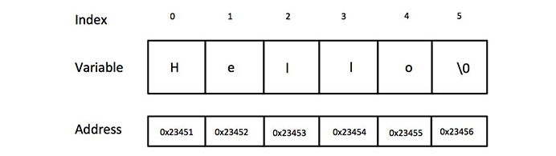

# _C Programming Tutorial_
## C - [Basic Syntax](#basic-syntax)
## C - [Data Types](#data-types)
## C - [Variables](#variables)
## C - [Constants](#constants)
## C - [Storage Classes](#storage-classes)
## C - [Operators](#operators)
## C - [Decision Making](#decision-making)
## C - [Loops](#loops)
## C - [Functions](#functions)
## C - [Scope Rules](#scope-rules)
## C - [Arrays](#arrays)
## C - [Pointers](#pointers)
## C - [Strings](#strings)
## C - [Structures](#structures)
## C - [Unions](#unions)
## C - [Bit Fields](#bit-fields)
## C - [Typedef](#typedef)
## C - [Input & Output](#input-output)
## C - [File I/O](#file-io)
## C - [Preprocessors](#preprocessors)
## C - [Header Files](#headerfiles)
## C - [Type Casting](#type-casting)
## C - [Error Handling](#error-handling)
## C - [Recursion](#recursion)
## C - [Variable Arguments](#variable-arguments)
## C - [Memory Management](#memory-management)
## C - [Command Line Arguments](#command-line-arguments)

# _C Programming useful Resources_
## C - [Questions & Answers](#questions-answers)
## C - [Quick Guide](#quick-uide)
## C - [Useful Resources](#useful-resources)
## C - [Discussion](#discussion)

/* -------------------------------------------------------------------- */

# _C Programming Tutorial_
## <a id="basic-syntax"></a> C - Basic Syntax
  ### **Tokens in C**
  A C program consists of various tokens and a token is either a keyword, an identifier, a constant, a string literal, <br>
  or a symbol. For example, the following C statement consists of five tokens −
  ```sh
    printf("Hello, World! \n");
  ```  
  The individual tokens are −
  ```sh
    printf
    (
       "Hello, World! \n"
    )
    ;
  ``` 
  ### **Semicolons**
  In a C program, the semicolon is a statement terminator. That is, each individual statement must be ended with a <br> semicolon. It indicates the end of one logical entity.
  ```sh
    printf("Hello, World! \n");
    return 0;
  ```
  ### **Comments**
  Comments are like helping text in your C program and they are ignored by the compiler. They start with /* and terminate  <br> with the characters */ as shown below −
  ```sh
    /* my first program in C */
  ```
  You cannot have comments within comments and they do not occur within a string or character literals
  ### **dentifiers**
  A C identifier is a name used to identify a variable, function, or any other user-defined item. An identifier starts <br> with a letter A to Z, a to z, or an underscore '_' followed by zero or more letters, underscores, and digits (0 to 9). <br>
	C does not allow punctuation characters such as @, $, and % within identifiers. C is a case-sensitive programming <br> language. Thus, Manpower and manpower are two different identifiers in C. Here are some examples of acceptable identifiers −
  
  Given below are two different statements −
  ```sh
    mohd       zara    abc   move_name  a_123
    myname50   _temp   j     a23b9      retVal
  ```
  
  ### **Keywords**
  The following list shows the reserved words in C. These reserved words may not be used as constants or <br> variables or any other identifier names.

|             |    	         |    	           |    	          |
| ----------- | ------------ | --------------- | -------------- |
|    break    |	    enum     |    	register   |     typedef    |
|    case     |    extern    |    return       |    union       |
|    char     |	    float    |	    short      |    unsigned    |
|    const    |    for       |    signed       |    void        |
|    continue |    goto      |    sizeof       |    volatile    |
|    default  |    if        |    static       |    while       |
|    do    	  |    int       |    struct	     |    _Packed     |
|    double   |              |                 |                |	

## <a id="data-types"></a> C - Data Types
Data types in c refer to an extensive system used for declaring variables or functions <br> of different types. The type of a variable determines how much space it occupies in <br> storage and how the bit pattern stored is interpreted.

The types in C can be classified as follows −


|    Sr.No.    |    Types & Description                                             |
| ------------ | ------------------------------------------------------------------ |
|    1	       |    Basic Types                                                     |
|              |    They are arithmetic types and are further classified into: (a)  |  
|              |    integer types and (b) floating-point types.                     |
|    2	       |    Enumerated types                                                |
|              |    They are again arithmetic types and they are used to define     | 
|              |    variables that can only assign certain discrete integer values  |
|              |    throughout the program.                                         |
|    3	       |    The type void                                                   |
|              |    The type specifier void indicates that no value is available.   |
|    4	       |    Derived types                                                   |
|              |    They include (a) Pointer types, (b) Array types,                |
|              |    (c) Structure types, (d) Union types and (e) Function types.    |

The array types and structure types are referred collectively as the aggregate types. <br>
The type of a function specifies the type of the function's return value. We will see the basic types <br> in the following section, where as other types will be covered in the upcoming chapters. <br>

### **Integer Types**
The following table provides the details of standard integer types with their storage sizes and <br >value ranges −

|        Type       |    Storage size            |            Value range                  |
| ----------------- | -------------------------- | --------------------------------------- |  
|        char       |    1 byte	                 |        -128 to 127 or 0 to 255          |
|    unsigned char  |	   1 byte	                 |        0 to 255                         |    
|    signed char    |    1 byte	                 |        -128 to 127                      |
|    int	          |    2 or 4 bytes	           |        -32,768 to 32,767                |
|                   |                            |     or -2,147,483,648 to 2,147,483,647  |
|    unsigned int	  |    2 or 4 bytes            |    0 to 65,535 or 0 to 4,294,967,295    |
|    short	        |    2 bytes	               |        -32,768 to 32,767                |
|    unsigned short	|    2 bytes	               |        0 to 65,535                      |
|    long	          |    8 bytes or              |        -9223372036854775808             |
|                   |    (4bytes for 32 bit OS)	 |        to 9223372036854775807           |
|    unsigned long  |	   8 bytes	               |        0 to 18446744073709551615        |

To get the exact size of a type or a variable on a particular platform, you can use the sizeof 

operator. The expressions sizeof(type) yields the storage size of the object or type in bytes. Given 

below is an example to get the size of various type on a machine using different constant defined in 

limits.h header file −

Example
```sh
	#include <stdio.h>
	#include <stdlib.h>
	#include <limits.h>
	#include <float.h>
	
	int main(int argc, char** argv) {
	
		printf("CHAR_BIT    :   %d\n", CHAR_BIT);
		printf("CHAR_MAX    :   %d\n", CHAR_MAX);
		printf("CHAR_MIN    :   %d\n", CHAR_MIN);
		printf("INT_MAX     :   %d\n", INT_MAX);
		printf("INT_MIN     :   %d\n", INT_MIN);
		printf("LONG_MAX    :   %ld\n", (long) LONG_MAX);
		printf("LONG_MIN    :   %ld\n", (long) LONG_MIN);
		printf("SCHAR_MAX   :   %d\n", SCHAR_MAX);
		printf("SCHAR_MIN   :   %d\n", SCHAR_MIN);
		printf("SHRT_MAX    :   %d\n", SHRT_MAX);
		printf("SHRT_MIN    :   %d\n", SHRT_MIN);
		printf("UCHAR_MAX   :   %d\n", UCHAR_MAX);
		printf("UINT_MAX    :   %u\n", (unsigned int) UINT_MAX);
		printf("ULONG_MAX   :   %lu\n", (unsigned long) ULONG_MAX);
		printf("USHRT_MAX   :   %d\n", (unsigned short) USHRT_MAX);	
		return 0;

	}
```
### **Floating-Point Types**
The following table provide the details of standard floating-point types with storage sizes and value 

ranges and their precision −

Table
|    Type        |    Storage size    |        Value range        |        Precision        |
| -------------- | ------------------ | ------------------------- | ----------------------- |
|    float       |	    4 byte        |	    1.2E-38 to 3.4E+38    |    6 decimal places     |
|    double      |	    8 byte        |     2.3E-308 to 1.7E+308	|    15 decimal places    |
|    long double |	    10 byte       |	    3.4E-4932 to 1.1E+4932|    19 decimal places    |

The header file float.h defines macros that allow you to use these values and other details about the 

binary representation of real numbers in your programs. The following example prints the storage space 

taken by a float type and its range values −

```sh
	#include <stdio.h>
	#include <stdlib.h>
	#include <limits.h>
	#include <float.h>
	
	int main(int argc, char** argv) {
	
		printf("Storage size for float : %d \n", sizeof(float));
		printf("FLT_MAX     :   %g\n", (float) FLT_MAX);
		printf("FLT_MIN     :   %g\n", (float) FLT_MIN);
		printf("-FLT_MAX    :   %g\n", (float) -FLT_MAX);
		printf("-FLT_MIN    :   %g\n", (float) -FLT_MIN);
		printf("DBL_MAX     :   %g\n", (double) DBL_MAX);
		printf("DBL_MIN     :   %g\n", (double) DBL_MIN);
		printf("-DBL_MAX     :  %g\n", (double) -DBL_MAX);
		printf("Precision value: %d\n", FLT_DIG );

		return 0;
	}
```
### **The void Type**
The void type specifies that no value is available. It is used in three kinds of situations −


|        Sr.No.        |                Types & Description                                             |
| -------------------- | ------------------------------------------------------------------------------ |
|        1	           |    Function returns as void                                                    |
|                      |    There are various functions in C which do not return any value or you can   |                      
|                      |    say they return void. A function with no return value has the return type   |                      
|                      |    as void. For example, void exit (int status);                               |
|        2	           |    Function arguments as void                                                  |
|                      |    There are various functions in C which do not accept any parameter.         |
|                      |    A function with no parameter can accept a void. For example, int rand(void);|
|        3             |    Pointers to void                                                            |
|                      |    A pointer of type void * represents the address of an object,               |
|                      |    but not its type. For example, a memory allocation function                 |
|                      |    void *malloc( size_t size ); returns a pointer to void which                |
|                      |    can be casted to any data type.                                             |

## <a id="variables"></a> C - Variables
A variable is nothing but a name given to a storage area that our programs can manipulate. <br>
Each variable in C has a specific type, which determines the size and layout of the variable's memory; <br>
the range of values that can be stored within that memory; and the set of operations that can be applied to the variable. <br>

The name of a variable can be composed of letters, digits, and the underscore character. <br>
It must begin with either a letter or an underscore. Upper and lowercase letters are distinct because C is case-sensitive. <br>
Based on the basic types explained in the previous chapter, there will be the following basic variable types − <br>

|    Sr.No.    |    Type & Description1                        	                |
|    1         |    char                                                        |
|              |    Typically a single octet(one byte). It is an integer type.  |
|    2	       |    int                                                         |
|              |    The most natural size of integer for the machine.           |
|    3	       |    float                                                       |
|              |    A single-precision floating point value.                    |
|    4	       |    double                                                      |
|              |    A double-precision floating point value.                    |
|    5	       |    void                                                        |
|              |    Represents the absence of type.                             |

C programming language also allows to define various other types of variables, which we will cover in subsequent chapters like <br> Enumeration, Pointer, Array, Structure, Union, etc. For this chapter, let us study only basic variable types.

### **Variable Definition in C**
A variable definition tells the compiler where and how much storage to create for the variable. A variable definition specifies a data <br> type and contains a list of one or more variables of that type as follows −

```sh
  type variable_list;
```

Here, type must be a valid C data type including char, w_char, int, float, double, bool, or any user-defined object; and variable_list <br> may consist of one or more identifier names separated by commas. Some valid declarations are shown here −

```sh
	int    i, j, k;
	char   c, ch;
	float  f, salary;
	double d;
```

The line int i, j, k; declares and defines the variables i, j, and k; which instruct the compiler to create variables named i, j and k <br> of type int.

Variables can be initialized (assigned an initial value) in their declaration. The initializer consists of an equal sign followed by a <br> constant expression as follows −

```sh
  type variable_name = value;
```

Some examples are −
```sh
	extern int d = 3, f = 5;    // declaration of d and f. 
	int d = 3, f = 5;           // definition and initializing d and f. 
	byte z = 22;                // definition and initializes z. 
	char x = 'x';               // the variable x has the value 'x'.
```

For definition without an initializer: variables with static storage duration are implicitly initialized with NULL (all bytes <br> have the value 0); the initial value of all other variables are undefined.

### **Variable Declaration in C**
A variable declaration provides assurance to the compiler that there exists a variable with the given type and name so that <br> the compiler can proceed for further compilation without requiring the complete detail about the variable. A variable <br> definition has its meaning at the time of compilation only, the compiler needs actual variable definition at the time of 
<br> linking the program.

A variable declaration is useful when you are using multiple files and you define your variable in one of the files which will <br> be available at the time of linking of the program. You will use the keyword extern to declare a variable at any place. <br> Though you can declare a variable multiple times in your C program, it can be defined only once in a file, a function, or <br> a block of code.

```sh
	#include <stdio.h>

	// Variable declaration:
	extern int a, b;
	extern int c;
	extern float f;
	
	int main () {
	
		/* variable definition: */
		int a, b;
		int c;
		float f;
	
		/* actual initialization */
		a = 10;
		b = 20;
	
		c = a + b;
		printf("value of c : %d \n", c);

		f = 70.0/3.0;
		printf("value of f : %f \n", f);
	
		return 0;
	}
```

### **Lvalues and Rvalues in C**
There are two kinds of expressions in C −

  - lvalue − Expressions that refer to a memory location are called "lvalue" expressions. An lvalue may appear as either the <br> left-hand or right-hand side of an assignment.

  - rvalue − The term rvalue refers to a data value that is stored at some address in memory. An rvalue is an expression that <br> cannot have a value assigned to it which means an rvalue may appear on the right-hand side but not on the left-hand <br> side of an assignment.

Variables are lvalues and so they may appear on the left-hand side of an assignment. Numeric literals are rvalues and so they <br> may not be assigned and cannot appear on the left-hand side. Take a look at the following valid and invalid statements −

```sh
  int g = 20; // valid statement
  10 = 20; // invalid statement; would generate compile-time error
```

## <a id="constants"></a> C - Constants
Constants refer to fixed values that the program may not alter during its execution. These fixed values are also called <br> literals.

Constants can be of any of the basic data types like an integer constant, a floating constant, a character constant, or a <br> string literal. There are enumeration constants as well.

Constants are treated just like regular variables except that their values cannot be modified after their definition.

### **Integer Literals**
An integer literal can be a decimal, octal, or hexadecimal constant. A prefix specifies the base or radix: 0x or 0X for <br> hexadecimal, 0 for octal, and nothing for decimal.

An integer literal can also have a suffix that is a combination of U and L, for unsigned and long, respectively. The suffix <br> can be uppercase or lowercase and can be in any order.

Here are some examples of integer literals −
```sh
	212         /* Legal */
	215u        /* Legal */
	0xFeeL      /* Legal */
	078         /* Illegal: 8 is not an octal digit */
	032UU       /* Illegal: cannot repeat a suffix */
```

Following are other examples of various types of integer literals −
```sh
	85         /* decimal */
	0213       /* octal */
	0x4b       /* hexadecimal */
	30         /* int */
	30u        /* unsigned int */
	30l        /* long */
	30ul       /* unsigned long */
```

### **Floating-point Literals**
A floating-point literal has an integer part, a decimal point, a fractional part, and an exponent part. You can represent <br> floating point literals either in decimal form or exponential form.

While representing decimal form, you must include the decimal point, the exponent, or both; and while representing <br> exponential form, you must include the integer part, the fractional part, or both. The signed exponent is introduced by e or E.

Here are some examples of floating-point literals −
```sh
	3.14159       /* Legal */
	314159E-5L    /* Legal */
	510E          /* Illegal: incomplete exponent */
	210f          /* Illegal: no decimal or exponent */
	.e55          /* Illegal: missing integer or fraction */
```

### **Character Constants**
Character literals are enclosed in single quotes, e.g., 'x' can be stored in a simple variable of char type.

A character literal can be a plain character (e.g., 'x'), an escape sequence (e.g., '\t'), or a universal character (e.g., <br> '\u02C0').

There are certain characters in C that represent special meaning when preceded by a backslash for example, newline (\n) or <br> tab (\t).

|    Escape sequence	    |    Meaning                                        |
| ----------------------- | ------------------------------------------------- |
|    \\	                  |    \ character                                    
|    \'	                  |    ' character
|    \"	                  |    " character
|    \?	                  |    ? character
|    \a	                  |    Alert or bell
|    \b	                  |    Backspace
|    \f	                  |    Form feed
|    \n	                  |    Newline
|    \r	                  |    Carriage return
|    \t	                  |    Horizontal tab
|    \v	                  |    Vertical tab
|    \ooo	                |    Octal number of one to three digits
|    \xhh                 |    Hexadecimal number of one or more digits


Following is the example to show a few escape sequence characters −
```sh
	#include <stdio.h>

	int main() {
		printf("Hello\tWorld\n\n");

		return 0;
	}
```

### **Defining Constants**
There are two simple ways in C to define constants −

  - Using #define preprocessor.
  - Using const keyword.

### **The #define Preprocessor**
Example
```sh
	#include <stdio.h>

	#define LENGTH 10   
	#define WIDTH  5
	#define NEWLINE '\n'
	
	int main() {
		int area;  
	
		area = LENGTH * WIDTH;
		printf("value of area : %d", area);
		printf("%c", NEWLINE);

		return 0;
	}
```

### **The const Keyword**
Example
```sh
	#include <stdio.h>

	int main() {
		const int  LENGTH = 10;
		const int  WIDTH = 5;
		const char NEWLINE = '\n';
		int area;  
		
		area = LENGTH * WIDTH;
		printf("value of area : %d", area);
		printf("%c", NEWLINE);

		return 0;
	}
```
## <a id="storage-classes"></a> C - Storage Classes
A storage class defines the scope (visibility) and life-time of variables and/or functions within a C Program. They precede <br> the type that they modify. We have four different storage classes in a C program −
  - auto
  - register
  - static
  - extern

### **The auto Storage Class**
The auto storage class is the default storage class for all local variables.
```sh
	{
		int mount;
		auto int month;
	}
```
The example above defines two variables with in the same storage class. 'auto' can only be used within functions, i.e., <br> local variables.

### **The register Storage Class**
The register storage class is used to define local variables that should be stored in a register instead of RAM. This means <br> that the variable has a maximum size equal to the register size (usually one word) and can't have the unary '&' <br> operator applied to it (as it does not have a memory location).
```sh
	{
		register int  miles;
	}
```
### **The static Storage Class**
The static storage class instructs the compiler to keep a local variable in existence during the life-time of the program <br> instead of creating and destroying it each time it comes into and goes out of scope. Therefore, making local variables <br> static allows them to maintain their values between function calls.

The static modifier may also be applied to global variables. When this is done, it causes that variable's scope to be <br> restricted to the file in which it is declared.

In C programming, when static is used on a global variable, it causes only one copy of that member to be shared by all the <br> objects of its class.
```sh
	#include <stdio.h>
 
	/* function declaration */
	void func(void);
		
	static int count = 5; /* global variable */
		
	main() {
	
			while(count--) {
				func();
			}
		
			return 0;
	}
	
	/* function definition */
	void func( void ) {
	
			static int i = 5; /* local static variable */
			i++;
	
			printf("i is %d and count is %d\n", i, count);
	}
```

### **The extern Storage Class**
The extern storage class is used to give a reference of a global variable that is visible to ALL the program files. When you <br> use 'extern', the variable cannot be initialized however, it points the variable name at a storage location that has <br> been previously defined.

When you have multiple files and you define a global variable or function, which will also be used in other files, then <br> extern will be used in another file to provide the reference of defined variable or function. Just for understanding, extern <br> is used to declare a global variable or function in another file.

The extern modifier is most commonly used when there are two or more files sharing the same global variables or functions as <br> explained below.

**First File: main.c**
```sh
	#include <stdio.h>
 
	int count ;
	extern void write_extern();
		
	main() {
			count = 5;
			write_extern();
	}
```
**Second File: support.c**
```sh
	#include <stdio.h>
 
	extern int count;
		
	void write_extern(void) {
			printf("count is %d\n", count);
	}
```

Here, extern is being used to declare count in the second file, where as it has its definition in the first file, main.c. <br> Now, compile these two files as follows −
```sh
  $gcc main.c support.c
```
It will produce the executable program a.out. When this program is executed, it produces the following result −
```sh
  count is 5
```

## <a id="operators"></a> C - Operators
An operator is a symbol that tells the compiler to perform specific mathematical or logical functions. C language is rich in <br> built-in operators and provides the following types of operators −

  - Arithmetic Operators
  - Relational Operators
  - Logical Operators
  - Bitwise Operators
  - Assignment Operators
  - Misc Operators

We will, in this chapter, look into the way each operator works.

### **Arithmetic Operators**
The following table shows all the arithmetic operators supported by the C language. Assume variable A holds 10 and variable B holds 20 then −
|    Operator    |        	Description                                            |    	Example    |
| -------------- | --------------------------------------------------------------- | --------------- |
|       +	       |    Adds two operands.	                                         |    A + B = 30
|       −	       |    Subtracts second operand from the first.	                   |    A − B = -10    
|       *	       |    Multiplies both operands.	                                   |    A * B = 200
|       /	       |    Divides numerator by de-numerator.	                         |    B / A = 2
|       %	       |    Modulus Operator and remainder of after an integer division. |    B % A = 0
|       ++       |    Increment operator increases the integer value by one.	     |    A++ = 11
|       --       |    Decrement operator decreases the integer value by one.	     |    A-- = 9

### **Relational Operators**
The following table shows all the relational operators supported by C. Assume variable A holds 10 and ?<br> variable B holds 20 then −

|    Operator    |                        	Description                                |   	    Example            |
| -------------- | ------------------------------------------------------------------- | ------------------------- |
|    ==          |    Checks if the values of two operands are equal or not.           |                           |
|                |    If yes, then the condition becomes true.	                       |    (A == B) is not true.  |
|    !=	         |    Checks if the values of two operands are equal or not.           |                           |
|                |    If the values are not equal, then the condition becomes true.    |    (A != B) is true.      |
|    >           |    Checks if the value of left operand is greater than the          |                           |
|                |    value of right operand. If yes, then the condition becomes true. |    (A > B) is not true.   |
|    <	         |    Checks if the value of left operand is less than the value       |                           |
|                |    of right operand. If yes, then the condition becomes true.	     |    (A < B) is true.       |
|    >=	         |    Checks if the value of left operand is greater than or equal     |                           |
|                |    to the value of right operand. If yes, then the condition        |                           |
|                |    becomes true.	                                                   |    (A >= B) is not true.  |
|    <=	         |    Checks if the value of left operand is less than or equal        |                           |
|                |    to the value of right operand. If yes, then the condition        |                           |
|                |    becomes true.	                                                   |    (A <= B) is true.      |

### **Logical Operators**
Following table shows all the logical operators supported by C language. Assume variable A holds 1 and variable B holds 0, then −

|    Operator    |                        Description                                  |    	Example              |
| -------------- | ------------------------------------------------------------------- | ------------------------- |
|    &&	         |    Called Logical AND operator. If both the operands are non-zero,  |                           |
|                |    then the condition becomes true.	                               |    (A && B) is false.     |    
|    //          |    Called Logical OR Operator. If any of the two operands is        |                           |
|                |    non-zero, then the condition becomes true.	                     |    (A // B) is true.      |
|    !	         |    Called Logical NOT Operator. It is used to reverse the logical   |                           |
|                |    state of its operand. If a condition is true, then Logical NOT   |                           |
|                |    operator will make it false.	                                   |    !(A && B) is true.     |

### **Bitwise Operators**
Bitwise operator works on bits and perform bit-by-bit operation. The truth tables for &, |, and ^ is as follows −

|    p    |    q	    |    p & q    |    p / q    |    	p ^ q    |
| ------- | --------- | ----------- | ----------- | ------------ |
|    0    |	    0     |    	0       |    	0       |    	0        |
|    0    |   	1     |   	0       |   	1       |  	  1        |
|    1    |   	1     |   	1       |   	1       |  	  0        |
|    1    |   	0     |   	0       |   	1       |  	  1        |

Assume A = 60 and B = 13 in binary format, they will be as follows −

A = 0011 1100

B = 0000 1101

-----------------

A&B = 0000 1100

A | B = 0011 1101

A^B = 0011 0001

~A = 1100 0011

The following table lists the bitwise operators supported by C. Assume variable 'A' holds 60 and variable 'B' holds 13, then −

|    Operator    |    	Description                                                |    	Example                       |
| -------------- | --------------------------------------------------------------- | ---------------------------------- |
|      &	       |      Binary AND Operator copies a bit to the result if it       |
|                |      exists in both operands.	                                 |    (A & B) = 12, i.e., 0000 1100
|      |	       |      Binary OR Operator copies a bit if it exists in either     |
|                |      operand.	                                                 |    (A / B) = 61, i.e., 0011 1101
|      ^	       |      Binary XOR Operator copies the bit if it is set in one     |
|                |      operand but not both.	                                     |    (A ^ B) = 49, i.e., 0011 0001
|      ~	       |      Binary One's Complement Operator is unary and has the      |
|                |      effect of 'flipping' bits.	                               |    (~A ) = ~(60), i.e,. -0111101
|      <<        |      Binary Left Shift Operator. The left operands value is     |
|                |      moved left by the number of bits specified by the right    |
|                |      operand.	                                                 |    A << 2 = 240 i.e., 1111 0000
|      >>        |      Binary Right Shift Operator. The left operands value is    |
|                |      moved right by the number of bits specified by the right   |
|                |      operand.	                                                 |    A >> 2 = 15 i.e., 0000 1111

### **Assignment Operators**
The following table lists the assignment operators supported by the C language −


|    Operator    |    	Description                                            |	    Example
| -------------- | ----------------------------------------------------------- | -------------------------------------------------- |
|      =	       |      Simple assignment operator. Assigns values from right  |
|                |      side operands to left side operand	                   |      C = A + B will assign the value of A + B to C
|      +=	       |      Add AND assignment operator. It adds the right operand | 
|                |      to the left operand and assign the result to the left  |
|                |      operand.	                                             |      C += A is equivalent to C = C + A
|      -=	       |      Subtract AND assignment operator. It subtracts the     |
|                |      right operand from the left operand and assigns the    |
|                |      result to the left operand.	                           |      C -= A is equivalent to C = C - A
|      *=	       |      Multiply AND assignment operator. It multiplies the    |
|                |      right operand with the left operand and assigns the    |
|                |      result to the left operand.	                           |      C *= A is equivalent to C = C * A
|      /=	       |      Divide AND assignment operator. It divides the left    |
|                |      operand with the right operand and assigns the result  |
|                |      to the left operand.	                                 |      C /= A is equivalent to C = C / A
|      %=	       |      Modulus AND assignment operator. It takes modulus      |
|                |      using two operands and assigns the result to the left  |
|                |      operand.	                                             |      C %= A is equivalent to C = C % A
|      <<=       |      Left shift AND assignment operator.	                   |      C <<= 2 is same as C = C << 2
|      >>=       |      Right shift AND assignment operator.	                 |      C >>= 2 is same as C = C >> 2
|      &=	       |      Bitwise AND assignment operator.	                     |      C &= 2 is same as C = C & 2
|      ^=	       |      Bitwise exclusive OR and assignment operator.	         |      C ^= 2 is same as C = C ^ 2
|      |=	       |      Bitwise inclusive OR and assignment operator.	         |      C |= 2 is same as C = C | 2

### **Misc Operators ↦ sizeof & ternary**
Besides the operators discussed above, there are a few other important operators including sizeof and ? : supported by the C Language.

|    Operator    |    	Description                               |    	    Example   
| -------------- | ---------------------------------------------- | ----------------------------------------------------------- |       
|    sizeof()    |    	Returns the size of a variable.	          |    sizeof(a), where a is integer, will return 4.
|    &	         |      Returns the address of a variable.	      |    &a; returns the actual address of the variable.
|    *	         |      Pointer to a variable.	                  |    *a;
|    ? :         |	    Conditional Expression.	                  |    If Condition is true ? then value X : otherwise value Y

### **Operators Precedence in C**
Operator precedence determines the grouping of terms in an expression and decides how an expression is evaluated. Certain operators have higher <br> precedence than others; for example, the multiplication operator has a higher precedence than the addition operator.

For example, x = 7 + 3 * 2; here, x is assigned 13, not 20 because operator * has a higher precedence than +, so it first gets multiplied with 3*2 <br> and then adds into 7.

Here, operators with the highest precedence appear at the top of the table, those with the lowest appear at the bottom. Within an expression, <br> higher precedence operators will be evaluated first.

|        Category        |        	Operator                    |        	Associativity
| ---------------------- | ------------------------------------ | ---------------------------- |
|    Postfix	           |    () [] -> . ++ - -	                |    Left to right
|    Unary	             |    + - ! ~ ++ - - (type)* & sizeof	  |    Right to left
|    Multiplicative	     |    * / %	                            |    Left to right
|    Additive	           |    + -	                              |    Left to right
|    Shift	             |    << >>	                            |    Left to right
|    Relational	         |    < <= > >=	                        |    Left to right
|    Equality	           |    == !=	                            |    Left to right
|    Bitwise AND	       |    &	                                |    Left to right
|    Bitwise XOR	       |    ^	                                |    Left to right
|    Bitwise OR	         |    /	                                |    Left to right
|    Logical AND	       |    &&	                              |    Left to right
|    Logical OR	         |    //	                              |    Left to right
|    Conditional	       |    ?:	                              |    Right to left
|    Assignment	         |    = += -= *= /= %=>>= <<= &= ^= /=	|    Right to left
|    Comma	             |    ,	                                |    Left to right

## <a id="decision-making"></a> C - Decision Making
Decision making structures require that the programmer specifies one or more conditions to be evaluated or tested by the program, along <br> with a statement or statements to be executed if the condition is determined to be true, and optionally, other statements to be <br> executed if the condition is determined to be false.

Show below is the general form of a typical decision making structure found in most of the programming languages −
    

C programming language assumes any non-zero and non-null values as true, and if it is either zero or null, then it is assumed as false value.

C programming language provides the following types of decision making statements.

|    Sr.No.   |    Statement & Description    
| ----------- | -------------------------------------------------------------------------------------------------------- |
|    1        |	   [if statement](https://www.tutorialspoint.com/cprogramming/if_statement_in_c.htm)
|             |    An if statement consists of a boolean expression followed by one or more statements.
|    2	      |    [if...else statement](https://www.tutorialspoint.com/cprogramming/if_else_statement_in_c.htm)
|             |    An if statement can be followed by an optional else statement, which executes when the Boolean expression is false.
|    3        |    [nested if statements](https://www.tutorialspoint.com/cprogramming/nested_if_statements_in_c.htm)
|             |    You can use one if or else if statement inside another if or else if statement(s).
|    4	      |    [switch statement](https://www.tutorialspoint.com/cprogramming/switch_statement_in_c.htm)
|             |    A switch statement allows a variable to be tested for equality against a list of values.
|    5	      |    [nested switch statements](https://www.tutorialspoint.com/cprogramming/nested_switch_statements_in_c.htm)
|             |    You can use one switch statement inside another switch statement(s).

### **The ? : Operator**
We have covered conditional operator ? : in the previous chapter which can be used to replace if...else statements. It has the following <br> general form −
```sh
  Exp1 ? Exp2 : Exp3;
```
Where Exp1, Exp2, and Exp3 are expressions. Notice the use and placement of the colon.
<br> The value of a ? expression is determined like this −
  - Exp1 is evaluated. If it is true, then Exp2 is evaluated and becomes the value of the entire ? expression.
  - If Exp1 is false, then Exp3 is evaluated and its value becomes the value of the expression.

## <a id="loops"></a> C - Loops
You may encounter situations, when a block of code needs to be executed several number of times. In general, statements are executed <br>sequentially: The first statement in a function is executed first, followed by the second, and so on.

Programming languages provide various control structures that allow for more complicated execution paths.

A loop statement allows us to execute a statement or group of statements multiple times. Given below is the general form of a loop <br> statement in most of the programming languages −
    
  

C programming language provides the following types of loops to handle looping requirements.

|    Sr.No.    |    	Loop Type & Description
| ------------ | ------------------------------------------------------------------------------------ |
|    1	       |    [while loop](https://www.tutorialspoint.com/cprogramming/c_while_loop.htm)
|              |    Repeats a statement or group of statements while a given condition is true. 
|              |    It tests the condition before executing the loop body.
|    2	       |    [for loop](https://www.tutorialspoint.com/cprogramming/c_for_loop.htm)
|              |    Executes a sequence of statements multiple times and abbreviates the code that manages the loop variable.
|    3	       |    [do...while loop](https://www.tutorialspoint.com/cprogramming/c_do_while_loop.htm)
|              |    It is more like a while statement, except that it tests the condition at the end of the loop body.
|    4	       |    [nested loops](https://www.tutorialspoint.com/cprogramming/c_nested_loops.htm)
|              |    You can use one or more loops inside any other while, for, or do..while loop.

### **Loop Control Statements**
Loop control statements change execution from its normal sequence. When execution leaves a scope, all automatic objects that were created <br>in that scope are destroyed.

C supports the following control statements.

|    Sr.No.	    |    Control Statement & Description
| ------------- | ---------------------------------------------------------------------------- |
|    1          |    [break statement](https://www.tutorialspoint.com/cprogramming/c_break_statement.htm)
|               |    Terminates the loop or switch statement and transfers execution to the 
|               |    statement immediately following the loop or switch.
|    2	        |    [continue statement](https://www.tutorialspoint.com/cprogramming/c_continue_statement.htm)
|               |    Causes the loop to skip the remainder of its body and immediately retest its condition prior to reiterating.
|    3	        |    [goto statement](https://www.tutorialspoint.com/cprogramming/c_goto_statement.htm)
|               |    Transfers control to the labeled statement.

### **he Infinite Loop**
A loop becomes an infinite loop if a condition never becomes false. The for loop is traditionally used for this purpose. Since none of <br> the three expressions that form the 'for' loop are required, you can make an endless loop by leaving the conditional expression empty.
```sh
	#include <stdio.h>
 
	int main () {
	
			for( ; ; ) {
				printf("This loop will run forever.\n");
			}
	
			return 0;
	}
```
When the conditional expression is absent, it is assumed to be true. You may have an initialization and increment expression, but C <br> programmers more commonly use the for(;;) construct to signify an infinite loop.

## <a id="functions"></a> C - Functions
A function is a group of statements that together perform a task. Every C program has at least one function, which is main(), and all the <br> most trivial programs can define additional functions.

You can divide up your code into separate functions. How you divide up your code among different functions is up to you, but logically <br> the division is such that each function performs a specific task.

A function declaration tells the compiler about a function's name, return type, and parameters. A function definition provides the actual <br> body of the function.

The C standard library provides numerous built-in functions that your program can call. For example, strcat() to concatenate two strings, <br> memcpy() to copy one memory location to another location, and many more functions.

A function can also be referred as a method or a sub-routine or a procedure, etc.

### **Defining a Function**
The general form of a function definition in C programming language is as follows −
```sh
	return_type function_name( parameter list ) {
		body of the function
	}
```

A function definition in C programming consists of a function header and a function body. Here are all the parts of a function −

  - **Return Type** − A function may return a value. The return_type is the data type of the value the function returns. Some functions perform the desired operations without returning a value. In this case, the return_type is the keyword void.

  - **Function Name** − This is the actual name of the function. The function name and the parameter list together constitute the function signature.

  - **Parameters** − A parameter is like a placeholder. When a function is invoked, you pass a value to the parameter. This value is referred to as actual parameter or argument. The parameter list refers to the type, order, and number of the parameters of a function. Parameters are optional; that is, a function may contain no parameters.

  - **Function Body** − The function body contains a collection of statements that define what the function does.

Example
<br>Given below is the source code for a function called max(). This function takes two parameters num1 and num2 and returns the maximum <br>value between the two −

```sh
	/* function returning the max between two numbers */
	int max(int num1, int num2) {
	
			/* local variable declaration */
			int result;
		
			if (num1 > num2)
				result = num1;
			else
				result = num2;
		
			return result; 
	}
```
### **Function Declarations**
A function declaration tells the compiler about a function name and how to call the function. The actual body of the function can be <br>defined separately.

A function declaration has the following parts −
```sh
  return_type function_name( parameter list );
```
For the above defined function max(), the function declaration is as follows −
```sh
  int max(int num1, int num2);
```
Parameter names are not important in function declaration only their type is required, so the following is also a valid declaration −
```sh
  int max(int, int);
```
Function declaration is required when you define a function in one source file and you call that function in another file. In such case, <br> you should declare the function at the top of the file calling the function.

### **Calling a Function**
While creating a C function, you give a definition of what the function has to do. To use a function, you will have to call that function <br>to perform the defined task.

When a program calls a function, the program control is transferred to the called function. A called function performs a defined task and <br>when its return statement is executed or when its function-ending closing brace is reached, it returns the program control back to <br>the main program.

To call a function, you simply need to pass the required parameters along with the function name, and if the function returns a value, <br> then you can store the returned value. For example −
```sh
	#include <stdio.h>
 
	/* function declaration */
	int max(int num1, int num2);
		
	int main () {
	
			/* local variable definition */
			int a = 100;
			int b = 200;
			int ret;
		
			/* calling a function to get max value */
			ret = max(a, b);
		
			printf( "Max value is : %d\n", ret );
		
			return 0;
	}
		
	/* function returning the max between two numbers */
	int max(int num1, int num2) {
	
			/* local variable declaration */
			int result;
		
			if (num1 > num2)
				result = num1;
			else
				result = num2;
		
			return result; 
	}
```

### **Function Arguments**
If a function is to use arguments, it must declare variables that accept the values of the arguments. These variables are called the <br> formal parameters of the function.

Formal parameters behave like other local variables inside the function and are created upon entry into the function and destroyed upon exit.

While calling a function, there are two ways in which arguments can be passed to a function −
|    Sr.No.    |    	Call Type & Description  
| ------------ | ---------------------------------------------------------------------- |                                  
|    1         |	    [Call by value](https://www.tutorialspoint.com/cprogramming/c_function_call_by_value.htm)
|              |      This method copies the actual value of an argument into the formal parameter of the function. In this case, changes |              |      made to the parameter inside the function have no effect on the argument.
|    2	       |      [Call by reference](https://www.tutorialspoint.com/cprogramming/c_function_call_by_reference.htm)
|              |      This method copies the address of an argument into the formal parameter. Inside the function, the address is used |              |      to access the actual argument used in the call. This means that changes made to the parameter affect the argument.

By default, C uses call by value to pass arguments. In general, it means the code within a function cannot alter the arguments used to <br> call the function.

## <a id="scope-rules"></a> C - Scope Rules
A scope in any programming is a region of the program where a defined variable can have its existence and beyond that variable it cannot <br> be accessed. There are three places where variables can be declared in C programming language −

  - Inside a function or a block which is called local variables.
  - Outside of all functions which is called global variables.
  - In the definition of function parameters which are called formal parameters.

Let us understand what are local and global variables, and formal parameters.
### **Local Variables**
Variables that are declared inside a function or block are called local variables. They can be used only by statements that are inside <br> that function or block of code. Local variables are not known to functions outside their own. The following example shows how local <br> variables are used. Here all the variables a, b, and c are local to main() function.

```sh
	#include <stdio.h>
 
	int main () {
	
		/* local variable declaration */
		int a, b;
		int c;
		
		/* actual initialization */
		a = 10;
		b = 20;
		c = a + b;
		
		printf ("value of a = %d, b = %d and c = %d\n", a, b, c);
		
		return 0;
	}
```

### **Global Variables**
Global variables are defined outside a function, usually on top of the program. Global variables hold their values throughout the <br> lifetime of your program and they can be accessed inside any of the functions defined for the program.

A global variable can be accessed by any function. That is, a global variable is available for use throughout your entire program after <br>its declaration. The following program show how global variables are used in a program.
```sh
	#include <stdio.h>
 
	/* global variable declaration */
	int g;
		
	int main () {
	
		/* local variable declaration */
		int a, b;
		
		/* actual initialization */
		a = 10;
		b = 20;
		g = a + b;
		
		printf ("value of a = %d, b = %d and g = %d\n", a, b, g);
		
		return 0;
	}
```
A program can have same name for local and global variables but the value of local variable inside a function will take preference. <br> Here is an example −
```sh
	#include <stdio.h>
 
	/* global variable declaration */
	int g = 20;
		
	int main () {
	
		/* local variable declaration */
		int g = 10;
		
		printf ("value of g = %d\n",  g);
		
		return 0;
	}
```

### **Formal Parameters**
Formal parameters, are treated as local variables with-in a function and they take precedence over global variables. Following is an example −
```sh
	#include <stdio.h>
 
	/* global variable declaration */
	int a = 20;
		
	int main () {
	
		/* local variable declaration in main function */
		int a = 10;
		int b = 20;
		int c = 0;
	
		printf ("value of a in main() = %d\n",  a);
		c = sum( a, b);
		printf ("value of c in main() = %d\n",  c);
	
		return 0;
	}
	
	/* function to add two integers */
	int sum(int a, int b) {
	
			printf ("value of a in sum() = %d\n",  a);
			printf ("value of b in sum() = %d\n",  b);
	
			return a + b;
	}
```
### **Initializing Local and Global Variables**
When a local variable is defined, it is not initialized by the system, you must initialize it yourself. Global variables are initialized <br> automatically by the system when you define them as follows −
|    Data Type    |    	Initial Default Value    
| --------------- | ---------------------------- |
|    int	        |    0
|    char	        |    '\0'
|    float	      |    0
|    double	      |    0
|    pointer	    |    NULL

It is a good programming practice to initialize variables properly, otherwise your program may produce unexpected results, because <br> uninitialized variables will take some garbage value already available at their memory location.

## <a id="arrays"></a> C - Arrays
Arrays a kind of data structure that can store a fixed-size sequential collection of elements of the same type. An array is used to <br>store a collection of data, but it is often more useful to think of an array as a collection of variables of the same type.

Instead of declaring individual variables, such as number0, number1, ..., and number99, you declare one array variable such as numbers <br> and use numbers[0], numbers[1], and ..., numbers[99] to represent individual variables. A specific element in an array is accessed by an index.

All arrays consist of contiguous memory locations. The lowest address corresponds to the first element and the highest address to the <br>last element.

  

### **Declaring Arrays**
To declare an array in C, a programmer specifies the type of the elements and the number of elements required by an array as follows −
```sh
  type arrayName [ arraySize ];
```

This is called a single-dimensional array. The **arraySize** must be an integer constant greater than zero and **type** can be any valid <br> C data type. For example, to declare a 10-element array called **balance** of type double, use this statement −
```sh
  double balance[10];
```

### **Initializing Arrays**
You can initialize an array in C either one by one or using a single statement as follows −
```sh
  double balance[5] = {1000.0, 2.0, 3.4, 7.0, 50.0};
```

The number of values between braces { } cannot be larger than the number of elements that we declare for the array between square <br> brackets [ ].

If you omit the size of the array, an array just big enough to hold the initialization is created. Therefore, if you write −
```sh
  double balance[] = {1000.0, 2.0, 3.4, 7.0, 50.0};
```
You will create exactly the same array as you did in the previous example. Following is an example to assign a single element of the <br> array −
```sh
  balance[4] = 50.0;
```

The above statement assigns the 5th element in the array with a value of 50.0. All arrays have 0 as the index of their first element <br> which is also called the base index and the last index of an array will be total size of the array minus 1. Shown below is the <br> pictorial representation of the array we discussed above −

  

### **Accessing Array Elements**
An element is accessed by indexing the array name. This is done by placing the index of the element within square brackets after the <br> name of the array. For example −
```sh
  double salary = balance[9];
```
The above statement will take the 10th element from the array and assign the value to salary variable. The following example Shows how <br> to use all the three above mentioned concepts viz. declaration, assignment, and accessing arrays −
```sh
	#include <stdio.h>
 
	int main () {
	
		int n[ 10 ]; /* n is an array of 10 integers */
		int i,j;
	
		/* initialize elements of array n to 0 */         
		for ( i = 0; i < 10; i++ ) {
			n[ i ] = i + 100; /* set element at location i to i + 100 */
		}
		
		/* output each array element's value */
		for (j = 0; j < 10; j++ ) {
			printf("Element[%d] = %d\n", j, n[j] );
		}
	
		return 0;
	}
```

### **Arrays in Detail**
Arrays are important to C and should need a lot more attention. The following important concepts related to array should be clear to a C <br> programmer −

|    Sr.No.	    |    Concept & Description
| ------------- | -------------------------------------------------------------- |
|    1	        |    [Multi-dimensional arrays](https://www.tutorialspoint.com/cprogramming/c_multi_dimensional_arrays.htm)
|               |    C supports multidimensional arrays. The simplest form of the multidimensional array is the two-dimensional array.
|    2	        |    [Passing arrays to functions](https://www.tutorialspoint.com/cprogramming/c_passing_arrays_to_functions.htm)
|               |    You can pass to the function a pointer to an array by specifying the array's name without an index.
|    3	        |    [Return array from a function](https://www.tutorialspoint.com/cprogramming/c_return_arrays_from_function.htm)
|               |    C allows a function to return an array.
|    4	        |    [Pointer to an array](https://www.tutorialspoint.com/cprogramming/c_pointer_to_an_array.htm)
|               |    You can generate a pointer to the first element of an array by simply specifying the array name, without any index.

## <a id="pointers"></a> C - Pointers
Pointers in C are easy and fun to learn. Some C programming tasks are performed more easily with pointers, and other tasks, such as <br>dynamic memory allocation, cannot be performed without using pointers. So it becomes necessary to learn pointers to become a perfect <br>C programmer. Let's start learning them in simple and easy steps.

As you know, every variable is a memory location and every memory location has its address defined which can be accessed using ampersand <br>(&) operator, which denotes an address in memory. Consider the following example, which prints the address of the variables defined −
```sh
	#include <stdio.h>

	int main () {
	
		int  var1;
		char var2[10];

		printf("Address of var1 variable: %x\n", &var1  );
		printf("Address of var2 variable: %x\n", &var2  );

		return 0;
	}
```
### **What are Pointers?**
A pointer is a variable whose value is the address of another variable, i.e., direct address of the memory location. Like any variable <br> or constant, you must declare a pointer before using it to store any variable address. The general form of a pointer variable <br>declaration is −
```sh
	type *var-name;
```
Here, type is the pointer's base type; it must be a valid C data type and var-name is the name of the pointer variable. The asterisk * <br> used to declare a pointer is the same asterisk used for multiplication. However, in this statement the asterisk is being used to <br> designate a variable as a pointer. Take a look at some of the valid pointer declarations −
```sh
	int    *ip;    /* pointer to an integer */
	double *dp;    /* pointer to a double */
	float  *fp;    /* pointer to a float */
	char   *ch     /* pointer to a character */
```
The actual data type of the value of all pointers, whether integer, float, character, or otherwise, is the same, a long hexadecimal <br> number that represents a memory address. The only difference between pointers of different data types is the data type of the variable <br> or constant that the pointer points to.

### **How to Use Pointers?**
There are a few important operations, which we will do with the help of pointers very frequently. (a) We define a pointer variable, (b) <br> assign the address of a variable to a pointer and (c) finally access the value at the address available in the pointer variable. <br> This is done by using unary operator * that returns the value of the variable located at the address specified by its operand. The <br> following example makes use of these operations −
```sh
	#include <stdio.h>

	int main () {
	
		int  var = 20;   /* actual variable declaration */
		int  *ip;        /* pointer variable declaration */

		ip = &var;  /* store address of var in pointer variable*/

		printf("Address of var variable: %x\n", &var  );

		/* address stored in pointer variable */
		printf("Address stored in ip variable: %x\n", ip );

		/* access the value using the pointer */
		printf("Value of *ip variable: %d\n", *ip );

		return 0;
	}
```
### **NULL Pointers**
It is always a good practice to assign a NULL value to a pointer variable in case you do not have an exact address to be assigned. This <br> is done at the time of variable declaration. A pointer that is assigned NULL is called a null pointer.

The NULL pointer is a constant with a value of zero defined in several standard libraries. Consider the following program −
```sh
	#include <stdio.h>

	int main () {
	
			int  *ptr = NULL;
	
			printf("The value of ptr is : %x\n", ptr  );
		
			return 0;
	}
```
In most of the operating systems, programs are not permitted to access memory at address 0 because that memory is reserved by the <br> operating system. However, the memory address 0 has special significance; it signals that the pointer is not intended to point to an <br> accessible memory location. But by convention, if a pointer contains the null (zero) value, it is assumed to point to nothing.

To check for a null pointer, you can use an 'if' statement as follows −
```sh
	if(ptr)     /* succeeds if p is not null */
	if(!ptr)    /* succeeds if p is null */
```

### **Pointers in Detail**
Pointers have many but easy concepts and they are very important to C programming. The following important pointer concepts should be <br> clear to any C programmer −

|    Sr.No.    |    Concept & Description  
| ------------ | ------------------------------------------------------------- |  
|    1	       |    [Pointer arithmetic](https://www.tutorialspoint.com/cprogramming/c_pointer_arithmetic.htm)
|              |    There are four arithmetic operators that can be used in pointers: ++, --, +, -
|    2	       |    [Array of pointers](https://www.tutorialspoint.com/cprogramming/c_array_of_pointers.htm)
|              |    You can define arrays to hold a number of pointers.\
|    3	       |    [Pointer to pointer](https://www.tutorialspoint.com/cprogramming/c_pointer_to_pointer.htm)
|              |    C allows you to have pointer on a pointer and so on.
|    4	       |    [Passing pointers to functions in C](https://www.tutorialspoint.com/cprogramming/c_passing_pointers_to_functions.htm)
|              |    Passing an argument by reference or by address enable the passed argument 
|              |    to be changed in the calling function by the called function.
|    5	       |    [Return pointer from functions in C](https://www.tutorialspoint.com/cprogramming/c_return_pointer_from_functions.htm)
|              |    C allows a function to return a pointer to the local variable, static variable, 
|              |    and dynamically allocated memory as well.

## <a id="strings"></a> C - Strings
Strings are actually one-dimensional array of characters terminated by a null character '\0'. Thus a null-terminated string contains the <br> characters that comprise the string followed by a null.

The following declaration and initialization create a string consisting of the word "Hello". To hold the null character at the end of <br> the array, the size of the character array containing the string is one more than the number of characters in the word "Hello."
```sh
  char greeting[6] = {'H', 'e', 'l', 'l', 'o', '\0'};
```
If you follow the rule of array initialization then you can write the above statement as follows −

```sh
  char greeting[] = "Hello";
```
Following is the memory presentation of the above defined string in C/C++ −

  

Actually, you do not place the null character at the end of a string constant. The C compiler automatically places the '\0' at the end <br> of the string when it initializes the array. Let us try to print the above mentioned string −
```sh
	#include <stdio.h>

	int main () {
	
			char greeting[6] = {'H', 'e', 'l', 'l', 'o', '\0'};
			printf("Greeting message: %s\n", greeting );
			return 0;
	}
```
C supports a wide range of functions that manipulate null-terminated strings −

|    Sr.No.    |            	Function & Purpose
| ------------ | ----------------------------------------------------------------- |
|    1         |	      strcpy(s1, s2);
|              |        Copies string s2 into string s1.
|    2         |	      strcat(s1, s2);
|              |        Concatenates string s2 onto the end of string s1.
|   3          |        strlen(s1);
|              |        Returns the length of string s1.
|    4         |	      strcmp(s1, s2);
|              |        Returns 0 if s1 and s2 are the same; less than 0 if s1<s2; greater than 0 if s1>s2.
|    5         |	      strchr(s1, ch);
|              |        Returns a pointer to the first occurrence of character ch in string s1.
|    6         |    	  strstr(s1, s2);
|              |        Returns a pointer to the first occurrence of string s2 in string s1.

The following example uses some of the above-mentioned functions −
```sh
	#include <stdio.h>
	#include <string.h>
	
	int main () {
	
		char str1[12] = "Hello";
		char str2[12] = "World";
		char str3[12];
		int  len ;

		/* copy str1 into str3 */
		strcpy(str3, str1);
		printf("strcpy( str3, str1) :  %s\n", str3 );

		/* concatenates str1 and str2 */
		strcat( str1, str2);
		printf("strcat( str1, str2):   %s\n", str1 );

		/* total lenghth of str1 after concatenation */
		len = strlen(str1);
		printf("strlen(str1) :  %d\n", len );

		return 0;
	}
```
## <a id="structures"></a> C - Structures
Arrays allow to define type of variables that can hold several data items of the same kind. Similarly structure is another user defined <br> data type available in C that allows to combine data items of different kinds.

Structures are used to represent a record. Suppose you want to keep track of your books in a library. You might want to track the <br>following attributes about each book −
  - Title
  - Author
  - Subject
  - Book ID

### **Defining a Structure**
To define a structure, you must use the struct statement. The struct statement defines a new data type, with more than one member. The <br> format of the struct statement is as follows −
```sh
	struct [structure tag] {

		member definition;
		member definition;
		...
		member definition;
	} [one or more structure variables];  
```

The **structure tag** is optional and each member definition is a normal variable definition, such as int i; or float f; or any other <br> valid variable definition. At the end of the structure's definition, before the final semicolon, you can specify one or more <br> structure variables but it is optional. Here is the way you would declare the Book structure −
```sh
	struct Books {
		char  title[50];
		char  author[50];
		char  subject[100];
		int   book_id;
	} book;  
```
### **Accessing Structure Members**
To access any member of a structure, we use the member access operator (.). The member access operator is coded as a period between the <br> structure variable name and the structure member that we wish to access. You would use the keyword struct to define variables of <br> structure type. The following example shows how to use a structure in a program −
```sh
	#include <stdio.h>
	#include <string.h>
		
	struct Books {
			char  title[50];
			char  author[50];
			char  subject[100];
			int   book_id;
	};
		
	int main( ) {
	
		struct Books Book1;        /* Declare Book1 of type Book */
		struct Books Book2;        /* Declare Book2 of type Book */
	
		/* book 1 specification */
		strcpy( Book1.title, "C Programming");
		strcpy( Book1.author, "Nuha Ali"); 
		strcpy( Book1.subject, "C Programming Tutorial");
		Book1.book_id = 6495407;

		/* book 2 specification */
		strcpy( Book2.title, "Telecom Billing");
		strcpy( Book2.author, "Zara Ali");
		strcpy( Book2.subject, "Telecom Billing Tutorial");
		Book2.book_id = 6495700;
	
		/* print Book1 info */
		printf( "Book 1 title : %s\n", Book1.title);
		printf( "Book 1 author : %s\n", Book1.author);
		printf( "Book 1 subject : %s\n", Book1.subject);
		printf( "Book 1 book_id : %d\n", Book1.book_id);

		/* print Book2 info */
		printf( "Book 2 title : %s\n", Book2.title);
		printf( "Book 2 author : %s\n", Book2.author);
		printf( "Book 2 subject : %s\n", Book2.subject);
		printf( "Book 2 book_id : %d\n", Book2.book_id);

		return 0;
	}
```
### **Structures as Function Arguments**
You can pass a structure as a function argument in the same way as you pass any other variable or pointer.
```sh
	#include <stdio.h>
	#include <string.h>
		
	struct Books {
			char  title[50];
			char  author[50];
			char  subject[100];
			int   book_id;
	};
	
	/* function declaration */
	void printBook( struct Books book );
	
	int main( ) {
	
		struct Books Book1;        /* Declare Book1 of type Book */
		struct Books Book2;        /* Declare Book2 of type Book */
	
		/* book 1 specification */
		strcpy( Book1.title, "C Programming");
		strcpy( Book1.author, "Nuha Ali"); 
		strcpy( Book1.subject, "C Programming Tutorial");
		Book1.book_id = 6495407;

		/* book 2 specification */
		strcpy( Book2.title, "Telecom Billing");
		strcpy( Book2.author, "Zara Ali");
		strcpy( Book2.subject, "Telecom Billing Tutorial");
		Book2.book_id = 6495700;
	
		/* print Book1 info */
		printBook( Book1 );

		/* Print Book2 info */
		printBook( Book2 );

		return 0;
	}
	
	void printBook( struct Books book ) {
	
		printf( "Book title : %s\n", book.title);
		printf( "Book author : %s\n", book.author);
		printf( "Book subject : %s\n", book.subject);
		printf( "Book book_id : %d\n", book.book_id);
	}
```
### **Pointers to Structures**
You can define pointers to structures in the same way as you define pointer to any other variable −
```sh
  struct Books *struct_pointer;
```
Now, you can store the address of a structure variable in the above defined pointer variable. To find the address of a structure <br> variable, place the '&'; operator before the structure's name as follows −
```sh
  struct_pointer = &Book1;
```
To access the members of a structure using a pointer to that structure, you must use the → operator as follows −
```sh
  struct_pointer->title;
```
Let us re-write the above example using structure pointer.
```sh
	#include <stdio.h>
	#include <string.h>
		
	struct Books {
		char  title[50];
		char  author[50];
		char  subject[100];
		int   book_id;
	};
	
	/* function declaration */
	void printBook( struct Books *book );
	int main( ) {
	
		struct Books Book1;        /* Declare Book1 of type Book */
		struct Books Book2;        /* Declare Book2 of type Book */
	
		/* book 1 specification */
		strcpy( Book1.title, "C Programming");
		strcpy( Book1.author, "Nuha Ali"); 
		strcpy( Book1.subject, "C Programming Tutorial");
		Book1.book_id = 6495407;

		/* book 2 specification */
		strcpy( Book2.title, "Telecom Billing");
		strcpy( Book2.author, "Zara Ali");
		strcpy( Book2.subject, "Telecom Billing Tutorial");
		Book2.book_id = 6495700;
	
		/* print Book1 info by passing address of Book1 */
		printBook( &Book1 );

		/* print Book2 info by passing address of Book2 */
		printBook( &Book2 );

		return 0;
	}
	
	void printBook( struct Books *book ) {
	
		printf( "Book title : %s\n", book->title);
		printf( "Book author : %s\n", book->author);
		printf( "Book subject : %s\n", book->subject);
		printf( "Book book_id : %d\n", book->book_id);
	}
```

### **Bit Fields**
Bit Fields allow the packing of data in a structure. This is especially useful when memory or data storage is at a premium. Typical examples include −

  - Packing several objects into a machine word. e.g. 1 bit flags can be compacted.
  - Reading external file formats -- non-standard file formats could be read in, e.g., 9-bit integers.

C allows us to do this in a structure definition by putting :bit length after the variable. For example −
```sh
	struct packed_struct {
		unsigned int f1:1;
		unsigned int f2:1;
		unsigned int f3:1;
		unsigned int f4:1;
		unsigned int type:4;
		unsigned int my_int:9;
	} pack;
```
Here, the packed_struct contains 6 members: Four 1 bit flags f1..f3, a 4-bit type and a 9-bit my_int.

C automatically packs the above bit fields as compactly as possible, provided that the maximum length of the field is less than or equal <br> to the integer word length of the computer. If this is not the case, then some compilers may allow memory overlap for the fields <br> while others would store the next field in the next word.

## <a id="unions"></a> C - Unions
A union is a special data type available in C that allows to store different data types in the same memory location. You can define a <br> union with many members, but only one member can contain a value at any given time. Unions provide an efficient way of using the <br> same memory location for multiple-purpose.

### **Defining a Union**
To define a union, you must use the **union** statement in the same way as you did while defining a structure. The union statement defines a <br>new data type with more than one member for your program. The format of the union statement is as follows −
```sh
	union [union tag] {
		member definition;
		member definition;
		...
		member definition;
	} [one or more union variables];  
```

The **union tag** is optional and each member definition is a normal variable definition, such as int i; or float f; or any other valid <br> variable definition. At the end of the union's definition, before the final semicolon, you can specify one or more union variables <br> but it is optional. Here is the way you would define a union type named Data having three members i, f, and str −
```sh
	union Data {
		int i;
		float f;
		char str[20];
	} data;  
```

Now, a variable of **Data** type can store an integer, a floating-point number, or a string of characters. It means a single variable, i.<br> e., same memory location, can be used to store multiple types of data. You can use any built-in or user defined data types inside a <br> union based on your requirement.

The memory occupied by a union will be large enough to hold the largest member of the union. For example, in the above example, Data <br> type will occupy 20 bytes of memory space because this is the maximum space which can be occupied by a character string. The <br> following example displays the total memory size occupied by the above union −
```sh
	#include <stdio.h>
	#include <string.h>
		
	union Data {
		int i;
		float f;
		char str[20];
	};
		
	int main( ) {
	
		union Data data;        

		printf( "Memory size occupied by data : %d\n", sizeof(data));

		return 0;
	}
```

### **Accessing Union Members**
To access any member of a union, we use the member access operator (.). The member access operator is coded as a period between the <br> union variable name and the union member that we wish to access. You would use the keyword union to define variables of union type. The <br> following example shows how to use unions in a program −
```sh
	#include <stdio.h>
	#include <string.h>
		
	union Data {
		int i;
		float f;
		char str[20];
	};
		
	int main( ) {
	
		union Data data;        

		data.i = 10;
		data.f = 220.5;
		strcpy( data.str, "C Programming");

		printf( "data.i : %d\n", data.i);
		printf( "data.f : %f\n", data.f);
		printf( "data.str : %s\n", data.str);

		return 0;
	}
```
Here, we can see that the values of i and f members of union got corrupted because the final value assigned to the variable has occupied <br> the memory location and this is the reason that the value of str member is getting printed very well.

Now let's look into the same example once again where we will use one variable at a time which is the main purpose of having unions −
```sh
	#include <stdio.h>
	#include <string.h>
		
	union Data {
		int i;
		float f;
		char str[20];
	};
		
	int main( ) {
	
		union Data data;        

		data.i = 10;
		printf( "data.i : %d\n", data.i);
		
		data.f = 220.5;
		printf( "data.f : %f\n", data.f);
		
		strcpy( data.str, "C Programming");
		printf( "data.str : %s\n", data.str);

		return 0;
	}
```
## <a id="bit-fields"></a> C - Bit Fields
Suppose your C program contains a number of TRUE/FALSE variables grouped in a structure called status, as follows −
```sh
	struct {
		unsigned int widthValidated;
		unsigned int heightValidated;
	} status;
```

This structure requires 8 bytes of memory space but in actual, we are going to store either 0 or 1 in each of the variables. The C <br> programming language offers a better way to utilize the memory space in such situations.

If you are using such variables inside a structure then you can define the width of a variable which tells the C compiler that you are <br> going to use only those number of bytes. For example, the above structure can be re-written as follows −
```sh
	struct {
		unsigned int widthValidated : 1;
		unsigned int heightValidated : 1;
	} status;
```

The above structure requires 4 bytes of memory space for status variable, but only 2 bits will be used to store the values.

If you will use up to 32 variables each one with a width of 1 bit, then also the status structure will use 4 bytes. However as soon as <br> you have 33 variables, it will allocate the next slot of the memory and it will start using 8 bytes. Let us check the following <br> example to understand the concept −
```sh
  #include <stdio.h>
	#include <string.h>
	
	/* define simple structure */
	struct {
		unsigned int widthValidated;
		unsigned int heightValidated;
	} status1;
	
	/* define a structure with bit fields */
	struct {
		unsigned int widthValidated : 1;
		unsigned int heightValidated : 1;
	} status2;
		
	int main( ) {
		printf( "Memory size occupied by status1 : %d\n", sizeof(status1));
		printf( "Memory size occupied by status2 : %d\n", sizeof(status2));
		return 0;
	}
```
### **Bit Field Declaration**
The declaration of a bit-field has the following form inside a structure −
```sh
	struct {
		type [member_name] : width ;
	};
```
The following table describes the variable elements of a bit field −

|    Sr.No.    |    	Element & Description
| ------------ | -------------------------------------------------------------- |
|    1	       |    type
|              |    An integer type that determines how a bit-field's value is interpreted. 
|              |    The type may be int, signed int, or unsigned int.
|    2         |    member_name
|              |    The name of the bit-field.
|    3	       |    width
|              |    The number of bits in the bit-field. The width must be less than or equal to the bit width of the specified type.

The variables defined with a predefined width are called bit fields. A bit field can hold more than a single bit; for example, if you <br> need a variable to store a value from 0 to 7, then you can define a bit field with a width of 3 bits as follows −
```sh
	struct {
		unsigned int age : 3;
	} Age;
```
The above structure definition instructs the C compiler that the age variable is going to use only 3 bits to store the value. If you try <br> to use more than 3 bits, then it will not allow you to do so. Let us try the following example −
```sh
	#include <stdio.h>
	#include <string.h>
	
	struct {
			unsigned int age : 3;
	} Age;
	
	int main( ) {
	
			Age.age = 4;
			printf( "Sizeof( Age ) : %d\n", sizeof(Age) );
			printf( "Age.age : %d\n", Age.age );
	
			Age.age = 7;
			printf( "Age.age : %d\n", Age.age );
	
			Age.age = 8;
			printf( "Age.age : %d\n", Age.age );
	
			return 0;
	}
```
## <a id="typedef"></a> C - Typedef
The C programming language provides a keyword called **typedef**, which you can use to give a type a new name. Following is an example to <br> define a term **BYTE** for one-byte numbers −
```sh
  typedef unsigned char BYTE;
```
After this type definition, the identifier BYTE can be used as an abbreviation for the type **unsigned char, for example..**
```sh
  BYTE  b1, b2;
```
By convention, uppercase letters are used for these definitions to remind the user that the type name is really a symbolic abbreviation, <br> but you can use lowercase, as follows −
```sh
  typedef unsigned char byte;
```

You can use typedef to give a name to your user defined data types as well. For example, you can use typedef with structure to define a <br> new data type and then use that data type to define structure variables directly as follows −
```sh
	#include <stdio.h>
	#include <string.h>
		
	typedef struct Books {
		char title[50];
		char author[50];
		char subject[100];
		int book_id;
	} Book;
		
	int main( ) {
	
		Book book;
	
		strcpy( book.title, "C Programming");
		strcpy( book.author, "Nuha Ali"); 
		strcpy( book.subject, "C Programming Tutorial");
		book.book_id = 6495407;
	
		printf( "Book title : %s\n", book.title);
		printf( "Book author : %s\n", book.author);
		printf( "Book subject : %s\n", book.subject);
		printf( "Book book_id : %d\n", book.book_id);

		return 0;
	}
```
### **typedef vs #define**
**#define** is a C-directive which is also used to define the aliases for various data types similar to **typedef** but with the <br>following differences −

  - **typedef** is limited to giving symbolic names to types only where as #define can be used to define alias for values as well, q., <br> you can define 1 as ONE etc.
  - **typedef** interpretation is performed by the compiler whereas #define statements are processed by the pre-processor.

The following example shows how to use #define in a program −
```sh
	#include <stdio.h>
 
	#define TRUE  1
	#define FALSE 0
		
	int main( ) {
		printf( "Value of TRUE : %d\n", TRUE);
		printf( "Value of FALSE : %d\n", FALSE);

		return 0;
	}
```

## <a id="input-output"></a> C - Input & Output
When we say **Input**, it means to feed some data into a program. An input can be given in the form of a file or from the command line. <br> C programming provides a set of built-in functions to read the given input and feed it to the program as per requirement.

When we say **Output**, it means to display some data on screen, printer, or in any file. C programming provides a set of built-in <br> functions to output the data on the computer screen as well as to save it in text or binary files.

### **The Standard Files**
C programming treats all the devices as files. So devices such as the display are addressed in the same way as files and the following <br> three files are automatically opened when a program executes to provide access to the keyboard and screen.

|    Standard File    |    File Pointer    |    	Device
| ------------------- | ------------------ | ----------------------- |
|    Standard input	  |    stdin	         |    Keyboard
|    Standard output	|    stdout	         |    Screen
|    Standard error	  |    stderr	         |    Your screen

The file pointers are the means to access the file for reading and writing purpose. This section explains how to read values from the <br> screen and how to print the result on the screen.

### **The getchar() and putchar() Functions**
The **int getchar(void)** function reads the next available character from the screen and returns it as an integer. This function reads <br> only single character at a time. You can use this method in the loop in case you want to read more than one character from the screen.

The **int putchar(int c)** function puts the passed character on the screen and returns the same character. This function puts only <br> single character at a time. You can use this method in the loop in case you want to display more than one character on the screen. Check <br> the following example −
```sh
	#include <stdio.h>
	int main( ) {
	
			int c;
	
			printf( "Enter a value :");
			c = getchar( );
	
			printf( "\nYou entered: ");
			putchar( c );
	
			return 0;
	}
```
When the above code is compiled and executed, it waits for you to input some text. When you enter a text and press enter, then the <br> program proceeds and reads only a single character and displays it as follows −

### **The gets() and puts() Functions**
The **char *gets(char *s)** function reads a line from **stdin** into the buffer pointed to by s until either a terminating newline or EOF (End of File).

The **int puts(const char *s)** function writes the string 's' and 'a' trailing newline to **stdout**.
**NOTE:** Though it has been deprecated to use gets() function, Instead of using gets, you want to use
```sh
	#include <stdio.h>
	int main( ) {

		char str[100];

		printf( "Enter a value :");
		gets( str );

		printf( "\nYou entered: ");
		puts( str );

		return 0;
	}
```

### **The scanf() and printf() Functions**
The **int scanf(const char *format, ...)** function reads the input from the standard input stream stdin and scans that input according <br> to the format provided.

The **int printf(const char *format, ...)** function writes the output to the standard output stream stdout and produces the output <br> according to the format provided.

The **format** can be a simple constant string, but you can specify %s, %d, %c, %f, etc., to print or read strings, integer, character <br> or float respectively. There are many other formatting options available which can be used based on requirements. Let us now <br> proceed with a simple example to understand the concepts better −
```sh
	#include <stdio.h>
	int main( ) {
	
			char str[100];
			int i;
	
			printf( "Enter a value :");
			scanf("%s %d", str, &i);
	
			printf( "\nYou entered: %s %d ", str, i);
	
			return 0;
	}
```
## <a id="file-io"></a> C - File I/O
The last chapter explained the standard input and output devices handled by C programming language. This chapter cover how C programmers <br> can create, open, close text or binary files for their data storage.

A file represents a sequence of bytes, regardless of it being a text file or a binary file. C programming language provides access on <br> high level functions as well as low level (OS level) calls to handle file on your storage devices. This chapter will take you <br> through the important calls for file management.

### **Opening Files**
You can use the **fopen( )** function to create a new file or to open an existing file. This call will initialize an object of the type <br> **FILE**, which contains all the information necessary to control the stream. The prototype of this function call is as follows −
```sh
  FILE *fopen( const char * filename, const char * mode );
```
Here, **filename** is a string literal, which you will use to name your file, and access **mode** can have one of the following values −

|    Sr.No.	    |    Mode & Description
| ------------- | ------------------------------------------------------------------- |
|    1	        |    r
|               |    Opens an existing text file for reading purpose.
|    2	        |    w
|               |    Opens a text file for writing. If it does not exist, 
|               |    then a new file is created. Here your program will start 
|               |    writing content from the beginning of the file.
|    3	        |    a
|               |    Opens a text file for writing in appending mode. 
|               |    If it does not exist, then a new file is created. Here your 
|               |    program will start appending content in the existing file content.
|    4	        |    r+
|               |    Opens a text file for both reading and writing.
|    5	        |    w+
|               |    Opens a text file for both reading and writing. 
|               |    It first truncates the file to zero length if it exists, 
|               |    otherwise creates a file if it does not exist.
|    6	        |    a+
|               |    Opens a text file for both reading and writing. 
|               |    It creates the file if it does not exist. The reading will 
|               |    start from the beginning but writing can only be appended.

If you are going to handle binary files, then you will use following access modes instead of the above mentioned ones −
```sh
  "rb", "wb", "ab", "rb+", "r+b", "wb+", "w+b", "ab+", "a+b"
```
The **fclose(-)** function returns zero on success, or **EOF** if there is an error in closing the file. This function actually flushes <br> any data still pending in the buffer to the file, closes the file, and releases any memory used for the file. The EOF is a constant <br> defined in the header file **stdio.h**.

There are various functions provided by C standard library to read and write a file, character by character, or in the form of a fixed <br> length string.

### **Closing a File**
To close a file, use the fclose( ) function. The prototype of this function is −
```sh
  int fclose( FILE *fp );
```
### **Writing a File**
Following is the simplest function to write individual characters to a stream −
```sh
  int fputc( int c, FILE *fp );
```
The function **fputc()** writes the character value of the argument c to the output stream referenced by fp. It returns the written <br> character written on success otherwise **EOF** if there is an error. You can use the following functions to write a null-terminated <br> string to a stream −
```sh
  int fputs( const char *s, FILE *fp );
```
The function **fputs()** writes the string **s** to the output stream referenced by fp. It returns a non-negative value on success, otherwise **EOF** is returned in case of any error. You can use int **fprintf(FILE *fp,const char *format, ...)** function as well to write a string into a file. Try the following example.

Make sure you have **/tmp** directory available. If it is not, then before proceeding, you must create this directory on your machine.
```sh
  #include <stdio.h>

	main() {
		FILE *fp;

		fp = fopen("/tmp/test.txt", "w+");
		fprintf(fp, "This is testing for fprintf...\n");
		fputs("This is testing for fputs...\n", fp);
		fclose(fp);
	}
```

### **Reading a File**
Given below is the simplest function to read a single character from a file −
```sh
  int fgetc( FILE * fp );
```
The **fgetc()** function reads a character from the input file referenced by fp. The return value is the character read, or in case of <br> any error, it returns **EOF**. The following function allows to read a string from a stream −
```sh
  char *fgets( char *buf, int n, FILE *fp );
```

The functions **fgets()** reads up to n-1 characters from the input stream referenced by fp. It copies the read string into the buffer <br> **buf**, appending a **null** character to terminate the string.

If this function encounters a newline character '\n' or the end of the file EOF before they have read the maximum number of characters, <br> then it returns only the characters read up to that point including the new line character. You can also use **int fscanf(FILE *fp, <br> const char *format, ...)** function to read strings from a file, but it stops reading after encountering the first space character.
```sh
	#include <stdio.h>

	main() {
	
		FILE *fp;
		char buff[255];

		fp = fopen("/tmp/test.txt", "r");
		fscanf(fp, "%s", buff);
		printf("1 : %s\n", buff );

		fgets(buff, 255, (FILE*)fp);
		printf("2: %s\n", buff );
		
		fgets(buff, 255, (FILE*)fp);
		printf("3: %s\n", buff );
		fclose(fp);
	
	}
```
Let's see a little more in detail about what happened here. First, **fscanf()** read just **This** because after that, it encountered a <br> space, second call is for **fgets()** which reads the remaining line till it encountered end of line. Finally, the last call **fgets()** <br> reads the second line completely.

### **Binary I/O Functions**
There are two functions, that can be used for binary input and output −
```sh
	size_t fread(void *ptr, size_t size_of_elements, size_t number_of_elements, FILE *a_file);    
	size_t fwrite(const void *ptr, size_t size_of_elements, size_t number_of_elements, FILE *a_file);
```
Both of these functions should be used to read or write blocks of memories - usually arrays or structures.

## <a id="preprocessors"></a> C - Preprocessors
The **C Preprocessor** is not a part of the compiler, but is a separate step in the compilation process. In simple terms, a C <br> Preprocessor is just a text substitution tool and it instructs the compiler to do required pre-processing before the actual compilation. <br> We'll refer to the C Preprocessor as CPP.

All preprocessor commands begin with a hash symbol (#). It must be the first nonblank character, and for readability, a preprocessor <br> directive should begin in the first column. The following section lists down all the important preprocessor directives −

|    Sr.No.	    |    Directive & Description
| ------------- | --------------------------------------------------- |
|    1	        |    #define
|               |    Substitutes a preprocessor macro.
|    2	        |    #include
|               |    Inserts a particular header from another file.
|    3          |    #undef
|               |    Undefines a preprocessor macro.
|    4	        |    #ifdef
|               |    Returns true if this macro is defined.
|    5	        |    #ifndef
|               |    Returns true if this macro is not defined.
|    6        	|    #if
|               |    Tests if a compile time condition is true.
|    7	        |    #else
|               |    The alternative for #if.
|    8        	|    #elif
|               |    #else and #if in one statement.
|    9	        |    #endif
|               |    Ends reprocessor conditional.
|    10	        |    #error
|               |    Prints error message on stderr.
|    11	        |    #pragma
|               |    Issues special commands to the compiler, using a standardized method.

### **Peprocessors Examples**
Analyze the following examples to understand various directives.
```sh
	#define MAX_ARRAY_LENGTH 20
```

This directive tells the CPP to replace instances of MAX_ARRAY_LENGTH with 20. Use #define for constants to increase readability.
```sh
	#include <stdio.h>
	#include "myheader.h"
```

These directives tell the CPP to get stdio.h from **System Libraries** and add the text to the current source file. The next line tells <br> CPP to get **myheader.h** from the local directory and add the content to the current source file.
```sh
	#undef  FILE_SIZE
	#define FILE_SIZE 42
```
It tells the CPP to undefine existing FILE_SIZE and define it as 42.
```sh
	#ifndef MESSAGE
		#define MESSAGE "You wish!"
	#endif
```

It tells the CPP to define MESSAGE only if MESSAGE isn't already defined.
```sh
	#ifdef DEBUG
		/* Your debugging statements here */
	#endif
```
It tells the CPP to process the statements enclosed if DEBUG is defined. This is useful if you pass the -DDEBUG flag to the gcc compiler <br> at the time of compilation. This will define DEBUG, so you can turn debugging on and off on the fly during compilation.

### **Predefined Macros**
ANSI C defines a number of macros. Although each one is available for use in programming, the predefined macros should not be directly <br> modified.


|    Sr.No.    |    Macro & Description
| ------------ | --------------------------------------------------------------------- |
|    1	       |    __DATE__
|              |    The current date as a character literal in "MMM DD YYYY" format.
|    2	       |    __TIME__
|              |    The current time as a character literal in "HH:MM:SS" format.
|    3	       |    __FILE__
|              |    This contains the current filename as a string literal.
|    4	       |    __LINE__
|              |    This contains the current line number as a decimal constant.
|    5         |	  __STDC__
|              |    Defined as 1 when the compiler complies with the ANSI standard.

Let's try the following example −
```sh
	#include <stdio.h>

	int main() {
	
		printf("File :%s\n", __FILE__ );
		printf("Date :%s\n", __DATE__ );
		printf("Time :%s\n", __TIME__ );
		printf("Line :%d\n", __LINE__ );
		printf("ANSI :%d\n", __STDC__ );
	
	}
```
### **Preprocessor Operators**
The C preprocessor offers the following operators to help create macros −

**The Macro Continuation (\) Operator**
<br> A macro is normally confined to a single line. The macro continuation operator (\) is used to continue a macro that is too long for <br> a single line. For example −
```sh
  #define  message_for(a, b)  \
    printf(#a " and " #b ": We love you!\n")
```

**The Stringize (#) Operator**
The stringize or number-sign operator ( '#' ), when used within a macro definition, converts a macro parameter into a string constant. <br>This operator may be used only in a macro having a specified argument or parameter list. For example −
```sh
	#include <stdio.h>

	#define  message_for(a, b)  \
		printf(#a " and " #b ": We love you!\n")
	
	int main(void) {
		message_for(Carole, Debra);
		return 0;
	}
```

**The Token Pasting (##) Operator**
The token-pasting operator (##) within a macro definition combines two arguments. It permits two separate tokens in the macro definition <br> to be joined into a single token. For example −
```sh
	#include <stdio.h>

	#define tokenpaster(n) printf ("token" #n " = %d", token##n)
	
	int main(void) {
			int token34 = 40;
			tokenpaster(34);
			return 0;
	}
```
It happened so because this example results in the following actual output from the preprocessor −
```sh
  printf ("token34 = %d", token34);
```
This example shows the concatenation of token##n into token34 and here we have used both **stringize** and **token-pasting**.

**The Defined() Operator**
The preprocessor **defined** operator is used in constant expressions to determine if an identifier is defined using #define. If the <br> specified identifier is defined, the value is true (non-zero). If the symbol is not defined, the value is false (zero). The defined <br> operator is specified as follows −
```sh
	#include <stdio.h>

	#if !defined (MESSAGE)
			#define MESSAGE "You wish!"
	#endif
	
	int main(void) {
			printf("Here is the message: %s\n", MESSAGE);  
			return 0;
	}
```

### **Parameterized Macros**
One of the powerful functions of the CPP is the ability to simulate functions using parameterized macros. For example, we might have <br> some code to square a number as follows −
```sh
	int square(int x) {
			return x * x;
	}
```
We can rewrite above the code using a macro as follows −
```sh
  #define square(x) ((x) * (x))
```
Macros with arguments must be defined using the **#define** directive before they can be used. The argument list is enclosed in <br> parentheses and must immediately follow the macro name. Spaces are not allowed between the macro name and open parenthesis. For example −
```sh
	#include <stdio.h>

	#define MAX(x,y) ((x) > (y) ? (x) : (y))
	
	int main(void) {
		printf("Max between 20 and 10 is %d\n", MAX(10, 20));  
		return 0;
	}
```

## <a id="headerfiles"></a> C - Header Files
A header file is a file with extension **.h** which contains C function declarations and macro definitions to be shared between several <br> source files. There are two types of header files: the files that the programmer writes and the files that comes with your compiler.

You request to use a header file in your program by including it with the C preprocessing directive **#include**, like you have seen <br> inclusion of **stdio.h** header file, which comes along with your compiler.

Including a header file is equal to copying the content of the header file but we do not do it because it will be error-prone and it is <br> not a good idea to copy the content of a header file in the source files, especially if we have multiple source files in a program.

A simple practice in C or C++ programs is that we keep all the constants, macros, system wide global variables, and function prototypes <br> in the header files and include that header file wherever it is required.

### **Include Syntax**
Both the user and the system header files are included using the preprocessing directive #include. It has the following two forms −
```sh
  #include <file>
```

This form is used for system header files. It searches for a file named 'file' in a standard list of system directories. You can prepend <br> directories to this list with the -I option while compiling your source code.
```sh
  #include "file"
```
This form is used for header files of your own program. It searches for a file named 'file' in the directory containing the current <br> file. You can prepend directories to this list with the -I option while compiling your source code.

### **Include Operation**
The #include directive works by directing the C preprocessor to scan the specified file as input before continuing with the rest of the <br> current source file. The output from the preprocessor contains the output already generated, followed by the output resulting from <br> the included file, followed by the output that comes from the text after the #include directive. For example, if you have a header <br> file header.h as follows −
```sh
  char *test (void);
```
and a main program called program.c that uses the header file, like this −

```sh
	int x;
	#include "header.h"
	
	int main (void) {
			puts (test ());
	}
```
the compiler will see the same token stream as it would if program.c read.
```sh
	int x;
	char *test (void);
	
	int main (void) {
			puts (test ());
	}
```

### **Once-Only Headers**
If a header file happens to be included twice, the compiler will process its contents twice and it will result in an error. The standard <br>way to prevent this is to enclose the entire real contents of the file in a conditional, like this −
```sh
  #ifndef HEADER_FILE
	#define HEADER_FILE
	
	the entire header file file
	
	#endif
```
This construct is commonly known as a wrapper **#ifndef**. When the header is included again, the conditional will be false, because <br> HEADER_FILE is defined. The preprocessor will skip over the entire contents of the file, and the compiler will not see it twice.

### **Computed Includes**
Sometimes it is necessary to select one of the several different header files to be included into your program. For instance, they might <br> specify configuration parameters to be used on different sorts of operating systems. You could do this with a series of <br> conditionals as follows −
```sh
	#if SYSTEM_1
		# include "system_1.h"
	#elif SYSTEM_2
		# include "system_2.h"
	#elif SYSTEM_3
		...
	#endif
```
But as it grows, it becomes tedious, instead the preprocessor offers the ability to use a macro for the header name. This is called a **computed include**. Instead of writing a header name as the direct argument of **#include**, you simply put a macro name there −
```sh
	#define SYSTEM_H "system_1.h"
	...
	#include SYSTEM_H
```
SYSTEM_H will be expanded, and the preprocessor will look for system_1.h as if the **#include** had been written that way originally. <br> SYSTEM_H could be defined by your Makefile with a -D option.

## <a id="type-casting"></a> C - Type Casting
Converting one datatype into another is known as type casting or, type-conversion. For example, if you want to store a 'long' value into <br> a simple integer then you can type cast 'long' to 'int'. You can convert the values from one type to another explicitly using the <br> **cast operator** as follows −
```sh
  (type_name) expression
```
Consider the following example where the cast operator causes the division of one integer variable by another to be performed as a <br> floating-point operation −
```sh
	#include <stdio.h>

	main() {
	
		int sum = 17, count = 5;
		double mean;

		mean = (double) sum / count;
		printf("Value of mean : %f\n", mean );
	}
```

It should be noted here that the cast operator has precedence over division, so the value of sum is first converted to type **double** <br> and finally it gets divided by count yielding a double value.

Type conversions can be implicit which is performed by the compiler automatically, or it can be specified explicitly through the use of <br> the **cast operator**. It is considered good programming practice to use the cast operator whenever type conversions are necessary.

### **Integer Promotion**
Integer promotion is the process by which values of integer type "smaller" than **int** or **unsigned int** are converted either to <br> **int** or **unsigned int**. Consider an example of adding a character with an integer −
```sh
	#include <stdio.h>

	main() {

		int  i = 17;
		char c = 'c'; /* ascii value is 99 */
		int sum;

		sum = i + c;
		printf("Value of sum : %d\n", sum );
	}
```
Here, the value of sum is 116 because the compiler is doing integer promotion and converting the value of 'c' to ASCII before performing <br> the actual addition operation.

### **Usual Arithmetic Conversion**
The **usual arithmetic conversions** are implicitly performed to cast their values to a common type. The compiler first performs integer promotion; if the operands still have different types, then they are converted to the type that appears highest in the following hierarchy −

  
The usual arithmetic conversions are not performed for the assignment operators, nor for the logical operators && and ||. Let us take <br> the following example to understand the concept −
```sh
	#include <stdio.h>

	main() {
	
		int  i = 17;
		char c = 'c'; /* ascii value is 99 */
		float sum;

		sum = i + c;
		printf("Value of sum : %f\n", sum );
	}
```
Here, it is simple to understand that first c gets converted to integer, but as the final value is double, usual arithmetic conversion <br> applies and the compiler converts i and c into 'float' and adds them yielding a 'float' result.

## <a id="error-handling"></a> C - Error Handling
As such, C programming does not provide direct support for error handling but being a system programming language, it provides you <br> access at lower level in the form of return values. Most of the C or even Unix function calls return -1 or NULL in case of any error and <br> set an error code errno. It is set as a global variable and indicates an error occurred during any function call. You can find <br> various error codes defined in <error.h> header file.

So a C programmer can check the returned values and can take appropriate action depending on the return value. It is a good practice, to <br> set errno to 0 at the time of initializing a program. A value of 0 indicates that there is no error in the program.

### **errno, perror(). and strerror()**
The C programming language provides **perror()** and **strerror()** functions which can be used to display the text message associated <br> with **errno**.

  - **The perror()** function displays the string you pass to it, followed by a colon, a space, and then the textual representation of <br> the current errno value.
  - **The strerror()** function, which returns a pointer to the textual representation of the current errno value.
  - 
Let's try to simulate an error condition and try to open a file which does not exist. Here I'm using both the functions to show the <br> usage, but you can use one or more ways of printing your errors. Second important point to note is that you should use **stderr** file <br> stream to output all the errors.
```sh
	#include <stdio.h>
	#include <errno.h>
	#include <string.h>
	
	extern int errno ;
	
	int main () {
	
		FILE * pf;
		int errnum;
		pf = fopen ("unexist.txt", "rb");
	
		if (pf == NULL) {
		
			errnum = errno;
			fprintf(stderr, "Value of errno: %d\n", errno);
			perror("Error printed by perror");
			fprintf(stderr, "Error opening file: %s\n", strerror( errnum ));
		} else {
		
			fclose (pf);
		}
		
		return 0;
	}
```
### **Divide by Zero Errors**
It is a common problem that at the time of dividing any number, programmers do not check if a divisor is zero and finally it creates a <br> runtime error.

The code below fixes this by checking if the divisor is zero before dividing −
```sh
	#include <stdio.h>
	#include <stdlib.h>
	
	main() {
	
		int dividend = 20;
		int divisor = 0;
		int quotient;
	
		if( divisor == 0){
			fprintf(stderr, "Division by zero! Exiting...\n");
			exit(-1);
		}
		
		quotient = dividend / divisor;
		fprintf(stderr, "Value of quotient : %d\n", quotient );

		exit(0);
	}
```
### **Program Exit Status**
It is a common practice to exit with a value of EXIT_SUCCESS in case of program coming out after a successful operation. Here, <br> EXIT_SUCCESS is a macro and it is defined as 0.

If you have an error condition in your program and you are coming out then you should exit with a status EXIT_FAILURE which is defined <br> as -1. So let's write above program as follows −
```sh
	#include <stdio.h>
	#include <stdlib.h>
	
	main() {
	
		int dividend = 20;
		int divisor = 5;
		int quotient;
	
		if( divisor == 0) {
			fprintf(stderr, "Division by zero! Exiting...\n");
			exit(EXIT_FAILURE);
		}
	
		quotient = dividend / divisor;
		fprintf(stderr, "Value of quotient : %d\n", quotient );

		exit(EXIT_SUCCESS);
	}
```

## <a id="recursion"></a> C - Recursion
Recursion is the process of repeating items in a self-similar way. In programming languages, if a program allows you to call a function <br> inside the same function, then it is called a recursive call of the function.
```sh
	void recursion() {
		recursion(); /* function calls itself */
	}
	
	int main() {
		recursion();
	}
```
The C programming language supports recursion, i.e., a function to call itself. But while using recursion, programmers need to be <br> careful to define an exit condition from the function, otherwise it will go into an infinite loop.

Recursive functions are very useful to solve many mathematical problems, such as calculating the factorial of a number, generating <br> Fibonacci series, etc.

### **umber Factorial**
The following example calculates the factorial of a given number using a recursive function −
```sh
  #include <stdio.h>

	unsigned long long int factorial(unsigned int i) {
	
		if(i <= 1) {
			return 1;
		}
		return i * factorial(i - 1);
	}
	
	int  main() {
		int i = 12;
		printf("Factorial of %d is %d\n", i, factorial(i));
		return 0;
	}
```

### **Fibonacci Series**
The following example generates the Fibonacci series for a given number using a recursive function
```sh
	#include <stdio.h>

	int fibonacci(int i) {
	
		if(i == 0) {
			return 0;
		}
	
		if(i == 1) {
			return 1;
		}
		return fibonacci(i-1) + fibonacci(i-2);
	}
	
	int  main() {
	
		int i;
	
		for (i = 0; i < 10; i++) {
			printf("%d\t\n", fibonacci(i));
		}
	
		return 0;
	}
```

## <a id="variable-arguments"></a> C - Variable Arguments
Sometimes, you may come across a situation, when you want to have a function, which can take variable number of arguments, i.e., <br> parameters, instead of predefined number of parameters. The C programming language provides a solution for this situation and you are <br> allowed to define a function which can accept variable number of parameters based on your requirement. The following example shows <br> the definition of such a function.
```sh
	int func(int, ... ) {
			.
			.
			.
	}
	
	int main() {
		func(1, 2, 3);
		func(1, 2, 3, 4);
	}
```
It should be noted that the function **func()** has its last argument as ellipses, i.e. three dotes (...) and the one just before the ellipses is always an int which will represent the total number variable arguments passed. To use such functionality, you need to make use of **stdarg.h** header file which provides the functions and macros to implement the functionality of variable arguments and follow the given steps −

  - Define a function with its last parameter as ellipses and the one just before the ellipses is always an **int** which will represent the number of arguments.

  - Create a **va_list** type variable in the function definition. This type is defined in stdarg.h header file.

  - Use int parameter and **va_start** macro to initialize the **va_list** variable to an argument list. The macro va_start is defined in stdarg.h header file.

  - Use **va_arg** macro and **va_list** variable to access each item in argument list.

  - Use a macro **va_end** to clean up the memory assigned to **va_list** variable.

Now let us follow the above steps and write down a simple function which can take the variable number of parameters and return their average −
```sh
	#include <stdio.h>
	#include <stdarg.h>
	
	double average(int num,...) {
	
		va_list valist;
		double sum = 0.0;
		int i;

		/* initialize valist for num number of arguments */
		va_start(valist, num);

		/* access all the arguments assigned to valist */
		for (i = 0; i < num; i++) {
			sum += va_arg(valist, int);
		}
	
		/* clean memory reserved for valist */
		va_end(valist);

		return sum/num;
	}
	
	int main() {
		printf("Average of 2, 3, 4, 5 = %f\n", average(4, 2,3,4,5));
		printf("Average of 5, 10, 15 = %f\n", average(3, 5,10,15));
	}
```
## <a id="memory-management"></a> C - Memory Management
This chapter explains dynamic memory management in C. The C programming language provides several functions for memory allocation and <br> management. These functions can be found in the <stdlib.h> header file.

|    Sr.No.	    |    Function & Description
| ------------- | ------------------------------------------------------------------- |
|    1	        |    void *calloc(int num, int size);
|               |    This function allocates an array of num elements each of which size in bytes will be size.
|    2	        |    void free(void *address);
|               |    This function releases a block of memory block specified by address.
|    3          |    void *malloc(size_t size);
|               |    This function allocates an array of num bytes and leave them uninitialized.
|    4	        |    void *realloc(void *address, int newsize);
|               |    This function re-allocates memory extending it upto newsize.

### **Allocating Memory Dynamically**
While programming, if you are aware of the size of an array, then it is easy and you can define it as an array. For example, to store a <br> name of any person, it can go up to a maximum of 100 characters, so you can define something as follows −
```sh
  char name[100];
```
But now let us consider a situation where you have no idea about the length of the text you need to store, for example, you want to <br> store a detailed description about a topic. Here we need to define a pointer to character without defining how much memory is required <br> and later, based on requirement, we can allocate memory as shown in the below example −
```sh
	#include <stdio.h>
	#include <stdlib.h>
	#include <string.h>
	
	int main() {
	
		char name[100];
		char *description;

		strcpy(name, "Zara Ali");

		/* allocate memory dynamically */
		description = malloc( 200 * sizeof(char) );
	
		if( description == NULL ) {
			fprintf(stderr, "Error - unable to allocate required memory\n");
		} else {
			strcpy( description, "Zara ali a DPS student in class 10th");
		}
		
		printf("Name = %s\n", name );
			printf("Description: %s\n", description );
	}
```
Same program can be written using calloc(); only thing is you need to replace malloc with calloc as follows −
```sh
  calloc(200, sizeof(char));
```
So you have complete control and you can pass any size value while allocating memory, unlike arrays where once the size defined, you <br> cannot change it.
 
### **Resizing and Releasing Memory**
When your program comes out, operating system automatically release all the memory allocated by your program but as a good practice when <br> you are not in need of memory anymore then you should release that memory by calling the function **free()**.

Alternatively, you can increase or decrease the size of an allocated memory block by calling the function **realloc()**. Let us check the <br> above program once again and make use of **realloc()** and **free()** functions −
```sh
	#include <stdio.h>
	#include <stdlib.h>
	#include <string.h>
	
	int main() {
	
		char name[100];
		char *description;

		strcpy(name, "Zara Ali");

		/* allocate memory dynamically */
		description = malloc( 30 * sizeof(char) );
	
		if( description == NULL ) {
			fprintf(stderr, "Error - unable to allocate required memory\n");
		} else {
			strcpy( description, "Zara ali a DPS student.");
		}
	
		/* suppose you want to store bigger description */
		description = realloc( description, 100 * sizeof(char) );
	
		if( description == NULL ) {
			fprintf(stderr, "Error - unable to allocate required memory\n");
		} else {
			strcat( description, "She is in class 10th");
		}
		
		printf("Name = %s\n", name );
		printf("Description: %s\n", description );

		/* release memory using free() function */
		free(description);
	}
```

## <a id="command-line-arguments"></a> C - Command Line Arguments
It is possible to pass some values from the command line to your C programs when they are executed. These values are called command line <br> arguments and many times they are important for your program especially when you want to control your program from outside instead <br> of hard coding those values inside the code.

The command line arguments are handled using main() function arguments where argc refers to the number of arguments passed, and argv[] <br> is a pointer array which points to each argument passed to the program. Following is a simple example which checks if there is any <br> argument supplied from the command line and take action accordingly −
```sh
  #include <stdio.h>

	int main( int argc, char *argv[] )  {
	
		if( argc == 2 ) {
			printf("The argument supplied is %s\n", argv[1]);
		}
		else if( argc > 2 ) {
			printf("Too many arguments supplied.\n");
		}
		else {
			printf("One argument expected.\n");
		}
	}
```
It should be noted that **argv[0]** holds the name of the program itself and **argv[1]** is a pointer to the first command line argument <br> supplied, and **argv[n]** is the last argument. If no arguments are supplied, argc will be one, and if you pass one argument then <br> argc is set at 2.

You pass all the command line arguments separated by a space, but if argument itself has a space then you can pass such arguments by <br> putting them inside double quotes "" or single quotes ''. Let us re-write above example once again where we will print program name <br> and we also pass a command line argument by putting inside double quotes −
```sh
	#include <stdio.h>

	int main( int argc, char *argv[] )  {
	
		printf("Program name %s\n", argv[0]);
	
		if( argc == 2 ) {
			printf("The argument supplied is %s\n", argv[1]);
		}
		else if( argc > 2 ) {
			printf("Too many arguments supplied.\n");
		}
		else {
			printf("One argument expected.\n");
		}
	}
```
# _C Programming useful Resources_
## <a id="questions-answers"></a> C - Questions & Answers
## <a id="quick-uide"></a> C - Quick Guide
## <a id="useful-resources"></a> C - Useful Resources
## <a id="discussion"></a> C - Discussion
